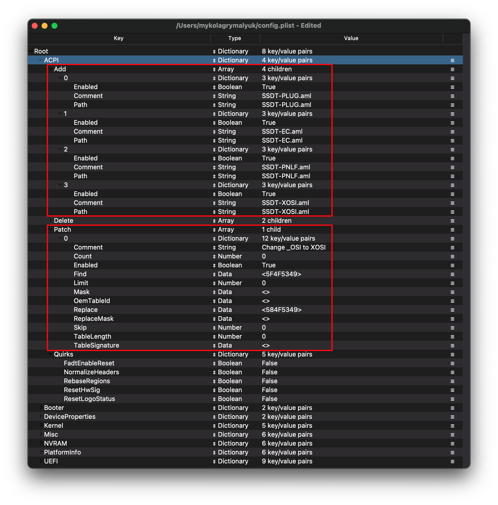
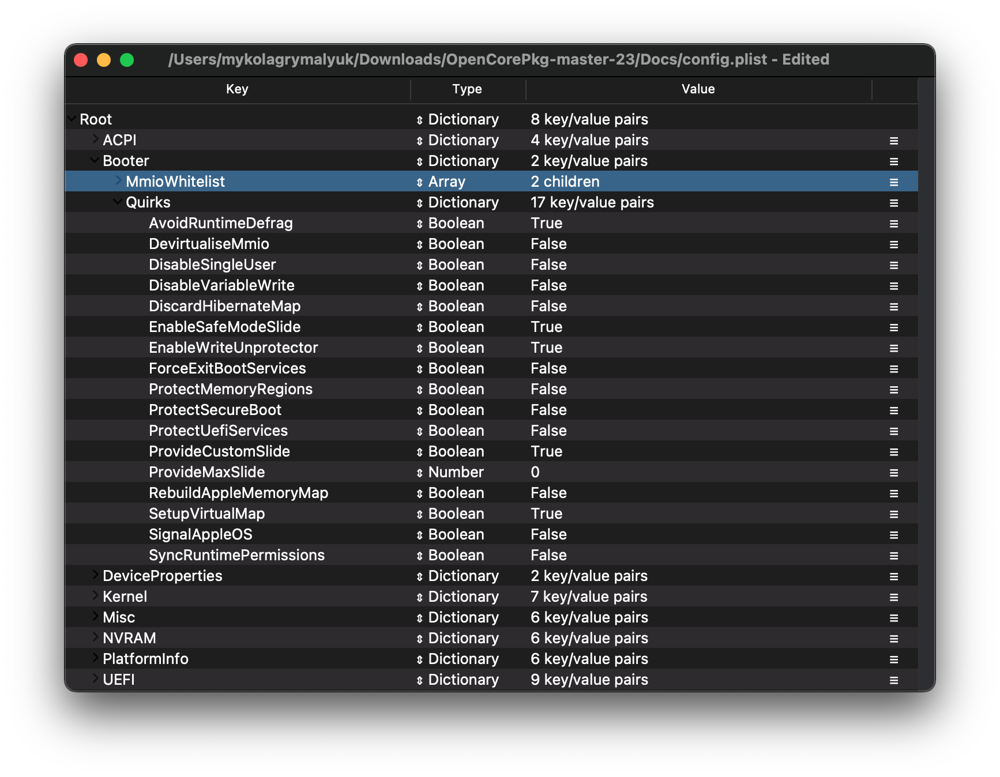
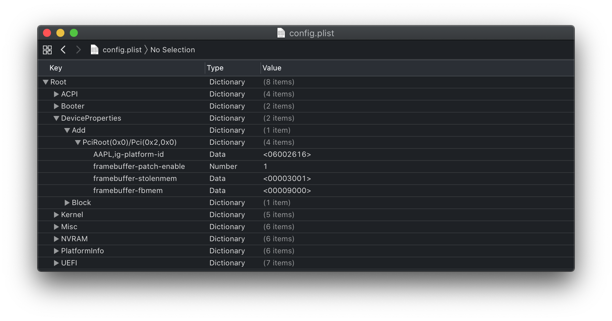
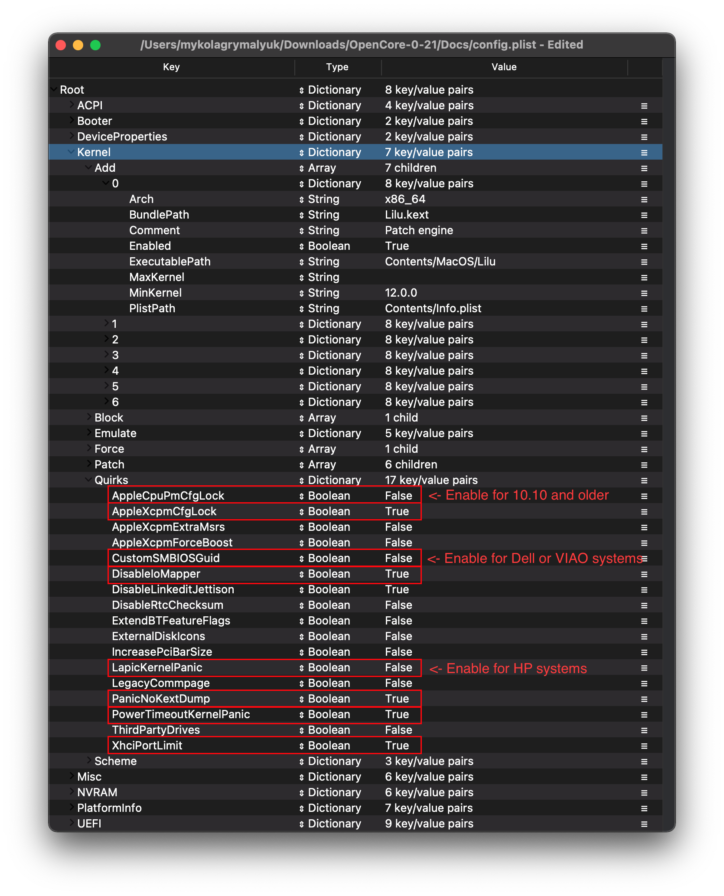
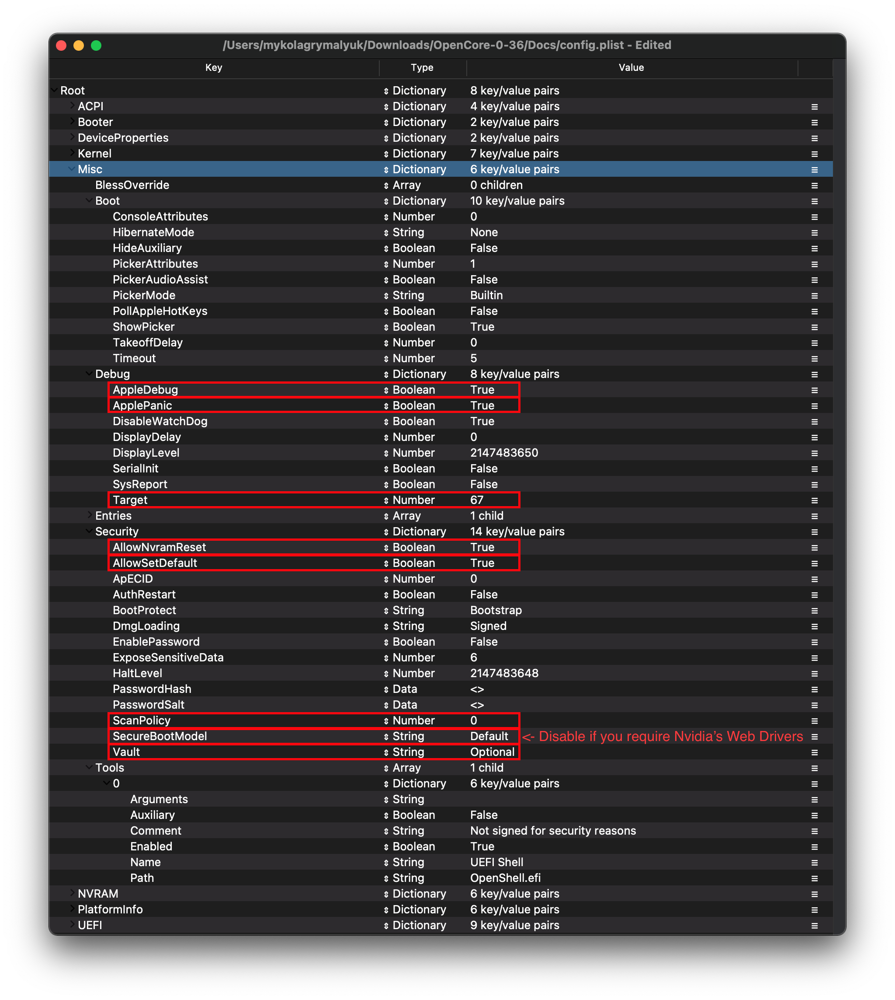
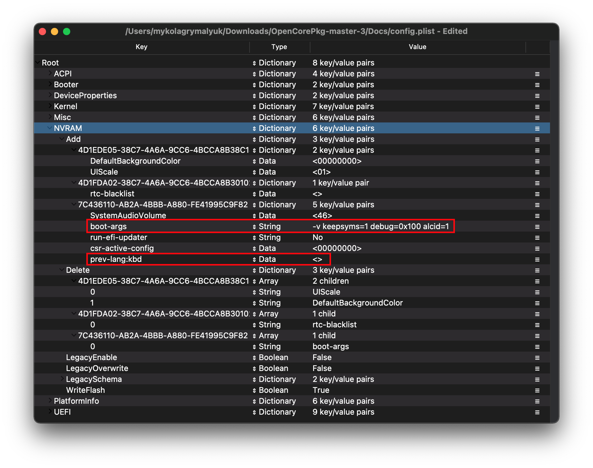
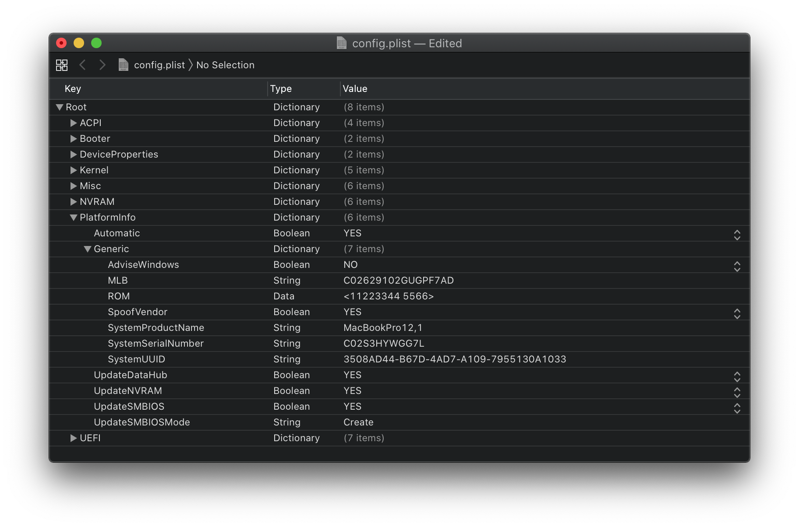
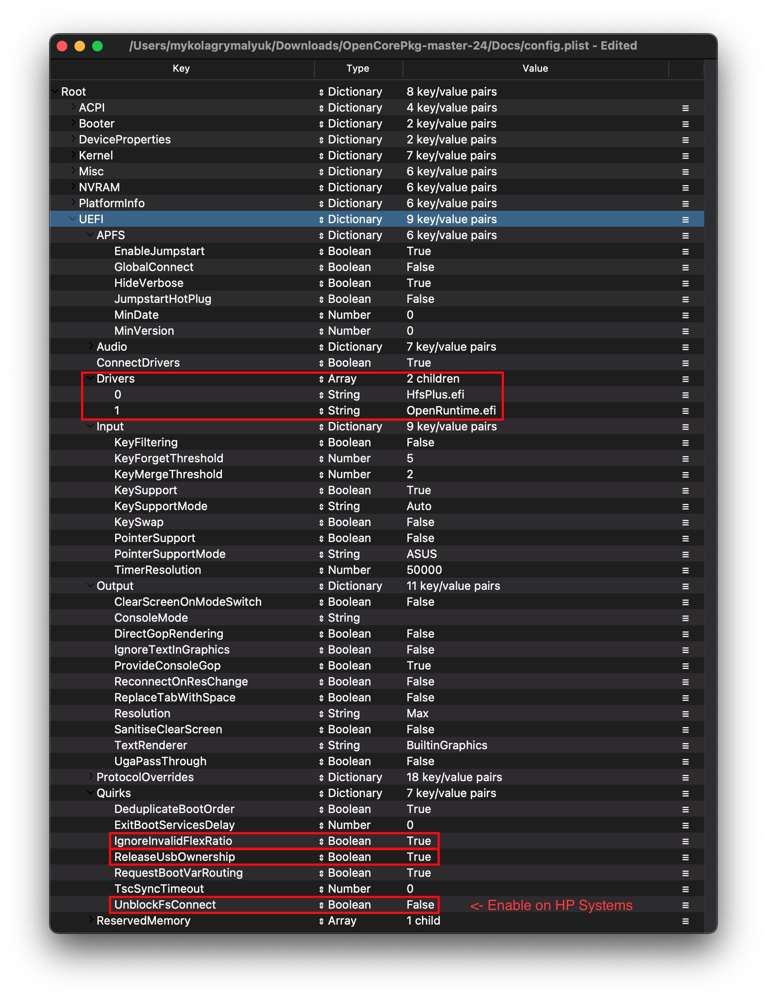

# Broadwell 笔记本电脑

| 支持 | 版本 |
| :--- | :--- |
| 支持的 OpenCore 版本 | 0.6.3 |
| 初始 macOS 支持版本 | OS X 10.10, Yosemite |

## 起点

虽然制作一个 config.plist 文件似乎很难，但其实并不是。它只是需要一些时间，但是此指南将会告诉你如何配置所有项目，你不会被抛弃在寒风中。这同时代表，如果你有问题，再浏览一遍你的配置以确保它们全部正确。使用 OpenCore 时较为重要的几点：

* **所有属性都必须被定义**，OpenCore 不会自动填上默认值，所以**不要删除任何属性，除非明确地告知了需要删除**。如果本指南没有阐述某个属性，保留它的默认值。
* **Sample.plist 不能直接使用**，你必须将它配置得适合你的电脑。
* **不要使用针对性的配置器（configurator）**，它们只会几乎不会考虑到 OpenCore 的配置，甚至有些配置器——例如 Mackie 的——会添加 Clover 的属性然后使 plist 出错！

尽管如此，还是简短地提示一下我们需要的工具：

* [ProperTree](https://github.com/corpnewt/ProperTree)
  * 通用的 plist 编辑器
* [GenSMBIOS](https://github.com/corpnewt/GenSMBIOS)
  * 用于生成 SMBIOS 数据
* [示例/config.plist](https://github.com/acidanthera/OpenCorePkg/releases)
  * 查看之前的部分以了解如何获得：[config.plist Setup](../config.plist/README.md)

**而且，请在放置好 OpenCore 之前不止一遍地阅读此指南，以确保你已经无误地配置了 OpenCore。记住，指南中的图片并非一直都是最新的，所以请阅读它们下面的文本，如果遇到没有提及的属性，保留它们的默认值即可。**

## ACPI



### Add

::: tip 信息

这是你为你的系统添加 SSDT 的地方，它们对于 **引导 macOS** 非常重要，而且很多用于 [定位 USB](https://dortania.github.io/OpenCore-Post-Install/usb/)、 [屏蔽不支持的显卡](https://dortania.github.io/OpenCore-Post-Install/) 等等。 对于我们的的系统来说，**它们甚至是引导时不可或缺的项目**。可以在这里找到制作和使用它们的指南：[**Getting started with ACPI**](https://dortania.github.io/Getting-Started-With-ACPI/)

我们需要添加一些 SSDT 来得到一些 Clover 提供的功能：

| 需要的 SSDT | 说明 |
| :--- | :--- |
| **[SSDT-PLUG](https://dortania.github.io/Getting-Started-With-ACPI/)** | 允许使用 Haswell 或更高版本的 CPU 的原生电源管理。查看 [Getting Started With ACPI Guide](https://dortania.github.io/Getting-Started-With-ACPI/) 以了解更多。 |
| **[SSDT-EC](https://dortania.github.io/Getting-Started-With-ACPI/)** | 修复嵌入式控制器，查看 [Getting Started With ACPI Guide](https://dortania.github.io/Getting-Started-With-ACPI/) 以了解更多。 |
| **[SSDT-GPIO](https://github.com/dortania/Getting-Started-With-ACPI/blob/master/extra-files/decompiled/SSDT-GPI0.dsl)** | 创建根端，让 VoodooI2C 可以连接，如果 VoodooI2C 运行出现问题可以尝试使用 [SSDT-XOSI](https://github.com/dortania/Getting-Started-With-ACPI/blob/master/extra-files/compiled/SSDT-XOSI.aml) 来代替。注意，英特尔 NUC 不需要此 SSDT。 |
| **[SSDT-PNLF](https://dortania.github.io/Getting-Started-With-ACPI/)** | 修复亮度控制，查看 [Getting Started With ACPI Guide](https://dortania.github.io/Getting-Started-With-ACPI/) 以了解更多。注意，英特尔 NUC 不需要此 SSDT。 |

注意，你**不应该**在这里添加你生成的 `DSDT.aml`，因为他已经在你的硬件里了。所以它如果已经存在，删除你的 `config.plist` 中对应的条目和位于 EFI/OC/ACPI 目录下的 `DSDT.aml` 。

想了解更深层的内容，例如转存 DSDT、怎样编译 SSDT 并使其符合标准，请查看 [**Getting started with ACPI**](https://dortania.github.io/Getting-Started-With-ACPI/) **页面。** 符合标准的 SSDT 的后缀名为 **.aml** （有些情况下隐藏）而且应当放在 `EFI/OC/ACPI` 目录下，**必须** 在你的 `ACPI -> Add` 中被说明。

:::

### Delete

这个部分会在加载的时候排除一些 ACPI 表，对于我们来说可以忽略。

### Patch

::: tip 信息

这个部分允许我们通过 OpenCore 以动态的方式修改 ACPI 的一部分（例如 DSDT、SSDT 等等）对于我们来说，我们需要以下这些：

* OSI 重命名
  * 当使用 SSDT- XOSI 时需要这个项目，因为我们需要重定向所有 OSI 请求到这个 SSDT，**如果你使用 SSDT-GPIO，则不需要**

| Comment | String | Change _OSI to XOSI |
| :--- | :--- | :--- |
| Enabled | Boolean | YES |
| Count | Number | 0 |
| Limit | Number | 0 |
| Find | Data | 5f4f5349 |
| Replace | Data | 584f5349 |

:::

### Quirks

与 ACPI 有联系的设置，所有内容保持默认，因为我们没有用到这些偏好设置。

## Booter



这个部分提供与 boot.efi 相关的 OpenRuntime 补丁设置，用于代替 AptioMemoryFix.efi。

### MmioWhitelist

这个部分允许一些本来不被允许的空间直接通过 macOS，与 `DevirtualiseMmio` 搭配时很有用。

### Quirks

::: tip 信息
关于 boot.efi 的补丁和修补硬件的设置，对于我们来说，保持默认值即可。
:::
::: details 更多深层的信息

* **AvoidRuntimeDefrag**: YES
  * 修复 UEFI 运行时服务，例如日期、时间、NVRAM（非易失性随机访问存储器）、电源控制等等。
* **EnableWriteUnprotector**: YES
  * 需要用于从 CR0 寄存器移除写入保护。
* **SetupVirtualMap**: YES
  * 修复 SetVirtualAddresses 请求至虚拟地址，技嘉主板需要此项目以解决较早出现的内核错误。
  

:::

## DeviceProperties



### Add

从一张表设置设备属性。

::: tip PciRoot(0x0)/Pci(0x2,0x0)

这个部分通过 WhateberGreen 的 [Framebuffer Patching Guide（框架缓冲存储器补丁指南）](https://github.com/acidanthera/WhateverGreen/blob/master/Manual/FAQ.IntelHD.en.md)进行配置，用于设置重要的核芯显卡属性。

当你在设置核芯显卡时，下面的表格应该可以帮助你找到正确的值来设置。这是对于部分值的解释：

* **AAPL,ig-platform-id**
  * 这个属性用于内部设置核芯显卡
* **类型**
  * 说明这个属性是否向笔记本电脑推荐（即拥有内置显示器的）或向英特尔 NUC 推荐（即独立的可接线的“盒子”）

一般情况下，请在设置你的核芯显卡属性时跟随这些步骤。如果有不一样的地方，跟随表格下方的配置注解：

1. 在初始配置你的 config.plist 时，只设置 AAPL,ig-platform-id——通常已经足够了。
2. 如果你在启动（macOS）后没有得到图形加速（7MB 内存和半透明的程序坞背景），那么你可能需要尝试不同的 `AAPL,ig-platform-id` 值，添加预留图形内存布丁，甚至是添加一个 `device-id` 属性。

| AAPL,ig-platform-id | 类型 | 注释 |
| ------------------- | ---- | ------- |
| **06002616** | Laptop | Broadwell 笔记本电脑的推荐值 |
| **02001616** | NUC | Broadwell NUC 的推荐值 |

##### 配置注解

* 对于 HD5600 你需要添加 `device-id` 并伪装为 `16260000`：

| Key | Type | Value |
| :--- | :--- | :--- |
| device-id | data | 26160000

* 在有些情况下，你无法在你的 UEFI 固件中设置动态显存技术中的预留部分为 96MB 或更高，那么你可能会遇到内核错误。通常它们将预留部分设置为 32MB，在那种情况下，这些值需要添加到你的核芯显卡属性

| Key | Type | Value |
| :--- | :--- | :--- |
| framebuffer-patch-enable | Data | 01000000 |
| framebuffer-stolenmem | Data | 00003001 |
| framebuffer-fbmem | Data | 00009000 |

:::

::: tip PciRoot(0x0)/Pci(0x1b,0x0)

`layout-id`

* 为应用 AppleALC 音频注入，你需要对“你的主板上用的是哪个音频解码器”和“选择与其匹配的 AppleALC 的布局”进行你自己的研究。[AppleALC Supported Codecs](https://github.com/acidanthera/AppleALC/wiki/Supported-codecs).
* 你可以直接删除这项属性，因为我们现在暂时用不到它。

对于我们来说，我们会使用启动参数 `alcid=xxx` 来替代以达到同样目标。 `alcid` 会覆盖所有其他存在的布局 ID。关于此项目的更多信息收录于 [OpenCore 安装后指南](https://dortania.github.io/OpenCore-Post-Install/)

:::

### Delete

从表中删除设备属性，对于我们来说可以忽略。

## Kernel



### Add

这里是具体说明哪个内核扩展将会被加载、以怎样的顺序加载及每个内核扩展所支持的架构的地方。一般情况下我们推荐保持由 ProperTree 完成的内容。然而 32 位 CPU 请看下面：

::: details 更多深层的信息

你需要始终记得的主要事情是：

* 加载顺序
  * 记住，所有的插件要在它的依赖*之后*加载。
  * 这也表明一些像 Lilu 一样的内核扩展**必须** 在 VirtualSMC、AppleALC、WhateverGreen 等等之前加载。

一个简短的提示，[ProperTree](https://github.com/corpnewt/ProperTree) 的用户可以执行 **Cmd/Ctrl + Shift + R** 以按照正确的顺序添加他们的所有内核扩展，而不用手动填写每个内核扩展。

* **Arch**
  * 此内核扩展所支持的架构
  * 当前支持的值有 `Any`、 `i386`（32 位）和 `x86_64`（64 位）
* **BundlePath**
  * 内核扩展的名称
  * 例如：`Lilu.kext`
* **Enabled**
  * 已经自己解释了，要么启用，要么禁用内核扩展
* **ExecutablePath**
  * 隐藏在内核扩展中的实际的可执行文件的路径，你可以通过右键单击并选择 `Show Package Contents`（`显示包内容`）来查看你的内核扩展的可执行文件路径。一般情况下，它们都是 `Contents/MacOS/Kext`，但有些也会在 `Plugin` 有内核扩展。注意，只有 plist 的内核扩展不需要填写此项。
  * 例如：`Contents/MacOS/Lilu`
* **MinKernel**
  * 你的内核扩展被注入的最低内核版本，查看下方的表格以获得更多可选的值
  * 例如：`12.00.00` for OS X 10.8
* **MaxKernel**
  * 你的内核扩展被注入的最高内核版本，查看下方的表格以获得更多可选的值
  * 例如：`11.99.99` for OS X 10.7
* **PlistPath**
  * 隐藏在内核扩展中的 `info.plist` 的路径
  * 例如：`Contents/Info.plist`
  

::: details 内核支持表格

| macOS/OS X 版本 | MinKernel | MaxKernel |
| :--- | :--- | :--- |
| 10.4 | 8.0.0 | 8.99.99 |
| 10.5 | 9.0.0 | 9.99.99 |
| 10.6 | 10.0.0 | 10.99.99 |
| 10.7 | 11.0.0 | 11.99.99 |
| 10.8 | 12.0.0 | 12.99.99 |
| 10.9 | 13.0.0 | 13.99.99 |
| 10.10 | 14.0.0 | 14.99.99 |
| 10.11 | 15.0.0 | 15.99.99 |
| 10.12 | 16.0.0 | 16.99.99 |
| 10.13 | 17.0.0 | 17.99.99 |
| 10.14 | 18.0.0 | 18.99.99 |
| 10.15 | 19.0.0 | 19.99.99 |
| 11 | 20.0.0 | 20.99.99 |

:::

### Emulate

需要用于伪装不支持的 CPU，例如奔腾和赛扬

* **CpuidMask**：留空
* **CpuidData**：留空

### Force

用于从系统卷中加载内核扩展，仅适用于缓存中没有某些内核扩展的旧操作系统（例如 OS X 10.6 中的 IONetworkingFamily）。

对于我们来说可以忽略。

### Block

在加载的时候排除一些内核扩展。与我们无关。

### Patch

同时为内核和内核扩展应用补丁。

### Quirks

::: tip 信息

设置与内核有关，对于我们来说打开以下的偏好设置即可：

| Quirk | Enabled | 注释 |
| :--- | :--- | :--- |
| AppleCpuPmCfgLock | NO | 如果要运行 10.10 或更低版本，或者无法在 BIOS 里关闭 `CFG-Lock`，则需要打开 |
| AppleXcpmCfgLock | YES | 如果 `CFG-Lock` 已经在 BIOS 中关闭，则不需要打开 |
| DisableIOMapper | YES | 如果 `VT-D` 已经在 BIOS 中关闭，则不需要打开 |
| LapicKernelPanic | NO | 惠普设备需要这个偏好设置 |
| PanicNoKextDump | YES | |
| PowerTimeoutKernelPanic | YES | |
| XhciPortLimit | YES | |

:::

::: details 更多深层的信息

* **AppleCpuPmCfgLock**: NO
  * 只在 CFG-Lock 无法在 BIOS 中关闭时需要
  * 只能在 Ivy Bridge 或更旧的 CPU 上使用
    * 注意：Broadwell 或更旧的 CPU 当运行 10.10 或更旧的操作系统时需要此项
* **AppleXcpmCfgLock**: YES
  * 只在 CFG-Lock 无法在 BIOS 中关闭时需要
  * 只能在 Haswell 或更旧的 CPU 上使用
    * 注意：Ivy Bridge-E 也包括在内，因为它支持 XCPM
* **CustomSMBIOSGuid**: NO
  * 在 UpdateSMBIOSMode 设置为 `Custom` 时使用 GUID 补丁。通常戴尔的笔记本电脑会需要
  * 在 UpdateSMBIOSMode 设置为 Custom 模式时打开此项也可以让 SMBIOS 不要注入为非 Apple 操作系统，然而我们不认可这种方式，因为它会破坏 Bootcamp 的兼容性。在你自己承担风险时使用
* **DisableIoMapper**: YES
  * 如果在 BIOS 中无法关闭 VT-D 或其他的操作系统需要它，则使用此项绕过 VT-D，更好地代替了 `dart=0`，因为 SIP（系统完整性保护）可以在 macOS 10.15 Catalina 中保持开启。
* **DisableLinkeditJettison**: YES
  * 允许 Lilu 和其他内核扩展在不使用 `keepsyms=1` 时获得更可靠的性能
* **DisableRtcChecksum**: NO
  * 在写入最初校验和（0x58-0x59）时阻止 AppleRTC，进行 BIOS 重置或在重启/关机后自动进入安全模式的用户需要此项。
* **ExtendBTFeatureFlags** NO
  * 对于在非 Apple 或非奋威网卡上出现持续性问题有帮助
* **LapicKernelPanic**: NO
  * 使 AP 核心被 LAPIC（本地高级可编程中断控制器）中断时不发生内核错误，一般用于惠普的设备。Clover 中与其有相同效果的是 `Kernel LAPIC`
* **LegacyCommpage**: NO
  * 为 64 位处理器解决在 macOS 中对 SSSE3 的依赖，主要用于 64 位奔腾 4 CPU（例如：Prescott）
* **PanicNoKextDump**: YES
  * 允许在内核错误来临时读取内核错误日志
* **PowerTimeoutKernelPanic**: YES
  * 帮助修复 Catalina 中电源改变后由 Apple 驱动程序引起的内核错误，尤其是数字音频。
* **XhciPortLimit**: YES
  * 这其实是 15 个接口限制的补丁，不要依赖于它，因为不能保证它是修复 USB 的解决方案。请在可能的时候 [定位 USB](https://dortania.github.io/OpenCore-Post-Install/usb/)。

原因就是 UsbInjectAll 在 macOS 中内建的工具没有适当的电流调节。用一个只有 plist 的内核扩展来描述你的接口更为简洁，并且不会浪费运行时的内存等等。

:::

### Scheme

设置与经典启动（Legacy booting）有关（例如 10.4-10.6），大多数情况下你可以跳过，然而对于一些使用经典启动的操作系统，你可以查看下方：

::: details 更多深层的信息

* **FuzzyMatch**: True
  * 用于忽略内核在缓存时的校验和，以代替选择最新的可用缓存。可以帮助在很多运行 10.6 的设备上提高引导性能。
* **KernelArch**: x86_64
  * 设置内核的架构类型，你可以在 `Auto`, `i386`（32 位）和 `x86_64`（64 位）中选择。
  * 如果你要引导需要 32 位内核的旧操作系统（例如 10.4 和 10.5），我们推荐将其设置为 `Auto` 并让 macOS 基于你的 SMBIOS 进行抉择。查看下面的表格以获得所有支持的值：
    * 10.4-10.5 — `x86_64`、`i386` 或 `i386-user32`
      * `i386-user32` 指向 32 位用户控件，所以 32 位 CPU 必须使用这个值（或是缺少 SSSE3 的 CPU）
      * `x86_64` 将会仍然包含一个 32 位的内核空间，然而将会在 10.4/10.5 中确保用户空间是 64 位的
    * 10.6 — `i386`、`i386-user32` 或 `x86_64`
    * 10.7 — `i386` 或 `x86_64`
    * 10.8 or newer — `x86_64`

* **KernelCache**: Auto
  * 设置内核缓存类型，主要对调试有用，所以我们推荐设置为 `Auto` 以获得最好的支持

:::

## Misc



### Boot

引导屏幕的设置（保持所有设置项默认）。

### Debug

::: tip 信息

对调试 OpenCore 引导问题很有帮助（我们将会改变*除了* `DisplayDelay` 的所有设置项）：

| 偏好设置 | 启用 |
| :--- | :--- |
| AppleDebug | YES |
| ApplePanic | YES |
| DisableWatchDog | YES |
| Target | 67 |

:::

::: details 更多深层的信息

* **AppleDebug**: YES
  * 打开 boot.efi 日志记录，在调试时很有用。注意，只支持 10.15.4 和更高的版本
* **ApplePanic**: YES
  * 尝试写入内核错误日志到磁盘
* **DisableWatchDog**: YES
  * 关闭 UEFI 侦察，可以对解决早期引导问题有所帮助
* **DisplayLevel**: `2147483650`
  * 显示更多的调试信息，需要 OpenCore 的 Debug（调试）版本
* **SerialInit**: NO
  * 在设置用 OpenCore 进行序列号输出的时候需要此项
* **SysReport**: NO
  * 在调试时（例如导出 ACPI 表）时有用
  * 注意，此项只适用于 Debug（调试）版本的 OpenCore
* **Target**: `67`
  * 显示更多的调试信息，需要 OpenCore 的 Debug（调试）版本

这些值都是基于从 [OpenCore debugging](../troubleshooting/debug.md) 中计算出来的结果

:::

### Security

::: tip 信息

“安全”已经自己解释了有什么作用，但是**也不能跳过**。我们需要改变以下项目：

| 偏好设置 | 启用 | 注释 |
| :--- | :--- | :--- |
| AllowNvramReset | YES | |
| AllowSetDefault | YES | |
| ScanPolicy | 0 | |
| SecureBootModel | Default | 此属性区分大小写，如果你不需要安全启动，设置为 `Disabled`（例如你需要 Nvidia 的 Web Driver 时） |
| Vault | Optional | 不能忽略掉此属性，如果你没有把它设置为 Optional，你会后悔的，注意，这是一个区分大小写的属性。 |

:::

::: details 更多深层的信息

* **AllowNvramReset**: YES
  * 同时允许 NVRAM 在引导菜单中和按下 `Cmd+Opt+P+R` 时重置
* **AllowSetDefault**: YES
  * 允许使用 `CTRL+Enter` 和 `CTRL+Index` 在引导菜单中设置默认启动项
* **ApECID**: 0
  * 用于获得自己的安全启动识别码，目前这个偏好设置不可靠，因为在 macOS 安装器中它还存在漏洞，所以我们强烈建议你保持默认值。
* **AuthRestart**: NO
  * 打开文件保险箱 2（FileVault 2）的重启认证，则重启时不再需要密码。需要考虑其带来的安全风险以启用
* **BootProtect**: Bootstrap
  * 允许使用 EFI/OC/Bootstrap 中的  Bootstrap.efi 来替代 BOOTx64.efi，在想要同时使用 rEFInd 或者避免 BOOTx64.efi 被 Windows 覆盖的情况下很有用。合理使用这项偏好设置的更多信息请查看[使用 Bootstrap.efi](https://dortania.github.io/OpenCore-Post-Install/multiboot/bootstrap.html#preparation)
* **DmgLoading**: Signed
  * 保证只有已签名的 DMG 被加载
* **ExposeSensitiveData**: `6`
  * 显示更多的调试信息，需要 OpenCore 的 Debug（调试）版本
* **Vault**: `Optional`
  * 我们基本不会使用文件保险箱，所以我们可以忽略，**而且如果此项设置为 Secure，你将无法启动**
  * 不能忽略掉此属性，如果你没有把它设置为 `Optional`，你会后悔的，注意，这是一个区分大小写的属性
* **ScanPolicy**: `0`
  * `0` 允许你看到所有可以启动的分区，请参阅[安全](https://dortania.github.io/OpenCore-Post-Install/universal/security.html) 部分以获得更多信息。**如果此项设置为默认，则无法从 USB 分区启动**
* **SecureBootModel**: Default
  * 在 macOS 中启用 Apple 的安全启动功能，请参阅[安全](https://dortania.github.io/OpenCore-Post-Install/universal/security.html) 部分以获得更多信息
  * 注意：在已经安装的系统上升级 OpenCore 可能会导致早起的启动失败。请查看此处以解决这个问题：[Stuck on OCB: LoadImage failed - Security Violation](/troubleshooting/extended/kernel-issues.md#stuck-on-ocb-loadimage-failed-security-violation)

:::

### Tools

用于运行 OpenCore 调试工具（例如 Shell）。ProperTree 的快照功能将为你添加此项。

### Entries

用于说明无法被 OpenCore 自动识别的非正常启动路径。

此部分不会在此处被说明，请参阅 [Configuration.pdf](https://github.com/acidanthera/OpenCorePkg/blob/master/Docs/Configuration.pdf) 中的 8.6 以获得更多信息

## NVRAM



### Add

::: tip 4D1EDE05-38C7-4A6A-9CC6-4BCCA8B38C14

用于设置 OpenCore 的 UI 缩放，默认值即可工作。查看更多深层的信息部分以获得更多信息

:::

::: details 更多深层的信息

引导器的设置路径，主要用于设置 UI 缩放

* **UIScale**：
  * `01`：基本分辨率
  * `02`：高分辨率（HiDPI）（通常在使文件保险箱正常运行于较小的屏幕上时需要）

* **DefaultBackgroundColor**：boot.efi 使用的背景色
  * `00000000`: 西拉黑（Syrah Black）
  * `BFBFBF00`: 浅灰

:::

::: tip 4D1FDA02-38C7-4A6A-9CC6-4BCCA8B30102

OpenCore 的 NVRAM GUID，主要和 RTCMemoryFixup 的用户有关

:::

::: details 更多深层的信息

* **rtc-blacklist**: <>
  * 配合 RTCMemoryFixup 使用，查看此处以了解更多信息：[修复 RTC 写入问题](https://dortania.github.io/OpenCore-Post-Install/misc/rtc.html#finding-our-bad-rtc-region)
  * 大部分用户可以忽略这一部分

:::

::: tip 7C436110-AB2A-4BBB-A880-FE41995C9F82

系统完整性保护（SIP）的位掩码（bitmask）

* **用途通用的启动参数（boot-args）**:

| 启动参数 | 说明 |
| :--- | :--- |
| **-v** | 此选项打开啰嗦（verbose）模式，可以滚动以显示所有后台的文本信息，因为在启动时，这些代替了 Apple 标志和进度条。它对很多黑苹果用户是非常宝贵的，因为它为你提供了所有关于启动进度的内部视图，可以帮助你辨认问题，例如有问题的内核扩展等等。 |
| **debug=0x100** | 此选项关闭 macOS 的引导侦察，可以帮助在发生内核错误时组织重启。那样，你就可以*有希望地*收集一些有用的信息，然后跟随这些痕迹解决问题。 |
| **keepsyms=1** | 这是一个常常和 debug=0x100 一起使用的参数，告诉操作系统在遇到内核错误时，同时输出符号。那些符号可以给出一些有用的深层信息，以追查错误的根源。 |
| **alcid=1** | 用于为 AppleALC 设置布局 ID，查看 [supported codecs](https://github.com/acidanthera/applealc/wiki/supported-codecs) 以查出哪个布局适用于你的系统详情。更多的信息包含在了 [OpenCore 安装后指南](https://dortania.github.io/OpenCore-Post-Install/) |

* **适用于 GPU 的启动参数**:

| 启动参数 | 说明 |
| :--- | :--- |
| **-wegnoegpu** | 用于屏蔽所有除了英特尔核芯显卡外的 GPU，对于想要运行独立显卡不支持的高版本 macOS 时很有用。 |

* **csr-active-config**: `00000000`
  * 对系统完整性保护（SIP）的设置。通常建议在恢复分区中使用 `csrutil` 更改此项。
  * csr-active-config 默认设置为 `00000000`，即打开系统完整性保护。你可以选择一个不同的值，但是我们推荐为了最佳的安全性而保持启用。更多信息可以在我们的故障排除页面查看：[关闭系统完整性保护](../troubleshooting/extended/post-issues.md#disabling-sip)

* **run-efi-updater**: `No`
  
* 此项用于阻止因 Apple 的固件升级包安装而打断启动；此项非常重要，因为这些固件升级（对 Mac 有用）不会正常运行。
  
* **prev-lang:kbd**: <>
  * 当使用非拉丁键盘时需要，格式为 `lang-COUNTRY:keyboard`，尽管你可以具体说明，但依然推荐留空（**示例配置中的默认值为俄语**）：
  > 译者注：如果你较为习惯使用中文，请设置 `prev-lang:kbd` 的值为 `zh-Hans:0` 或 `zh-Hans:252`。
  * 美式英语：`en-US:0`（HEX（16 进制）为 `656e2d55533a30`）
  * 完整列表可以在此处查看：[AppleKeyboardLayouts.txt](https://github.com/acidanthera/OpenCorePkg/blob/master/Utilities/AppleKeyboardLayouts/AppleKeyboardLayouts.txt)
  > 译者注：中文对应的值无法在此列表中找到。
  
  * 建议：`prev-lang:kbd` 可以被转换为 String（字符串）类型，所以你可以直接用 `en-US:0` 替代，不需要转为 HEX（16 进制）

| Key | Type | Value |
| :--- | :--- | :--- |
| prev-lang:kbd | String | en-US:0 |

:::

### Delete

强行重写 NVRAM 变量，注意，`Add` **不会覆盖** NVRAM 中已存在的值，所以像 `boot-args` 之类的值将会被留下。

* **LegacyEnable**: NO
  * 允许 NVRAM 存储为 nvram.plist，没有自带 NVRAM 的操作系统需要此项

* **LegacyOverwrite**: NO
  * 允许从 nvram.plist 覆盖固件变量，仅没有自带 NVRAM 的操作系统需要此项

* **LegacySchema**:
  * 用于分配 NVRAM 变量，和设置为 YES 的 LegacyEnable 一起使用

* **WriteFlash**: YES
  * 启用向闪存写入所有添加的变量。

## PlatformInfo



::: tip 信息

对于设置 SMBIOS 信息，我们将会使用 CorpNewt 的 [GenSMBIOS](https://github.com/corpnewt/GenSMBIOS) 应用程序。

对于此 Broadwell CPU 示例，我们将会选择 MacBookPro12,1 SMBIOS。典型的解决方案是这些：

| SMBIOS | CPU 类型 | GPU 类型 | 屏幕尺寸 |
| :--- | :--- | :--- | :--- |
| MacBook8,1 | 双核 7瓦（低端） | 核芯显卡：HD 5300 | 12" |
| MacBookAir7,1 | 双核 15w | 核芯显卡：HD 6000 | 11" |
| MacBookAir7,2 | 双核 15w | 核芯显卡：HD 6000 | 13" |
| MacBookPro12,1 | 双核 28w（高端） | 核芯显卡：Iris 6100 | 13" |
| MacBookPro11,2 | 四核 45w | 核芯显卡：Iris Pro 5200 | 15" |
| MacBookPro11,3 | 四核 45w | 核芯显卡：Iris Pro 5200 + 独立显卡：GT750M | 15" |
| MacBookPro11,4 | 四核 45w | 核芯显卡：Iris Pro 5200 | 15" |
| MacBookPro11,5 | 四核 45w | 核芯显卡：Iris Pro 5200 + 独立显卡：R9 M370X | 15" |
| iMac16,1 | NUC 系统 | HD 6000/Iris Pro 6200 |  N/A |

运行 GenSMBIOS，选择 1 以下载 Mac 序列号（MacSerial），选择 3 以挑选合适的 SMBIOS。我们将会得到像下面这样的输出：

```sh
  #######################################################
 #               MacBookPro12,1 SMBIOS Info            #
#######################################################

Type:         MacBookPro12,1
Serial:       C02M9SYJFY10
Board Serial: C02408101J9G2Y7A8
SmUUID:       7B227BEC-660D-405F-8E60-411B3E4EF055
```

`Type` 部分需要拷贝到 Generic -> SystemProductName 部分。

`Serial` 部分需要拷贝到 Generic -> SystemSerialNumber 部分。

`Board Serial` 部分需要拷贝到 Generic -> MLB 部分。

`SmUUID` 部分需要拷贝到 Generic -> SystemUUID 部分。

我们需要把 Generic -> ROM 设置为一个 Apple ROM 值（从一台真实的 Mac 导出），或你的网卡 MAC 地址，或者任何随机的 MAC 地址（需要是 6 段随机字节，在此指南中我们将使用 `11223300 0000`。在安装完成后你可以跟随 [修复 Apple 服务（iServices）](https://dortania.github.io/OpenCore-Post-Install/) 页面来知道如何找到你的真实 MAC 地址）

##### 记住，你需要的是一个无效的序列号，或者有效但是没有在使用中的序列号，你需要得到返回的信息是：“无效的序列号（"Invalid Serial"） 或者 “购买日期未验证”（"Purchase Date not Validated"）

[Apple 查看保障状态页面（Apple Check Coverage page）](https://checkcoverage.apple.com)

**Automatic**: YES

* 生成基于 Generic 部分的 PlatformInfo 以代替 DataHub、NVRAM 和 SMBIOS 部分。

:::

### Generic

::: details 更多深层的信息

* **AdviseWindows**: NO
  * 用于 EFI 分区不是 Windows 所在硬盘的首个分区时

* **SystemMemoryStatus**: Auto
  * 设置内存是否被包含在了 SMBIOS 信息中， 仅作为装点使用，所以我们推荐设置为 `Auto`
  
* **ProcessorType**: `0`
  * 设置为 `0` 以自动检测类型，但是如果你想覆盖此值也可以。查看 [AppleSmBios.h](https://github.com/acidanthera/OpenCorePkg/blob/master/Include/Apple/IndustryStandard/AppleSmBios.h) 以获得更多可选的值

* **SpoofVendor**: YES
  * 为 Acidanthera 交换供应商字段，在很多情况下使用 Apple 作为供应商并不安全

* **UpdateDataHub**: YES
  * 更新数据收集器（Data Hub）字段

* **UpdateNVRAM**: YES
  * 更新 NVRAM 字段

* **UpdateSMBIOS**: YES
  * 更新 SMBIOS 字段

* **UpdateSMBIOSMode**: Create
  * 以较新的已分配的 EfiReservedMemoryType 替换表，在戴尔笔记本电脑上使用 `Custom` 需要 `CustomSMBIOSGuid` 偏好设置
  * 设置为 `Custom` 且加入启用的 `CustomSMBIOSGuid` 属性也可以阻止 SMBIOS 注入为非 Apple 操作系统，，然而我们不认可这种方式，因为它会破坏 Bootcamp 的兼容性。在你自己承担风险时使用

:::

## UEFI



**ConnectDrivers**: YES

* 强制使用 .efi 驱动，设置为 NO 将会自动连接添加的 UEFI 驱动。这样可以略微加快引导速度，但是并非所有的驱动都会自行将其连接。例如一些文件系统驱动可能不会加载。

### Drivers

添加你的 .efi 驱动到这里。

现在应当只有这些驱动：

* HfsPlus.efi
* OpenRuntime.efi

### APFS

设置关于 APFS 驱动，保留所有默认值。

### Audio

与 AudioDxe 的设置有关，对于我们来说可以忽略（保留默认值）。这些设置与 macOS 中的音频支持无关。

* 更多关于使用 AudioDxe 和 Audio 部分的信息，请看 OpenCore 安装后指南页面：[添加图形界面（GUI）和 启动声音](https://dortania.github.io/OpenCore-Post-Install/)

### Input

有关于 boot.efi 中用于文件保险箱和热键的键盘放行支持，保留所有默认值，因为我们不需要用到这些偏好设置。查看这里以获得更多信息：[安全与文件保险箱](https://dortania.github.io/OpenCore-Post-Install/)

### Output

有关于 OpenCore 的可视化输出，保留所有默认值，因为我们不需要用到这些偏好设置。

### ProtocolOverrides

主要有关于虚拟机、经典 Mac 和文件保险箱用户。查看这里以获得更多信息： [Security and FileVault](https://dortania.github.io/OpenCore-Post-Install/)

### Quirks

::: tip 信息
有关于 UEFI 源的偏好设置，对于我们，需要改变以下设置：

| 偏好设置 | 启用 | 注释 |
| :--- | :--- | :--- |
| IgnoreInvalidFlexRatio | YES | |
| ReleaseUsbOwnership | YES | |
| UnblockFsConnect | NO | 主要用于惠普主板 |

:::

::: details 更多深层的信息

* **DeduplicateBootOrder**: YES
  * 需要从 `OC_VENDOR_VARIABLE_GUID` 到 `EFI_GLOBAL_VARIABLE_GUID` 的预修复引导变量的备选方案。用于修复引导选项。

* **IgnoreInvalidFlexRatio**: YES
  * 当 MSR_FLEX_RATIO (0x194) 在 BIOS 中不能被关闭时用于修复，所有基于早期 Skylake 的系统都需要此项
* **ReleaseUsbOwnership**: YES
  * 从固件驱动释放 USB 控制器，在当你的固件不支持 EHCI/XHCI 转换时需要。很多的笔记本电脑都使用劣质固件，所以我们最好启用此项l
* **RequestBootVarRouting**: YES
  * 将 AptioMemoryFix 从 `EFI_GLOBAL_VARIABLE_GUID` 重定向到 `OC_VENDOR_VARIABLE_GUID`。在固件尝试删除引导项目时需要，并且推荐为了修正更新安装过程、启动磁盘等等，而在所有系统上使用。

* **UnblockFsConnect**: NO
  * 一些固件封锁了被控制为使用驱动打开的分区，导致文件系统协议无法安装。主要与惠普系统没有列出驱动器相关

:::

### ReservedMemory

用于从操作系统中去除某些内存区域以供使用。主要有关于 Sandy Bridge 核芯显卡和内存有缺陷的系统。使用此偏好设置的相关内容未包含在此指南中

## 清理

现在你可以准备保存并将其放置到你的 EFI 中的 EFI/OC 目录了。

如果出现引导问题，请确保先阅读[故障排除部分](https://dortania.github.io/OpenCore-Install-Guide/troubleshooting/troubleshooting.html)，然后如果你还有无法解决的问题，我们有许多资源为你提供：

* [r/Hackintosh Subreddit](https://www.reddit.com/r/hackintosh/)
* [r/Hackintosh Discord](https://discord.gg/2QYd7ZT)

**Sanity check**:

感谢 Ramus 的努力，我们也有很好的工具帮助你检查可能缺失了一些部分的配置文件：

* [**Sanity Checker**](https://opencore.slowgeek.com)
* [**Sanity Checker**](https://opencore-sanity-checker.thrrip.space)（优化中国大陆访问速度）

注意，此工具并非由 Dortania 创建或与 Dortania 有关联，此网站的任何问题应当发送到这里：[Sanity Checker Repo](https://github.com/rlerdorf/OCSanity)

### 配置提示

**惠普用户**:

* Kernel -> Quirks -> LapicKernelPanic -> True
  * 否则你会因为 LAPIC（本地高级可编程中断控制器）而遇到内核错误
* UEFI -> Quirks -> UnblockFsConnect -> True

## 英特尔 BIOS 设置

* 注意：这些选项中的大多数可能不会包含在你的固件中，我们推荐尽可能匹配最接近的选项，但是如果很多这些选项在你的 BIOS 中不可用，也不要太担心

### Disable

* Fast Boot（快速启动）
* Secure Boot（安全启动）
* Serial/COM Port（串口）
* Parallel Port（并行端口）
* VT-d（英特尔支持直接 I/O 访问的虚拟化技术）（如果你设置 `DisableIoMapper` 为 YES，则可以打开）
* CSM（兼容性支持模块）
* Thunderbolt（雷雳接口）（仅对于初始安装，因为雷雳接口如果不正确设置，会导致错误）
* Intel SGX（英特尔软件保护扩展）
* Intel Platform Trust（英特尔平台信任技术）
* CFG Lock（MSR 0xE2 写入保护）（**此项必须关闭，如果你找不到此选项，则打开在 Kernel -> Quirks 下的 `AppleXcpmCfgLock`。你的 Hacintosh 不能在 CFG-Lock 打开的时候启动**）
  * 对于 10.10 和更旧的操作系统，你最好将 AppleCpuPmCfgLock 打开

### Enable

* VT-x（英特尔虚拟化技术）
* Above 4G decoding（芯片组 64 位兼容性硬件物理寻址）
* Hyper-Threading（超线程技术）
* Execute Disable Bit（禁用执行位操作）
* EHCI/XHCI Hand-off（EHCI/XHCI 转换）
* OS type: Windows 8.1/10 UEFI Mode（操作系统类型：Windows 8.1/10 UEFI 模式）
* DVMT Pre-Allocated（动态分配共享显存技术预留部分）(iGPU Memory)（核芯显卡显存）：64MB
* SATA Mode（SATA 模式）：AHCI

## 现在所有内容都已经完成，请转到[安装页面](../installation/installation-process.md)
