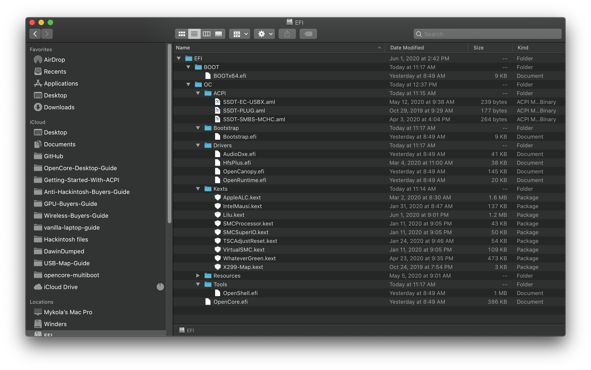
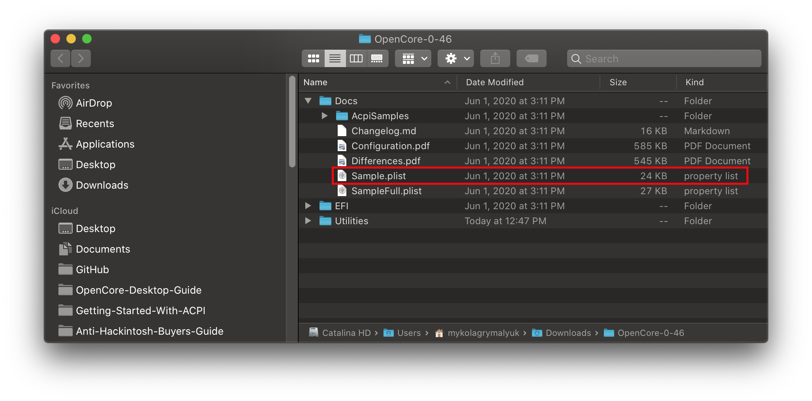
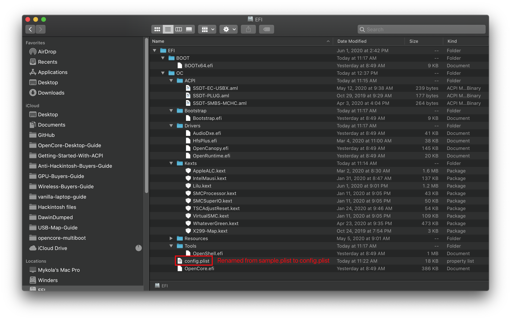

# config.plist 配置

现在，我们已经集齐了我们的内核扩展文件 (.kext)、SSDT 文件 (.aml) 和固件驱动文件 (.efi)，你的 USB 应该看起来是这个样子的：

* **注意**：你的 USB **看起来会与图片中不一样**，因为根据每个人的系统不同，需求也都不同。

## 创建你的 config.plist

首先，我们要从 [OpenCorePkg](https://github.com/acidanthera/OpenCorePkg/releases) 获取示例文件 sample.plist, 这个文件在 `Docs` 目录下：

接下来，我们把这个文件复制到我们 USB 的 EFI 分区（在 Windows 中叫作 BOOT）的 `EFI/OC/` 目录下, 然后将其重命名为 config.plist：

## 添加你的 SSDT、内核扩展和固件驱动

在后面的指南中，你将需要编辑 plist 这种格式的文件。在本指南中，我们将会使用 ProperTree 和 GenSMBIOS 自动化地完成一些繁琐的工作:

* [ProperTree](https://github.com/corpnewt/ProperTree)
  * 通用的 plist 编辑器
* [GenSMBIOS](https://github.com/corpnewt/GenSMBIOS)
  * 用于生成我们的 SMBIOS 数据

下面，我们打开 ProperTree 并用它编辑我们的 config.plist 文件：

* `ProperTree.command`
  * 用于 macOS
  * 高级提示：`Scripts` 目录下有一个 `buildapp.command` 实用程序，可以把 ProperTree 转换为 macOS 的专用应用程序。
* `ProperTree.bat`
  * 用于 Windows

运行 ProperTree 后，通过键盘快捷键 **Cmd/Ctrl + O** 选择 config.plist，在打开的文件选择对话框中选择你 USB 中的 `config.plist` 文件。

打开 config 文件后，按 **Cmd/Ctrl + Shift + R** 并指定基于你的 EFI/OC 文件夹创建一个“纯净快照”：

* 这将会移除 config.plist 中所有的条目并把你所有的 SSDT、内核扩展和固件驱动添加到 config.plist 中
* **Cmd/Ctrl + R** 也可以把你所有文件添加到 config.plist 中，但是如果项目之前被设置为了禁用，这种方式会保持项目的禁用状态。这个方式我们目前用不到，但是以后你在调试和解决问题的时候会非常有用。

完成后，你会发现你所有的 SSDT、内核扩展和固件驱动都已经被输入到了 config.plist 中：

如果你想把这个文件整理一下，可以删除掉 `#WARNING` 条目。虽然把它们留在那里不会引起任何问题，但这可以根据你的个人喜好来完成。

## 选择你的平台

现在到了重要的部分：选择配置的路径。不同的平台有着你需要加入的特殊设置项，所以了解你的硬件非常重要。接下来的步骤请参照下文指引：

### Intel 桌面平台

* 注意: Intel 的 NUC 系列是移动平台的硬件，如果你是这个系列，我们建议参照这篇文章 [Intel 笔记本电脑平台部分](#intel-laptop)

| 代号名称 | 系列 | 发行日期 |
| :--- | :--- | :--- |
| [Yonah、Conroe 和 Penryn](../config.plist/penryn.md) | E8XXX, Q9XXX, [示例 1](https://en.wikipedia.org/wiki/Yonah_(microprocessor))，[示例 2](https://en.wikipedia.org/wiki/Penryn_(microarchitecture)) | 2006-2009 年 |
| [Lynnfield 和 Clarkdale](../config.plist/clarkdale.md) | 5XX-8XX | 2010 年 |
| [Sandy Bridge](../config.plist/sandy-bridge.md) | 2XXX | 2011 年 |
| [Ivy Bridge](../config.plist/ivy-bridge.md) | 3XXX | 2012 年 |
| [Haswell](../config.plist/haswell.md) | 4XXX | 2013-2014 年 |
| [Skylake](../config.plist/skylake.md) | 6XXX | 2015-2016 年 |
| [Kaby Lake](../config.plist/kaby-lake.md) | 7XXX | 2017 年 |
| [Coffee Lake](../config.plist/coffee-lake.md) | 8XXX-9XXX | 2017-2019 年 |
| [Comet Lake](../config.plist/comet-lake.md) | 10XXX | 2020 年 |

### Intel 笔记本电脑平台

| 代号名称 | 系列 | 发行日期 |
| :--- | :--- | :--- |
| [Clarksfield 和 Arrandale](../config-laptop.plist/arrandale.md) | 3XX-9XX | 2010 年 |
| [Sandy Bridge](../config-laptop.plist/sandy-bridge.md) | 2XXX | 2011 年 |
| [Ivy Bridge](../config-laptop.plist/ivy-bridge.md) | 3XXX | 2012 年 |
| [Haswell](../config-laptop.plist/haswell.md) | 4XXX | 2013-2014 年 |
| [Broadwell](../config-laptop.plist/broadwell.md) | 5XXX | 2014-2015 年 |
| [Skylake](../config-laptop.plist/skylake.md) | 6XXX | 2015-2016 年 |
| [Kaby Lake 和 Amber Lake](../config-laptop.plist/kaby-lake.md) | 7XXX | 2017 年 |
| [Coffee Lake 和 Whiskey Lake](../config-laptop.plist/coffee-lake.md) | 8XXX | 2017-2018 年 |
| [Coffee Lake 和 and Comet Lake](../config-laptop.plist/coffee-lake-plus.md) | 9XXX-10XXX | 2019-2020 年 |
| [Ice Lake](../config-laptop.plist/icelake.md) | 10XXX | 2019-2020 年 |

### Intel 高端桌面平台

本章节包含了发烧友和服务器的硬件。

| 代号名称 | 系列 | 发行日期 |
| :--- | :--- | :--- |
| [Nehalem 和 Westmere](../config-HEDT/nehalem.md) | 9XX, X3XXX, X5XXX, [示例 1](https://en.wikipedia.org/wiki/Nehalem_(microarchitecture))，[2](https://en.wikipedia.org/wiki/Westmere_(microarchitecture)) | 2008-2010 年 |
| [Sandy/Ivy Bridge-E](../config-HEDT/ivy-bridge-e.md) | 3XXX, 4XXX | 2011-2013 年 |
| [Haswell-E](../config-HEDT/haswell-e.md) | 5XXX | 2014 年 |
| [Broadwell-E](../config-HEDT/broadwell-e.md) | 6XXX | 2016 年 |
| [Skylake/Cascade Lake-X/W](../config-HEDT/skylake-x.md) | 7XXX, 9XXX, 10XXX | 2017-2019 年 |

### AMD

| 代号名称 | 系列 | 发行日期 |
| :--- | :--- | :--- |
| [Bulldozer/Jaguar](../AMD/fx.md) | [It's weird](https://en.wikipedia.org/wiki/List_of_AMD_processors#Bulldozer_architecture;_Bulldozer,_Piledriver,_Steamroller,_Excavator_(2011%E2%80%932017)) | [AMD was really bad with naming back then](https://en.wikipedia.org/wiki/List_of_AMD_processors#Bulldozer_architecture;_Bulldozer,_Piledriver,_Steamroller,_Excavator_(2011%E2%80%932017)) |
| [Zen](../AMD/zen.md) | 1XXX, 2XXX, 3XXX, 5XXX | 2017-2020 年 |

* 注意: ~~Threadripper 第 3 代（39XX）目前不支持，但是 1 代和 2 代都是支持的~~
  * 最新版的 BIOS 和 OpenCore 已经修复了该问题，所有 Threadripper 平台的 CPU 都已支持。
