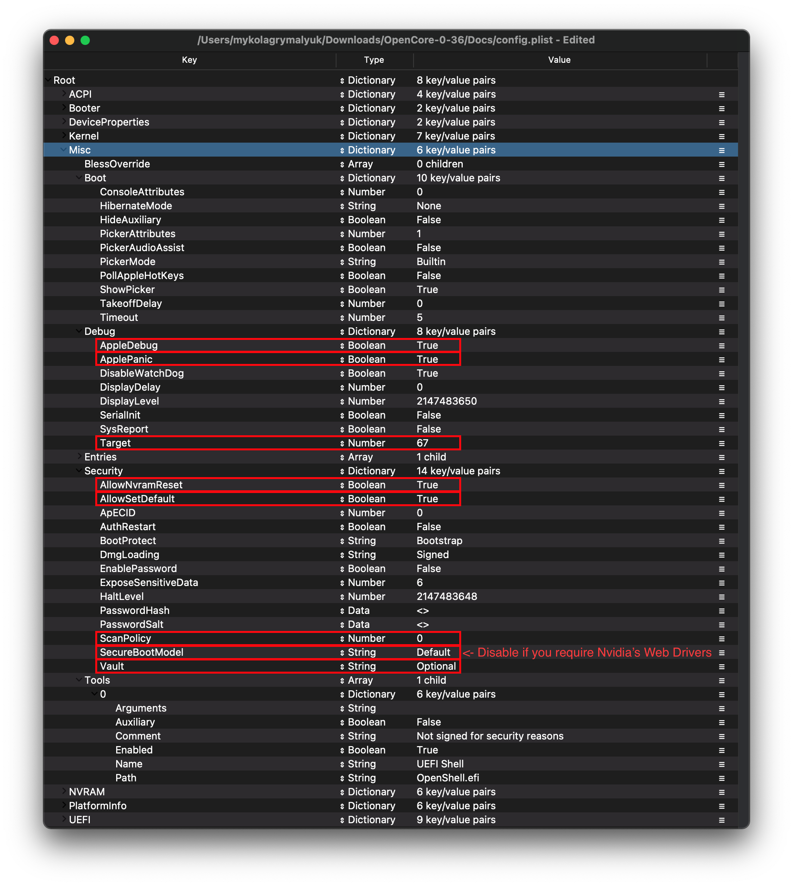

# Desktop Coffee Lake

| 支持 | 版本 |
| :--- | :--- |
| 支持的 OpenCore 版本 | 0.6.5 |
| 初始 macOS 支持 | macOS 10.13, High Sierra |

## 开始之前

制作一个config. plist 可能看起来很难， 然而并不是这样的，它只是需要一些时间，本指南将告诉你如何配置这一切。这也意味着，如果您有问题，请查看配置设置以确保它们正确。使用 OpenCore 需要注意的主要方面：

* **必须定义所有属性**, 没有默认值的 OpenCore 将无法生效，因此 **除非明确告诉节点，否则不要删除节点**. 如果指南未提及该选项，请保留其默认值。
* **Sample.plist 不能直接使用**, 你需要将其更改为适合自己的之后，再将其配置到系统中
* **不要使用任何快速配置工具**, 这些第三方的快速配置工具很少能尊重open core的配置，甚至有一些还会添加clover的属性值和无用的属性值。!

了解这些之后，我们需要一些辅助工具：

* [ProperTree](https://github.com/corpnewt/ProperTree)
  * 通用列表编辑器
* [GenSMBIOS](https://github.com/corpnewt/GenSMBIOS)
  * 用于生成我们的smbios数据
* [Sample/config.plist](https://github.com/acidanthera/OpenCorePkg/releases)
  * 请参阅上一节有关如何获取: [config.plist 安装程序](../config.plist/README.md)

**在设置 OpenCore 之前，请先阅读本指南，并确保按照此指南正确设置。请注意，图像并不总是最新的，所以请阅读它们下面的文本，如果文本中未提及的内容，请保留为默认值。

#**

## ACPI


### Add

::: Tips 信息

在这里，您将为您的系统添加SSDTs, 这些对于 **启动 macOS** 是至关重要的，并且他们还具有许多的用途，比如 [USB 映射](https://dortania.github.io/OpenCore-Post-Install/usb/), [禁用不受支持的 GPUs](../extras/spoof.md)等诸如此类的功能， 对于我们的系统**他是需要可以启动的**。 指南在这里可以找到: [**开始使用 ACPI**](https://dortania.github.io/Getting-Started-With-ACPI/)

对我们来说，我们需要几个 SSDT 来恢复 Clover 提供的功能:

| SSDTs名称 | 描述 |
| :--- | :--- |
| **[SSDT-PLUG](https://dortania.github.io/Getting-Started-With-ACPI/)** | 允许 Haswell 和更新的设备使用本机的 CPU 电源管理，请参阅 [开始使用 ACPI 指南](https://dortania.github.io/Getting-Started-With-ACPI/) 了解更多详情。 |
| **[SSDT-EC-USBX](https://dortania.github.io/Getting-Started-With-ACPI/)** | 修复了嵌入式控制器和 USB 电源，请参阅 [开始使用 ACPI 指南](https://dortania.github.io/Getting-Started-With-ACPI/) 了解更多详情。 |
| **[SSDT-AWAC](https://dortania.github.io/Getting-Started-With-ACPI/)** | 这是 [300 系列RTC补丁](https://www.hackintosh-forum.de/forum/thread/39846-asrock-z390-taichi-ultimate/?pageNo=2), 这些板可防止系统启动 macOS。另一种选择是 [SSDT-RTC0](https://dortania.github.io/Getting-Started-With-ACPI/) f当 Awac Ssdt 由于缺少旧版 Rtc 时钟而不兼容时， 请检查您是否需要它， 以及使用哪个时钟， 请参阅 [开始使用ACPI](https://dortania.github.io/Getting-Started-With-ACPI/) 页面。 |
| **[SSDT-PMC](https://dortania.github.io/Getting-Started-With-ACPI/)** | 因此，真正的 300 系列主板（非 Z370）不会在 ACPI 中声明 FW 芯片为 MMIO，因此 XNU 忽略 UEFI 内存映射声明的 MMIO 区域。此 SSDT 带回了 NVRAM 支持。请查看 [开始使用ACPI指南](https://dortania.github.io/Getting-Started-With-ACPI/) 了解更多详情。 |

请注意， **不应该** 添加生成的 `DSDT.aml` 在这里, 它已经在你的固件中。 因此，如果存在。请从`config.plist`中删除您添加到在EFI/OC/ACPI中的文件。

对于那些想要更深入了解或者更加深入的编辑您的Dsdt,以及如何使用并编译它们，请参阅 [**开始使用 ACPI**](https://dortania.github.io/Getting-Started-With-ACPI/) **页面。** 已经编译好的SSDT具有一个 **.aml** 扩展名(后缀格式) 将其放入文件夹 `EFI/OC/ACPI` **文件夹** 下，并且必须要在 `ACPI -> Add` 中指定。

:::

### Delete

这会阻止某些 ACPI 表加载，因为我们可以忽略这一点。

### Patch

本节允许我们通过 OpenCore 动态修改 ACPI 的部分（DSDT、SSDT 等）。对我们来说，我们的修补程序由我们的 SSDT 处理。这是一个更干净的解决方案， 因为这将使我们能够启动 Windows 和其他操作系统与 OpenCore

### Quirks

与 ACPI 相关的设置，请将此处的所有内容保留为默认值，因为这里的Quirks对于我们没有作用。

## Booter


本节专门介绍与 boot. efi 修补有关与 Openruntime 相关的quirks， 这是 AptiomemoryFix. efi 的替代品

### MmioWhitelist

本节允许设备传递到通常被忽略的 macOS，对于我们来说，我们可以忽略本节。

### Quirks

::: Tips 信息
与 boot.efi 修补和固件修复相关的设置，对于我们来说，我们需要更改以下内容：

| Quirk | Enabled | Comment |
| :--- | :--- | :--- |
| DevirtualiseMmio | YES | |
| EnableWriteUnprotector | NO | |
| ProtectUefiServices | YES | Z390 系列需要 |
| RebuildAppleMemoryMap | YES | |
| SyncRuntimePermissions | YES | |
:::

::: 更加深入的信息

* **AvoidRuntimeDefrag**: YES
  * 修复 UEFI 运行时服务，如日期、时间、NVRAM、电源控制等
* **DevirtualiseMmio**: YES
  * 减少被盗的内存占用，扩展 `slide=N` 值的选项，非常有助于修复Z390上的内存分配问题。在冰湖和Z390咖啡湖上也需要 `ProtectUefiServices` 
* **EnableWriteUnprotector**: NO
  * 这个 quirk 和 RebuildAppleMemoryMap 通常冲突，建议在较新的平台上启用后者并禁用此条目。
  * 然而，由于oem不使用最新EDKII构建的问题，您可能会发现上述组合将导致早期引导失败。这是由于缺少`MEMORY_ATTRIBUTE_TABLE` 因此我们建议禁用 RebuildAppleMemoryMap，启用EnableWriteUnprotector。 更多的信息在 [疑难解答部分](/troubleshooting/extended/kernel-issues.md#stuck-on-eb-log-exitbs-start)中有介绍。
* **ProtectUefiServices**: NO
  * 保护 UEFI 服务不被固件覆盖，主要与虚拟机、Icelake 和 Z390 系列相关'
  * 如果在 Z390 上，请 **启用这个 quirk**
* **RebuildAppleMemoryMap**: YES
  * 生成与 macOS 兼容的内存映射， 可能会中断某些笔记本电脑 OEM 固件， 所以如果您收到早期启动失败禁用此功能
* **SetupVirtualMap**: YES
  * 复 SetVirtual 地址对虚拟地址的呼叫， 不应该需要在 Skylake 和更新。某些固件（如千兆字节）可能仍然需要它，如果没有这个，内核会死机
* **SyncRuntimePermissions**: YES
  * 修复了与 MAT 表的对齐，并且需要使用 MAT 表启动 Windows 和 Linux，也建议用于 macOS。主要与重建苹果记忆地图用户相关

:::

## DeviceProperties


### Add

从地图中设置设备属性。

::: tip PciRoot(0x0)/Pci(0x2,0x0)

这个部分是通过 WhateverGreen设置的 [Framebuffer修补指南](https://github.com/acidanthera/WhateverGreen/blob/master/Manual/FAQ.IntelHD.en.md) 用于设置 iGPU 的属性. **如果你有一个 `-F` 后缀的 CPU, 不用看这一部分，因为您没有IGPU(集成显卡).**

`AAPL,ig-platform-id` 是 macOS 用于确定 iGPU 驱动程序如何与我们的系统交互，两个值之间选择如下：
| AAPL,ig-platform-id | Comment |
| :--- | :--- |
| 07009B3E | 当桌面 iGPU 用于驱动显示器时使用 |
| 00009B3E | 如果 07009B3E 不工作，可替代 |
| 0300913E | 当桌面 iGPU 仅用于计算任务且不驱动显示器时使用 |

* **注意**: 在macOS 10.15.5和更新版本中，使用`07009B3E`,黑屏似乎有很多问题，如果你得到类似的问题，尝试切换到`00009B3E`

我们还增加了两个属性: `framebuffer-patch-enable` 和 `framebuffer-stolenmem`。 第一个可以用过 WhateverGreen.kext 进行补丁， 第二个则将最小窃取内存设置为19MB。这通常是不必要的，因为这可以在BIOS中配置(推荐64MB)，但在不可用时是必需的。

* **注意**: Headless framebuffers(dGPU（独立显卡）是显示出来的) 不需要 `framebuffer-patch-enable` 和 `framebuffer-stolenmem`

如果用户在详细介绍了B360, B365, H310, H370, Z390后出现黑屏问题，请参见 [BusID iGPU patching](https://dortania.github.io/OpenCore-Post-Install/gpu-patching/intel-patching/) 页面

| Key | Type | Value |
| :--- | :--- | :--- |
| AAPL,ig-platform-id | Data | 07009B3E |
| framebuffer-patch-enable | Data | 01000000 |
| framebuffer-stolenmem | Data | 00003001 |

(这是一个桌面UHD 630没有dGPU（独立显卡），没有BIOS选项的iGPU内存的例子)

:::

::: tip PciRoot(0x0)/Pci(0x1b,0x0)

`layout-id`

* 应用 AppleALC 音频注入， 您需要自己研究主板的编解码器，并匹配其AppleALC的布局. [AppleALC 支持的编解码器](https://github.com/acidanthera/AppleALC/wiki/Supported-codecs).
* 您可以直接删除此属性， 因为它目前对我们来说不是必须使用的

对于我们来说，我们将使用`alcid=xxx`参数来引导系统， `alcid` 将覆盖存在的所有其它的布局id。有关此问题的更多信息，请参数 [安装后 页面](https://dortania.github.io/OpenCore-Post-Install/)

:::

### Delete

从地图中删除设备属性，对于我们，我们可以忽略这一点

## Kernel


### Add

Here's where we specify which kexts to load, in what specific order to load, and what architectures each kext is meant for. By default we recommend leaving what ProperTree has done, however for 32-bit CPUs please see below:

::: details More in-depth Info

The main thing you need to keep in mind is:

* Load order
  * Remember that any plugins should load *after* its dependencies
  * This means kexts like Lilu **must** come before VirtualSMC, AppleALC, WhateverGreen, etc

A reminder that [ProperTree](https://github.com/corpnewt/ProperTree) users can run **Cmd/Ctrl + Shift + R** to add all their kexts in the correct order without manually typing each kext out.

* **Arch**
  * Architectures supported by this kext
  * Currently supported values are `Any`, `i386` (32-bit), and `x86_64` (64-bit)
* **BundlePath**
  * Name of the kext
  * ex: `Lilu.kext`
* **Enabled**
  * Self-explanatory, either enables or disables the kext
* **ExecutablePath**
  * Path to the actual executable is hidden within the kext, you can see what path your kext has by right-clicking and selecting `Show Package Contents`. Generally, they'll be `Contents/MacOS/Kext` but some have kexts hidden within under `Plugin` folder. Do note that plist only kexts do not need this filled in.
  * ex: `Contents/MacOS/Lilu`
* **MinKernel**
  * Lowest kernel version your kext will be injected into, see below table for possible values
  * ex. `12.00.00` for OS X 10.8
* **MaxKernel**
  * Highest kernel version your kext will be injected into, see below table for possible values
  * ex. `11.99.99` for OS X 10.7
* **PlistPath**
  * Path to the `info.plist` hidden within the kext
  * ex: `Contents/Info.plist`
  
::: details Kernel Support Table

| OS X Version | MinKernel | MaxKernel |
| :--- | :--- | :--- |
| 10.4 | 8.0.0 | 8.99.99 |
| 10.5 | 9.0.0 | 9.99.99 |
| 10.6 | 10.0.0 | 10.99.99 |
| 10.7 | 11.0.0 | 11.99.99 |
| 10.8 | 12.0.0 | 12.99.99 |
| 10.9 | 13.0.0 | 13.99.99 |
| 10.10 | 14.0.0 | 14.99.99 |
| 10.11 | 15.0.0 | 15.99.99 |
| 10.12 | 16.0.0 | 16.99.99 |
| 10.13 | 17.0.0 | 17.99.99 |
| 10.14 | 18.0.0 | 18.99.99 |
| 10.15 | 19.0.0 | 19.99.99 |
| 11 | 20.0.0 | 20.99.99 |

:::

### Emulate

Needed for spoofing unsupported CPUs like Pentiums and Celerons

* **CpuidMask**: Leave this blank
* **CpuidData**: Leave this blank

### Force

Used for loading kexts off system volume, only relevant for older operating systems where certain kexts are not present in the cache(ie. IONetworkingFamily in 10.6).

For us, we can ignore.

### Block

Blocks certain kexts from loading. Not relevant for us.

### Patch

Patches both the kernel and kexts.

### Quirks

::: tip Info

Settings relating to the kernel, for us we'll be enabling the following:

| Quirk | Enabled | Comment |
| :--- | :--- | :--- |
| AppleXcpmCfgLock | YES | Not needed if `CFG-Lock` is disabled in the BIOS |
| DisableIOMapper | YES | Not needed if `VT-D` is disabled in the BIOS |
| LapicKernelPanic | NO | HP Machines will require this quirk |
| PanicNoKextDump | YES | |
| PowerTimeoutKernelPanic | YES | |
| XhciPortLimit | YES | |

:::

::: details More in-depth Info

* **AppleCpuPmCfgLock**: NO
  * Only needed when CFG-Lock can't be disabled in BIOS
  * Only applicable for Ivy Bridge and older
    * Note: Broadwell and older require this when running 10.10 or older
* **AppleXcpmCfgLock**: YES
  * Only needed when CFG-Lock can't be disabled in BIOS
  * Only applicable for Haswell and newer
    * Note: Ivy Bridge-E is also included as it's XCPM capable
* **CustomSMBIOSGuid**: NO
  * Performs GUID patching for UpdateSMBIOSMode set to `Custom`. Usually relevant for Dell laptops
  * Enabling this quirk with UpdateSMBIOSMode Custom mode can also disable SMBIOS injection into "non-Apple" OSes however we do not endorse this method as it breaks Bootcamp compatibility. Use at your own risk
* **DisableIoMapper**: YES
  * Needed to get around VT-D if either unable to disable in BIOS or needed for other operating systems, much better alternative to `dart=0` as SIP can stay on in Catalina
* **DisableLinkeditJettison**: YES
  * Allows Lilu and others to have more reliable performance without `keepsyms=1`
* **DisableRtcChecksum**: NO
  * Prevents AppleRTC from writing to primary checksum (0x58-0x59), required for users who either receive BIOS reset or are sent into Safe mode after reboot/shutdown
* **ExtendBTFeatureFlags** NO
  * Helpful for those having continuity issues with non-Apple/non-Fenvi cards
* **LapicKernelPanic**: NO
  * Disables kernel panic on AP core lapic interrupt, generally needed for HP systems. Clover equivalent is `Kernel LAPIC`
* **LegacyCommpage**: NO
  * Resolves SSSE3 requirement for 64 Bit CPUs in macOS, mainly relevant for 64-Bit Pentium 4 CPUs(ie. Prescott)
* **PanicNoKextDump**: YES
  * Allows for reading kernel panics logs when kernel panics occur
* **PowerTimeoutKernelPanic**: YES
  * Helps fix kernel panics relating to power changes with Apple drivers in macOS Catalina, most notably with digital audio.
* **XhciPortLimit**: YES
  * This is actually the 15 port limit patch, don't rely on it as it's not a guaranteed solution for fixing USB. Please create a [USB map](https://dortania.github.io/OpenCore-Post-Install/usb/) when possible.

The reason being is that UsbInjectAll reimplements builtin macOS functionality without proper current tuning. It is much cleaner to just describe your ports in a single plist-only kext, which will not waste runtime memory and such

:::

### Scheme

Settings related to legacy booting(ie. 10.4-10.6), for majority you can skip however for those planning to boot legacy OSes you can see below:

::: details More in-depth Info

* **FuzzyMatch**: True
  * Used for ignoring checksums with kernelcache, instead opting for the latest cache available. Can help improve boot performance on many machines in 10.6
* **KernelArch**: x86_64
  * Set the kernel's arch type, you can choose between `Auto`, `i386` (32-bit), and `x86_64` (64-bit).
  * If you're booting older OSes which require a 32-bit kernel(ie. 10.4 and 10.5) we recommend to set this to `Auto` and let macOS decide based on your SMBIOS. See below table for supported values:
    * 10.4-10.5 — `x86_64`, `i386` or `i386-user32`
      * `i386-user32` refers 32-bit userspace, so 32-bit CPUs must use this(or CPUs missing SSSE3)
      * `x86_64` will still have a 32-bit kernelspace however will ensure 64-bit userspace in 10.4/5
    * 10.6 — `i386`, `i386-user32`, or `x86_64`
    * 10.7 — `i386` or `x86_64`
    * 10.8 or newer — `x86_64`

* **KernelCache**: Auto
  * Set kernel cache type, mainly useful for debugging and so we recommend `Auto` for best support

:::

## Misc



### Boot

Settings for boot screen (Leave everything as default).

### Debug

::: tip Info

Helpful for debugging OpenCore boot issues(We'll be changing everything *but* `DisplayDelay`):

| Quirk | Enabled |
| :--- | :--- |
| AppleDebug | YES |
| ApplePanic | YES |
| DisableWatchDog | YES |
| Target | 67 |

:::

::: details More in-depth Info

* **AppleDebug**: YES
  * Enables boot.efi logging, useful for debugging. Note this is only supported on 10.15.4 and newer
* **ApplePanic**: YES
  * Attempts to log kernel panics to disk
* **DisableWatchDog**: YES
  * Disables the UEFI watchdog, can help with early boot issues
* **DisplayLevel**: `2147483650`
  * Shows even more debug information, requires debug version of OpenCore
* **SerialInit**: NO
  * Needed for setting up serial output with OpenCore
* **SysReport**: NO
  * Helpful for debugging such as dumping ACPI tables
  * Note that this is limited to DEBUG versions of OpenCore
* **Target**: `67`
  * Shows more debug information, requires debug version of OpenCore

These values are based of those calculated in [OpenCore debugging](../troubleshooting/debug.md)

:::

### Security

::: tip Info

Security is pretty self-explanatory, **do not skip**. We'll be changing the following:

| Quirk | Enabled | Comment |
| :--- | :--- | :--- |
| AllowNvramReset | YES | |
| AllowSetDefault | YES | |
| BlacklistAppleUpdate | YES | |
| ScanPolicy | 0 | |
| SecureBootModel | Default |  This is a word and is case-sensitive, set to `Disabled` if you do not want secure boot(ie. you require Nvidia's Web Drivers) |
| Vault | Optional | This is a word, it is not optional to omit this setting. You will regret it if you don't set it to Optional, note that it is case-sensitive |

:::

::: details More in-depth Info

* **AllowNvramReset**: YES
  * Allows for NVRAM reset both in the boot picker and when pressing `Cmd+Opt+P+R`
* **AllowSetDefault**: YES
  * Allow `CTRL+Enter` and `CTRL+Index` to set default boot device in the picker
* **ApECID**: 0
  * Used for netting personalized secure-boot identifiers, currently this quirk is unreliable due to a bug in the macOS installer so we highly encourage you to leave this as default.
* **AuthRestart**: NO
  * Enables Authenticated restart for FileVault 2 so password is not required on reboot. Can be considered a security risk so optional
* **BlacklistAppleUpdate**: YES
  * Used for blocking firmware updates, used as extra level of protection as macOS Big Sur no longer uses `run-efi-updater` variable
* **BootProtect**: None
  * Allows the use of Bootstrap.efi inside EFI/OC/Bootstrap instead of BOOTx64.efi, useful for those wanting to either boot with rEFInd or avoid BOOTx64.efi overwrites from Windows. Proper use of this quirks is covered here: [Using Bootstrap.efi](https://dortania.github.io/OpenCore-Post-Install/multiboot/bootstrap.html)
* **DmgLoading**: Signed
  * Ensures only signed DMGs load
* **ExposeSensitiveData**: `6`
  * Shows more debug information, requires debug version of OpenCore
* **Vault**: `Optional`
  * We won't be dealing vaulting so we can ignore, **you won't boot with this set to Secure**
  * This is a word, it is not optional to omit this setting. You will regret it if you don't set it to `Optional`, note that it is case-sensitive
* **ScanPolicy**: `0`
  * `0` allows you to see all drives available, please refer to [Security](https://dortania.github.io/OpenCore-Post-Install/universal/security.html) section for further details. **Will not boot USB devices with this set to default**
* **SecureBootModel**: Default
  * Enables Apple's secure boot functionality in macOS, please refer to [Security](https://dortania.github.io/OpenCore-Post-Install/universal/security.html) section for further details.
  * Note: Users may find upgrading OpenCore on an already installed system can result in early boot failures. To resolve this, see here: [Stuck on OCB: LoadImage failed - Security Violation](/troubleshooting/extended/kernel-issues.md#stuck-on-ocb-loadimage-failed-security-violation)

:::

### Tools

Used for running OC debugging tools like the shell, ProperTree's snapshot function will add these for you.

### Entries

Used for specifying irregular boot paths that can't be found naturally with OpenCore.

Won't be covered here, see 8.6 of [Configuration.pdf](https://github.com/acidanthera/OpenCorePkg/blob/master/Docs/Configuration.pdf) for more info

## NVRAM


### Add

::: tip 4D1EDE05-38C7-4A6A-9CC6-4BCCA8B38C14

Used for OpenCore's UI scaling, default will work for us. See in-depth section for more info

:::

::: details More in-depth Info

Booter Path, mainly used for UI Scaling

* **UIScale**:
  * `01`: Standard resolution
  * `02`: HiDPI (generally required for FileVault to function correctly on smaller displays)

* **DefaultBackgroundColor**: Background color used by boot.efi
  * `00000000`: Syrah Black
  * `BFBFBF00`: Light Gray

:::

::: tip 4D1FDA02-38C7-4A6A-9CC6-4BCCA8B30102

OpenCore's NVRAM GUID, mainly relevant for RTCMemoryFixup users

:::

::: details More in-depth Info

* **rtc-blacklist**: <>
  * To be used in conjunction with RTCMemoryFixup, see here for more info: [Fixing RTC write issues](https://dortania.github.io/OpenCore-Post-Install/misc/rtc.html#finding-our-bad-rtc-region)
  * Most users can ignore this section

:::

::: tip 7C436110-AB2A-4BBB-A880-FE41995C9F82

System Integrity Protection bitmask

* **General Purpose boot-args**:

| boot-args | Description |
| :--- | :--- |
| **-v** | This enables verbose mode, which shows all the behind-the-scenes text that scrolls by as you're booting instead of the Apple logo and progress bar. It's invaluable to any Hackintosher, as it gives you an inside look at the boot process, and can help you identify issues, problem kexts, etc. |
| **debug=0x100** | This disables macOS's watchdog which helps prevents a reboot on a kernel panic. That way you can *hopefully* glean some useful info and follow the breadcrumbs to get past the issues. |
| **keepsyms=1** | This is a companion setting to debug=0x100 that tells the OS to also print the symbols on a kernel panic. That can give some more helpful insight as to what's causing the panic itself. |
| **alcid=1** | Used for setting layout-id for AppleALC, see [supported codecs](https://github.com/acidanthera/applealc/wiki/supported-codecs) to figure out which layout to use for your specific system. More info on this is covered in the [Post-Install Page](https://dortania.github.io/OpenCore-Post-Install/) |

* **GPU-Specific boot-args**:

| boot-args | Description |
| :--- | :--- |
| **agdpmod=pikera** | Used for disabling boardID on Navi GPUs(RX 5000 series), without this you'll get a black screen. **Don't use if you don't have Navi**(ie. Polaris and Vega cards shouldn't use this) |
| **nvda_drv_vrl=1** | Used for enabling Nvidia's Web Drivers on Maxwell and Pascal cards in Sierra and HighSierra |
| **-wegnoegpu** | Used for disabling all other GPUs than the integrated Intel iGPU, useful for those wanting to run newer versions of macOS where their dGPU isn't supported |

* **csr-active-config**: `00000000`
  * Settings for 'System Integrity Protection' (SIP). It is generally recommended to change this with `csrutil` via the recovery partition.
  * csr-active-config by default is set to `00000000` which enables System Integrity Protection. You can choose a number of different values but overall we recommend keeping this enabled for best security practices. More info can be found in our troubleshooting page: [Disabling SIP](../troubleshooting/extended/post-issues.md#disabling-sip)

* **run-efi-updater**: `No`
  * This is used to prevent Apple's firmware update packages from installing and breaking boot order; this is important as these firmware updates (meant for Macs) will not work.

* **prev-lang:kbd**: <>
  * Needed for non-latin keyboards in the format of `lang-COUNTRY:keyboard`, recommended to keep blank though you can specify it(**Default in Sample config is Russian**):
  * American: `en-US:0`(`656e2d55533a30` in HEX)
  * Full list can be found in [AppleKeyboardLayouts.txt](https://github.com/acidanthera/OpenCorePkg/blob/master/Utilities/AppleKeyboardLayouts/AppleKeyboardLayouts.txt)
  * Hint: `prev-lang:kbd` can be changed into a String so you can input `en-US:0` directly instead of converting to HEX

| Key | Type | Value |
| :--- | :--- | :--- |
| prev-lang:kbd | String | en-US:0 |

:::

### Delete

::: tip Info

Forcibly rewrites NVRAM variables, do note that `Add` **will not overwrite** values already present in NVRAM so values like `boot-args` should be left alone. For us, we'll be changing the following:

| Quirk | Enabled |
| :--- | :--- |
| WriteFlash | YES |

:::

::: details More in-depth Info

* **LegacyEnable**: NO
  * Allows for NVRAM to be stored on nvram.plist, needed for systems without native NVRAM

* **LegacyOverwrite**: NO
  * Permits overwriting firmware variables from nvram.plist, only needed for systems without native NVRAM

* **LegacySchema**
  * Used for assigning NVRAM variables, used with LegacyEnable set to YES

* **WriteFlash**: YES
  * Enables writing to flash memory for all added variables.

:::

## PlatformInfo


::: tip Info

For setting up the SMBIOS info, we'll use CorpNewt's [GenSMBIOS](https://github.com/corpnewt/GenSMBIOS) application.

For this Coffee Lake example, we'll chose the iMac19,1 SMBIOS - this is done intentionally for compatibility's sake. There are two main SMBIOS used for Coffee Lake:

| SMBIOS | Hardware |
| :--- | :--- |
| iMac19,1 | For Mojave and newer |
| iMac18,3 | For High Sierra and older |

* You'll use 18,3 when you have a Pascal or Maxwell dGPU and are limited to versions of macOS with Web Drivers

Run GenSMBIOS, pick option 1 for downloading MacSerial and Option 3 for selecting out SMBIOS.  This will give us an output similar to the following:

```sh
  #######################################################
 #               iMac19,1 SMBIOS Info                  #
#######################################################

Type:         iMac19,1
Serial:       C02XG0FDH7JY
Board Serial: C02839303QXH69FJA
SmUUID:       DBB364D6-44B2-4A02-B922-AB4396F16DA8
```

The `Type` part gets copied to Generic -> SystemProductName.

The `Serial` part gets copied to Generic -> SystemSerialNumber.

The `Board Serial` part gets copied to Generic -> MLB.

The `SmUUID` part gets copied to Generic -> SystemUUID.

We set Generic -> ROM to either an Apple ROM (dumped from a real Mac), your NIC MAC address, or any random MAC address (could be just 6 random bytes, for this guide we'll use `11223300 0000`. After install follow the [Fixing iServices](https://dortania.github.io/OpenCore-Post-Install/universal/iservices.html) page on how to find your real MAC Address)

**Reminder that you want either an invalid serial or valid serial numbers but those not in use, you want to get a message back like: "Invalid Serial" or "Purchase Date not Validated"**

[Apple Check Coverage page](https://checkcoverage.apple.com)

**Automatic**: YES

* Generates PlatformInfo based on Generic section instead of DataHub, NVRAM, and SMBIOS sections

:::

### Generic

::: details More in-depth Info

* **AdviseWindows**: NO
  * Used for when the EFI partition isn't first on the Windows drive

* **SystemMemoryStatus**: Auto
  * Sets whether memory is soldered or not in SMBIOS info, purely cosmetic and so we recommend `Auto`
  
* **ProcessorType**: `0`
  * Set to `0` for automatic type detection, however this value can be overridden if desired. See [AppleSmBios.h](https://github.com/acidanthera/OpenCorePkg/blob/master/Include/Apple/IndustryStandard/AppleSmBios.h) for possible values

* **SpoofVendor**: YES
  * Swaps vendor field for Acidanthera, generally not safe to use Apple as a vendor in most case

* **UpdateDataHub**: YES
  * Update Data Hub fields

* **UpdateNVRAM**: YES
  * Update NVRAM fields

* **UpdateSMBIOS**: YES
  * Updates SMBIOS fields

* **UpdateSMBIOSMode**: Create
  * Replace the tables with newly allocated EfiReservedMemoryType, use `Custom` on Dell laptops requiring `CustomSMBIOSGuid` quirk
  * Setting to `Custom` with `CustomSMBIOSGuid` quirk enabled can also disable SMBIOS injection into "non-Apple" OSes however we do not endorse this method as it breaks Bootcamp compatibility. Use at your own risk

:::

## UEFI


**ConnectDrivers**: YES

* Forces .efi drivers, change to NO will automatically connect added UEFI drivers. This can make booting slightly faster, but not all drivers connect themselves. E.g. certain file system drivers may not load.

### Drivers

Add your .efi drivers here.

Only drivers present here should be:

* HfsPlus.efi
* OpenRuntime.efi

### APFS

Settings related to the APFS driver, leave everything here as default.

### Audio

Related to AudioDxe settings, for us we'll be ignoring(leave as default). This is unrelated to audio support in macOS.

* For further use of AudioDxe and the Audio section, please see the Post Install page: [Add GUI and Boot-chime](https://dortania.github.io/OpenCore-Post-Install/)

### Input

Related to boot.efi keyboard passthrough used for FileVault and Hotkey support, leave everything here as default as we have no use for these quirks. See here for more details: [Security and FileVault](https://dortania.github.io/OpenCore-Post-Install/)

### Output

Relating to OpenCore's visual output,  leave everything here as default as we have no use for these quirks.

### ProtocolOverrides

Mainly relevant for Virtual machines, legacy macs and FileVault users. See here for more details: [Security and FileVault](https://dortania.github.io/OpenCore-Post-Install/)

### Quirks

::: tip Info
Relating to quirks with the UEFI environment, for us we'll be changing the following:

| Quirk | Enabled | Comment |
| :--- | :--- | :--- |
| UnblockFsConnect | NO | Needed mainly by HP motherboards |

:::

::: details More in-depth Info

* **RequestBootVarRouting**: YES
  * Redirects AptioMemoryFix from `EFI_GLOBAL_VARIABLE_GUID` to `OC_VENDOR_VARIABLE_GUID`. Needed for when firmware tries to delete boot entries and is recommended to be enabled on all systems for correct update installation, Startup Disk control panel functioning, etc.

* **UnblockFsConnect**: NO
  * Some firmware block partition handles by opening them in By Driver mode, which results in File System protocols being unable to install. Mainly relevant for HP systems when no drives are listed

:::

### ReservedMemory

Used for exempting certain memory regions from OSes to use, mainly relevant for Sandy Bridge iGPUs or systems with faulty memory. Use of this quirk is not covered in this guide

## Cleaning up

And now you're ready to save and place it into your EFI under EFI/OC.

For those having booting issues, please make sure to read the [Troubleshooting section](../troubleshooting/troubleshooting.md) first and if your questions are still unanswered we have plenty of resources at your disposal:

* [r/Hackintosh Subreddit](https://www.reddit.com/r/hackintosh/)
* [r/Hackintosh Discord](https://discord.gg/2QYd7ZT)

**Sanity check**:

So thanks to the efforts of Ramus, we also have an amazing tool to help verify your config for those who may have missed something:

* [**Sanity Checker**](https://opencore.slowgeek.com)

Note that this tool is neither made nor maintained by Dortania, any and all issues with this site should be sent here: [Sanity Checker Repo](https://github.com/rlerdorf/OCSanity)

## Intel BIOS settings

* Note: Most of these options may not be present in your firmware, we recommend matching up as closely as possible but don't be too concerned if many of these options are not available in your BIOS

### Disable

* Fast Boot
* Secure Boot
* Serial/COM Port
* Parallel Port
* VT-d (can be enabled if you set `DisableIoMapper` to YES)
* CSM
* Thunderbolt(For initial install, as Thunderbolt can cause issues if not setup correctly)
* Intel SGX
* Intel Platform Trust
* CFG Lock (MSR 0xE2 write protection)(**This must be off, if you can't find the option then enable `AppleXcpmCfgLock` under Kernel -> Quirks. Your hack will not boot with CFG-Lock enabled**)

### Enable

* VT-x
* Above 4G decoding
* Hyper-Threading
* Execute Disable Bit
* EHCI/XHCI Hand-off
* OS type: Windows 8.1/10 UEFI Mode
* DVMT Pre-Allocated(iGPU Memory): 64MB
* SATA Mode: AHCI

# Now with all this done, head to the [Installation Page](../installation/installation-process.md)
