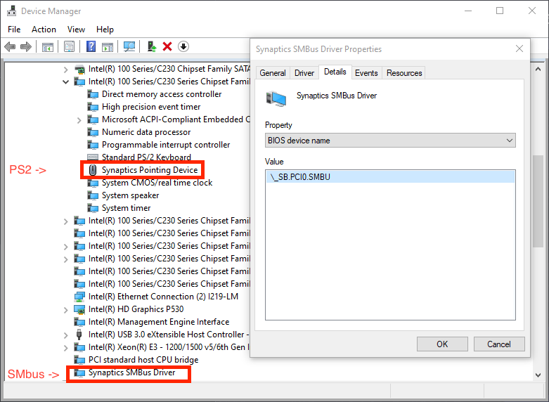
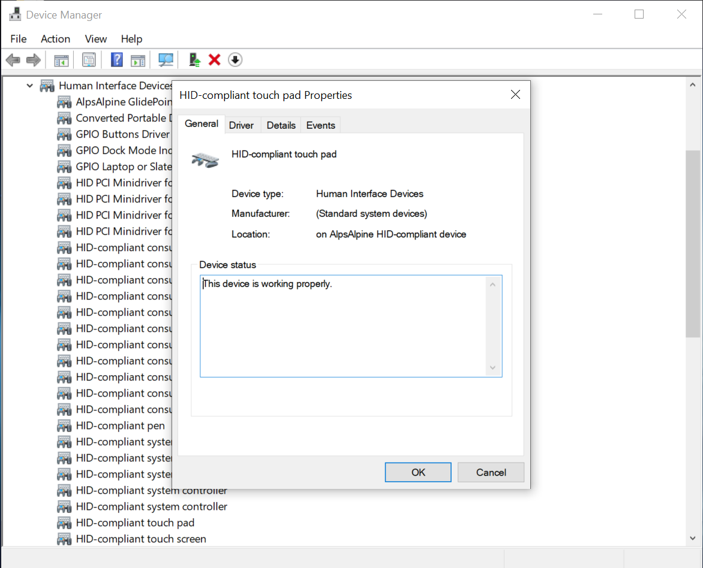

# 查找你的硬件

这一部分几乎是最精简的指南，注重于怎样查找你的正在运行的硬件；这主要和笔记本电脑和预编译用户有关，因为硬件规格更难以获取到。如果你已经知道了你拥有的硬件，那你可以跳过此页面，去到[创建 USB](./installer-guide/) 页面。

对于此指南，我们将会假设你已经安装了 Windows 或 Linux：

* [使用 Windows 查找硬件](#使用-windows-查找硬件)
* [使用 Linux 查找硬件](#使用-linux-查找硬件)

## 使用 Windows 查找硬件

对于我们，主要有 2 个选项：

* Windows 的内置设备管理器
* [AIDA64](https://www.aida64.com/downloads)

由于使用 GUI 更为简单，所以我们推荐下载 AIDA64 并运行，因为这会使查看规格更简单些。但我们也会同时教你以上两种查看硬件规格的方法。

### CPU 型号

| AIDA64 | 设备管理器|
| :--- | :--- |
|  |  |

### GPU 型号

| AIDA64 | 设备管理器|
| :--- | :--- |
|  |  |

### 芯片组型号

| AIDA64 | 设备管理器|
| :--- | :--- |
|  |  |

* 注意：基于 Intel SOC 的 CPU 将会在同一封装内拥有芯片组和其他功能，以替代实体芯片组。这意味着尝试寻找准确的芯片组会更难一些

### 键盘、触摸板和触控屏幕连接类型

| 设备管理器 |
| :--- |
|  |

很遗憾，AIDA64 没有提供任何关于触控设备的有用的信息，所以我们将会使用设备管理器来查找。

* 你可以找到如下这些设备：
  * `Human Interface Devices`（`人体学输入设备`）
  * `Keyboards`（`键盘`）
  * `Mice and other Pointer Devices`（`鼠标和其他触控设备`）

* 选择 `View -> Device by Connection`（`查看 -> 按连接列出设备`）以查看设备的准确连接类型。这将清晰说明设备是否通过 PS2、I2C、SMBus 或 USB 等进行连接

根据设备的不同，它可能显示在多个名称和连接中。这是你需要特别注意的地方：

::: details SMBus

这里会显示一些直连至 PCI 的设备，例如 `Synaptics SMBus Driver` 或者 `ELAN SMBus Driver`

* Synaptics 的设备将会在 PS2 中显示 `Synaptics PS2 device` 或 `Synaptics Pointing Device` 并在 PCI 中显示 `Synaptics SMBus Driver`



就如你所看到的，在图片的左侧，我们获得了 2 个 Synaptics 的设备，然而如果我们先，我们就会发现上方的设备连接到了 PS2，而下方的设备连接到了 SMBus。因此你可以在这两种模式中的任何一种模式下使用触控版，SMBus 通常能提供更高的精确度和更好的手势支持。

:::

::: details USB

| 按类型列出设备 | 按连接列出设备 |
| :--- | :--- |
|  | 

这将会显示为 `PS2 Compliant Trackpad`，在我们将视图显示为`按连接列出设备`也会显示为在 USB 中

:::

::: details I2C


这些将会几乎总是显示为一个 Microsoft HID 设备，尽管它们可以也可以和其他触控版一同出现。但是他们总是显示在 I2C 中。

:::

### 音频适配器

| AIDA64 | 设备管理器|
| :--- | :--- |
|  |  |

由于很多的设备制造商（OEM）都提供了设备的名称，在设备管理器中通过 PCI ID（例如 pci 14F1,50F4）就能得到最精确的信息。这意味着你需要百度/谷歌搜索这个 ID 以得出准确的设备 ID，然而 AIDA64 可以完全提供设备名称，使得在最终用户手里更容易使用。

### 网络控制器型号

| AIDA64 | 设备管理器|
| :--- | :--- |
|  |  |

由于很多的设备制造商（OEM）都提供了设备的名称，在设备管理器中通过 PCI ID（例如 `PCI\VEN_14E4&DEV_43A0` 就符合 `14E4` 的制造商 ID 和 `43A0` 的设备 ID）。这意味着你需要百度/谷歌搜索这个 ID 以得出准确的设备 ID，然而 AIDA64 可以完全提供设备名称，使得在最终用户手里更容易使用。

### 驱动器型号

| AIDA64 | 设备管理器|
| :--- | :--- |
|  |  |

由于设备制造商不会提供大量关于你的驱动器的信息，所以你需要百度/谷歌搜索一下，以查看哪个驱动器对应显示的名称。

## 使用 Linux 查找你的硬件

为了在 Linux 中查找你的硬件，我们需要用到以下一些工具：

* `cat`
* `pciutils`
* `dmidecode`

你会在下方看到一个可以在终端中运行的命令的列表，较好的一点是很多的 Linux 发行版自带了这些工具。如果没有，你很可能可以在发行版的软件包管理器中找到它们。

### CPU 型号

```sh
cat /proc/cpuinfo | grep 'model name'
```

### GPU 型号

```sh
lspci | grep -i --color 'vga\|3d\|2d'
```

### 芯片组型号

```sh
dmidecode -t baseboard
```

### 键盘、触摸板和触控屏幕连接类型

```sh
dmesg |grep -i 'input'
```

### 音频适配器

```sh
aplay -l
```

### 网络控制器型号

基本信息：

```sh
lspci | grep -i 'network'
```

更多深层的信息：

```sh
lshw -class network
```

### 驱动器型号

```sh
lshw -class disk -class storage
```
