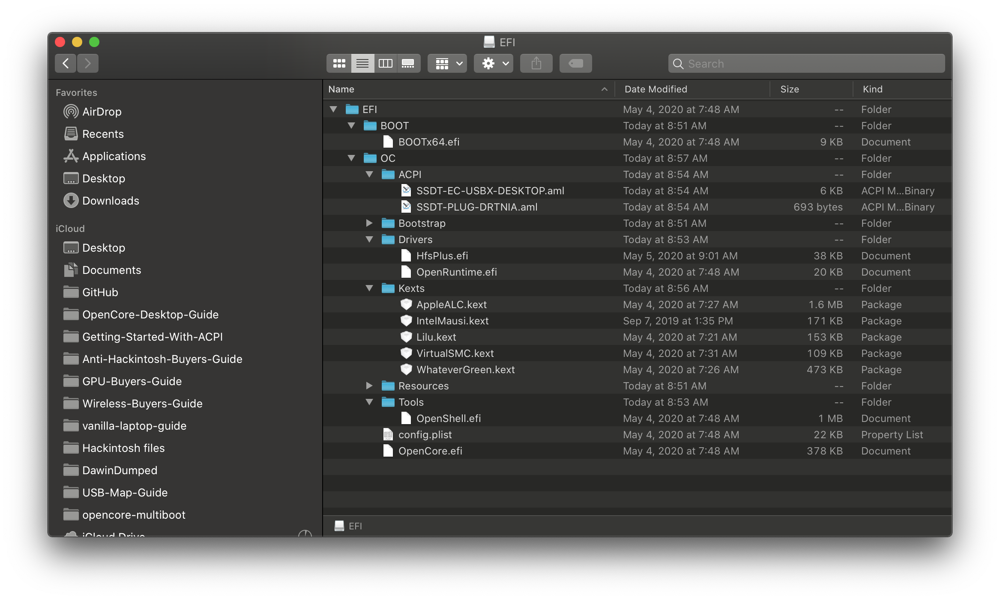

# 安装过程

现在您已经配置好 OpenCore，可以尝试启动了，有以下要点：

* 为 macOS 调整好 BIOS 设定
* 阅读 [多系统引导指南](https://hackintosh-multiboot.gitbook.io/hackintosh-multiboot/) 并查看 [多系统引导](https://dortania.github.io/OpenCore-Post-Install/multiboot/bootstrap.html#prerequisites) 专用的配置项
  * 主要和这些单硬盘多系统的电脑有关
* 备好一份 [基本故障排除](../troubleshooting/troubleshooting.md)
* 阅读并了解 [macOS 启动过程](../troubleshooting/boot.md)
  * 对于第一次安装的新手，了解这个对于判断卡在什么位置有帮助
* 以及充足的耐心

## 再次检查您配置完成的 EFI

最后，在启动安装器之前，您应该再次检查您的 EFI 是否被正确配置：

优秀的 EFI          |  糟糕的 EFI
:-------------------------:|:-------------------------:
  |  
EFI 分区里存在 EFI 文件夹 | 缺少 EFI 文件夹
ACPI 文件都经过编译(.aml) | ACPI 文件没有被编译(.dsl)
不包含 DSDT | 包含了 DSDT
移除了 Drivers 文件夹里不需要的文件 (.efi) | Drivers 文件夹下的文件保持默认
移除了 Tools 文件夹里不需要的文件 (.efi) | Tools 文件夹下的文件保持默认
需要的文件都位于 Kexts 文件夹里，且扩展名为 .kext | 带有源代码或者其他文件夹
EFI/OC 下有 config.plist | .plist 文件没有被正确命名或者放置到了错误的位置
只有需要的内核扩展被添加 | 所有列出的内核扩展都被添加了

然后，slowgeek 的网站可以是帮您检查 EFI 的好伙伴：

* [Sanity Checker](https://opencore.slowgeek.com)

## 从 USB 启动 OpenCore

现在，准备工作已经完成，将您的 USB 驱动器连接您的电脑，然后从它启动。要注意的是一些笔记本或者台式电脑会优先启动内置硬盘里的 Windows，您可能需要手动在 BIOS 启动选项中选择来引导启动 OpenCore。 您可以通过查看用户手册或者尝试百度或谷歌来找出进入 BIOS 设定或者 BIOS 启动选项的 Fn 按钮（如 Esc、F2、F10 或者 F12）

当您从 USB 启动 OpenCore 后，您应该会看到以下启动项:

1. Windows
2. macOS Base System (External) 或者是 Install macOS Big Sur (External)
3. OpenShell.efi
4. Reset NVRAM

我们应该选择 **第二个** 启动项。这个启动项的名称取决于您的 USB 启动盘是在什么平台上被制作的，如果是在 Linux 或者 Windows 下制作的启动盘，它可能会显示为 **“macOS Base System (External)”**，如果是在 macOS 下制作的，则会显示为 **“Install macOS Catalina (External)”**

## macOS 安装器

最终，我们启动了 macOS 安装器，并在跑完码后进入了 macOS 安装器！我们已经距离成功不远了，一些要注意的点是：

* 将要安装 macOS 的硬盘 **必须** 是 GUID 分区表 **并且** 格式化为 APFS 分区
  * 安装在机械硬盘上的 High Sierra 以及所有的 Sierra 版本系统都需要使用 macOS 日志式（HFS+）
* 这个硬盘 **必须** 拥有一个大于 200MB 的 EFI 分区
  * 默认情况下，macOS 在抹掉空盘时会留下一个 200MB 的 EFI 分区
  * 阅读 [多系统引导指南](https://hackintosh-multiboot.gitbook.io/hackintosh-multiboot/) 来了解如何在一个装有 Windows 的硬盘上分区

一旦您开始安装 macOS，您需要等待系统进行安装直到自动重启。在重启后，您需要再次启动到 OpenCore, 不过这次我们不再是选择安装器或者恢复环境（recovery） - 您需要选择硬盘上的 **macOS Installer** 来完成进一步的安装。您应该会看到苹果标志，并在下方看到计时器“剩余 x 分钟”。现在您可以喝点饮料或者吃点零食什么的来消磨时间，电脑会自动重启数次完成安装。如果一切顺利，您将会看到“配置您的 Mac 页面”。

您已经成功进入系统了! 🎉

您接下来需要查看[安装后指南](https://dortania.github.io/OpenCore-Post-Install/)来继续完善您的系统
