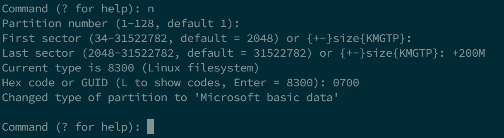
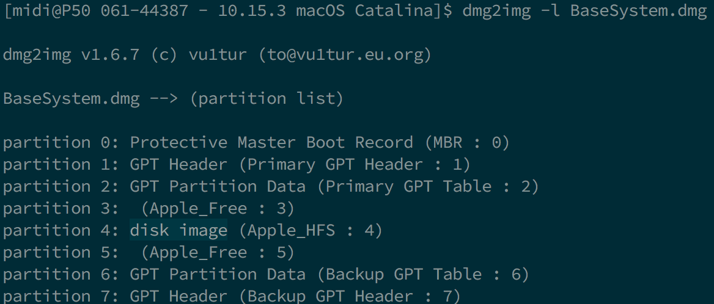

# 在 Linux 中制作安装器

* 支持的版本：0.6.4

虽然你不需要进行一次完全重新安装以使用 OpenCore，但是建议一些用户对他们的引导管理器升级进行完全的重新安排。

你需要依赖这些来开始：

* 4GB USB 驱动器
* [macrecovery.py](https://github.com/acidanthera/OpenCorePkg/releases)
* 注意：0.6.4 和更低版本的 macrecovery.py 构建是损坏的，你需要[下载 master 分支的副本](https://github.com/acidanthera/OpenCorePkg/archive/master.zip)并使用放置于 `Utilities/macrecovery/` 目录下的那一个

## 下载 macOS

我们现在开始，首先 cd 到 [macrecovery 所在的目录](https://github.com/acidanthera/OpenCorePkg/releases)然后运行下方的命令：


```sh
# 将下方的命令中的目录调整为正确的
cd ~/Downloads/OpenCore-0/Utilities/macrecovery/
```

接着，取决于你想要启动什么操作系统，运行下方的其中一组命令：

```sh
# Lion（10.7）：
python ./macrecovery.py -b Mac-2E6FAB96566FE58C -m 00000000000F25Y00 download
python ./macrecovery.py -b Mac-C3EC7CD22292981F -m 00000000000F0HM00 download

# Mountain Lion（10.8）：
python ./macrecovery.py -b Mac-7DF2A3B5E5D671ED -m 00000000000F65100 download

# Mavericks（10.9）：
python ./macrecovery.py -b Mac-F60DEB81FF30ACF6 -m 00000000000FNN100 download

# Yosemite（10.10）：
python ./macrecovery.py -b Mac-E43C1C25D4880AD6 -m 00000000000GDVW00 download

# El Capitan（10.11）：
python ./macrecovery.py -b Mac-FFE5EF870D7BA81A -m 00000000000GQRX00 download

# Sierra（10.12）：
python ./macrecovery.py -b Mac-77F17D7DA9285301 -m 00000000000J0DX00 download

# High Sierra（10.13）
python ./macrecovery.py -b Mac-7BA5B2D9E42DDD94 -m 00000000000J80300 download
python ./macrecovery.py -b Mac-BE088AF8C5EB4FA2 -m 00000000000J80300 download

# Mojave（10.14）
python ./macrecovery.py -b Mac-7BA5B2DFE22DDD8C -m 00000000000KXPG00 download

# Catalina（10.15）
python ./macrecovery.py -b Mac-00BE6ED71E35EB86 -m 00000000000000000 download

# 最新版本
# 例如：Big Sur（11）
python ./macrecovery.py -b Mac-E43C1C25D4880AD6 -m 00000000000000000 download
```

在这里，在终端中运行其中一组命令，完成时你将会得到类似这样的输出：


* **注意**：取决于操作系统，你会得到 BaseSystem 或 RecoveryImage 文件。他们都有同样的作用，所以当我们提到 BaseSystem 时，相同的内容也适用于 RecoveryImage

* **macOS 11 Big Sur 注意事项**：因为这个操作系统太新了，依然有一些确定的问题需要系统来解决。对于更多的信息，参阅此处：[OpenCore 和 macOS 11: Big Sur](../extras/big-sur/README.md)
  * 对于第一次使用的用户，我们推荐 10.15 Catalina
* **Nvidia 显卡注意事项**：记得确认你的硬件是否支持较新的操作系统，请参阅[硬件限制](../macos-limits.md)

## 创建安装器

这个部分将着眼于在 USB 设备上创建必要的分区。你可以使用你最喜欢的程序，它可以是 `gdisk` `fdisk` `parted` `gparted` 或 `gnome-disks`。此指南将注重于使用 `gdisk`，因为它很好用，并且可以在稍后更改分区类型，让 macOS Recovery HD 可以启动。（此处使用的发行版是 Ubuntu 18.04，其他版本或发行版可能也没有问题）

本指南基于[《Internet Install Guide》](https://midi1996.github.io/hackintosh-internet-install-gitbook/)，归功于 [midi1996](https://github.com/midi1996) 对其的付出。

### 方法 1

在终端中：

1. 运行 `lsblk` 并查明你的 USB 块设备
  
2. 运行 `sudo gdisk /dev/<你的 USB 块设备>`
   1. 如果你被询问要使用什么分区表，选择 GPT。
      
   2. 发送 `p` 以输出你的块设备的分区（并确认它是你需要的那一个）
      
   3. 发送 `o` 以清除分区表并创建一个新的 GPT 分区表（如果目前不是空的）
      1. 使用 `y` 来确认
         
   4. 发送 `n`
      1. `partition number`：留空以保持默认
      2. `first sector`：留空以保持默认
      3. `last sector`：留空以选择整块磁盘
      4. `Hex code or GUID`：使用 `0700` 设置为微软基本数据分区（Microsoft basic data partition）类型
   5. 发送 `w`
      * 使用 `y` 来确认
      
      * 在某些情况下还需要重启一次，但是很少见，如果你想保证没有问题，那就重启你的电脑。你也可以尝试重新插入你的 USB 驱动器。
   6. 发送 `q` 以关闭 `gdisk`（通常情况下它会自己关闭）
3. 使用 `lsblk` 来查明你的分区的标识符
4. 运行 `sudo mkfs.vfat -F 32 -n "OPENCORE" /dev/<你的 USB 分区块>` 以将你的 USB 驱动器格式化为 FAT32 文件系统并命名为 OPENCORE
5. 然后 `cd` 到 `/OpenCore/Utilities/macrecovery/`，你将会获得一个 `.dmg` 和 `.chunklist` 文件
   1. 使用 `udisksctl` 挂载你的 USB 分区（`udisksctl mount -b /dev/<你的 USB 分区块>`，大多数情况下不需要 sudo）或者使用 `mount`（`sudo mount /dev/<你的 USB 分区块> /你的/挂载点`，需要 sudo）
   2. `cd` 到你的 USB 驱动器并在你的 FAT32 USB 分区的根目录 `mkdir com.apple.recovery.boot`
   3. 现在 `cp` 或 `rsync` `BaseSystem.dmg` 和 `BaseSystem.chunklist` 到 `com.apple.recovery.boot` 文件夹中。

### 方法 2（在方法 1 失败时使用）

在终端中：

1. 运行 `lsblk` 并查明你的 USB 块设备
   
2. 运行 `sudo gdisk /dev/<你的 USB 块设备>`
   1. 如果你被询问要使用什么分区表，选择 GPT。
      
   2. 发送 `p` 以输出你的块设备的分区（并确认它是你需要的那一个）
      
   3. 发送 `o` 以清除分区表并创建一个新的 GPT 分区表（如果目前不是空的）
      1. 使用 `y` 来确认
         
   4. 发送 `n`
      1. partition number：留空以保持默认
      2. first sector：留空以保持默认
      3. last sector：`+200M` 以创建一个 200MB 的分区，并会在稍后命名为 OPENCORE
      4. Hex code or GUID：使用 `0700` 设置为微软基本数据分区（Microsoft basic data partition）类型
      
   5. 发送 `n`
      1. partition number：留空以保持默认
      2. first sector：留空以保持默认
      3. last sector：留空以保持默认（或者如果你想进一步划分 USB 驱动器的剩余部分，你可以使用 `+3G`）
      4. Hex code or GUID：使用 `af00` 设置为 Apple HFS/HFS+ 分区类型
      
   6. 发送 `w`
      * 使用 `y` 来确认
      
      * 在某些情况下还需要重启一次，但是很少见，如果你想保证没有问题，那就重启你的电脑。你也可以尝试重新插入你的 USB 驱动器。
   7. 发送 `q` 以关闭 `gdisk`（通常情况下它会自己关闭）
3. 再次使用 `lsblk` 以查明 200MB 驱动器和其他分区
   
4. 运行 `sudo mkfs.vfat -F 32 -n "OPENCORE" /dev/<你的 200MB 分区块>` 以格式化你的 200MB 分区为 FAT32 文件系统，并命名为 OPENCORE
5. 然后 `cd` 到 `/OpenCore/Utilities/macrecovery/`，你将会获得一个 `.dmg` 和 `.chunklist` 文件
   1. 使用 `udisksctl` 挂载你的 USB 分区（`udisksctl mount -b /dev/<你的 USB 分区块>`，大多数情况下不需要 sudo）或者使用 `mount`（`sudo mount /dev/<你的 USB 分区块> /你的/挂载点`，需要 sudo）
   2. `cd` 到你的 USB 驱动器并在你的 FAT32 USB 分区的根目录 `mkdir com.apple.recovery.boot`
   3. 下载 `dmg2img`（在大多数发行版中可用）
   4. 运行 `dmg2img -l BaseSystem.dmg` 并查明哪个分区具有 `disk image` 特性
      
   5. 运行 `dmg2img -p <分区号> -i BaseSystem.dmg -o <你的 3GB+ 分区块>` 以提取并写入恢复模式镜像到分区中
      * 这将会花费一些时间。如果你在使用一个速度较慢的 USB 设备，将会花费**大量时间**（一个快速的 USB2.0 驱动器花费了少于 5 分钟）。
      

## 现在所有事项都已完成，跳转到[设置 EFI](./opencore-efi.md) 以完成你的工作
