# 在 macOS 中创建安装器

* 支持的版本：0.6.4

虽然你不需要进行一次完全重新安装以使用 OpenCore，但是建议一些用户对他们的引导管理器升级进行完全的重新安排。

我们将会以获得一份 macOS 副本为开始。如果你只是想制作一个 OpenCore 启动盘，你可以跳过这个部分并跳转到格式化 USB。对其他的人，你可以从 App Store 下载 macOS 或者使用 gibMacOS。

## 下载 macOS：较新版本

* 这个方式允许你下载 macOS 10.13 和更高版本，对于 10.12 和更低版本请查看[下载 macOS：经典版本](#下载-macos-经典版本)

在一台安装了 macOS 的设备上，获取你想要安装的 macOS 版本，只需直接进入 App Store 并下载想要的操作系统发行版，然后继续查看 [**创建安装器**](#创建安装器)。

如果需要明确的操作系统发行版，或者无法从 App Store 下载，你可以使用实用工具 gibMacOS。

那么现在我们来获取 [gibMacOS](https://github.com/corpnewt/gibMacOS)，然后将它提取到一个本地的目录。

然后运行 `gibMacOS.command`：

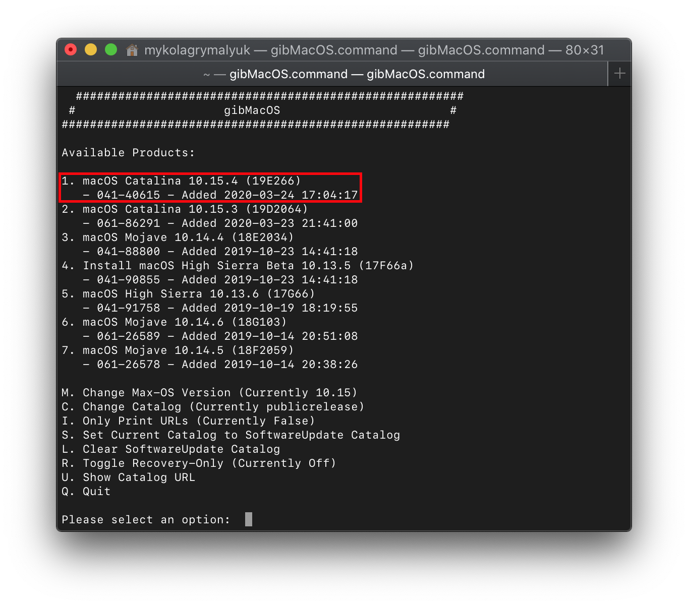

就如你所看到的一样，我们获得了 macOS 安装器的一个优质列表。如果你需要测试版的 macOS，你可以选择 `C. Change Catalog`。在这个示例中我们将选择 1：

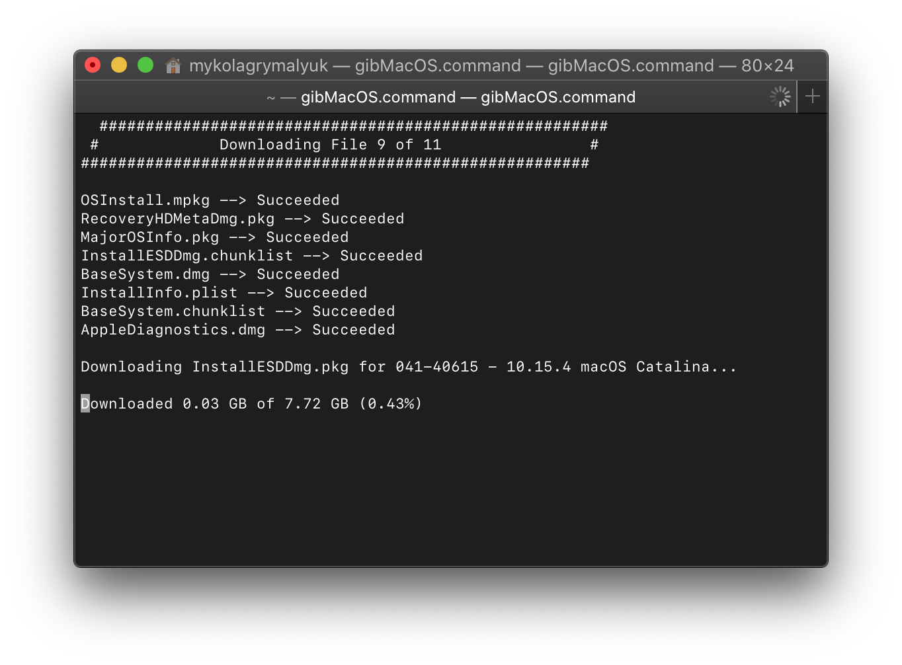

* **macOS 11 Big Sur 注意事项**：由于这个操作系统是全新的，某些问题依旧需要系统来解决。更多信息请参阅此处x：[OpenCore 和 macOS 11， Big Sur](../extras/big-sur/README.md)
  * 对于第一次使用的用户，我们推荐 10.15 Catalina
* **Nvidia 显卡注意事项**：记得确认你的硬件是否支持较新的操作系统，请参阅[硬件限制](../macos-limits.md)

这会需要一定的时间，因为我们正在下载总共 8GB+ 的 macOS 安裝程序，所以强烈推荐在你等待的时候阅读剩下的指南。

一旦完成，我们必须提取安装程序或者构建它：

* [提取安装程序](#提取安装程序)
  * 对于 macOS 11+
* [构建安装程序](#构建安装程序)
  * 对于 10.15 和更低版本

### 提取安装程序

对于 macOS 11 和更高版本，Apple 现在将安装器打包在了 InstallAssistant（安装助理）包中。它会位于 `gibMacOS/macOS Downloads/`：

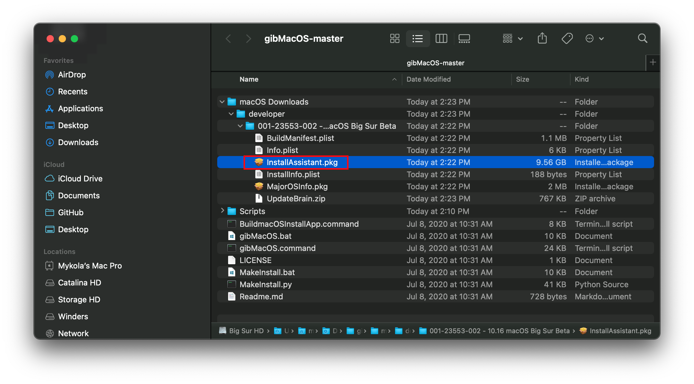

运行 InstallAssistant.pkg 然后选择你要用于启动的驱动器，这将是 Install.app 被放置到的位置：

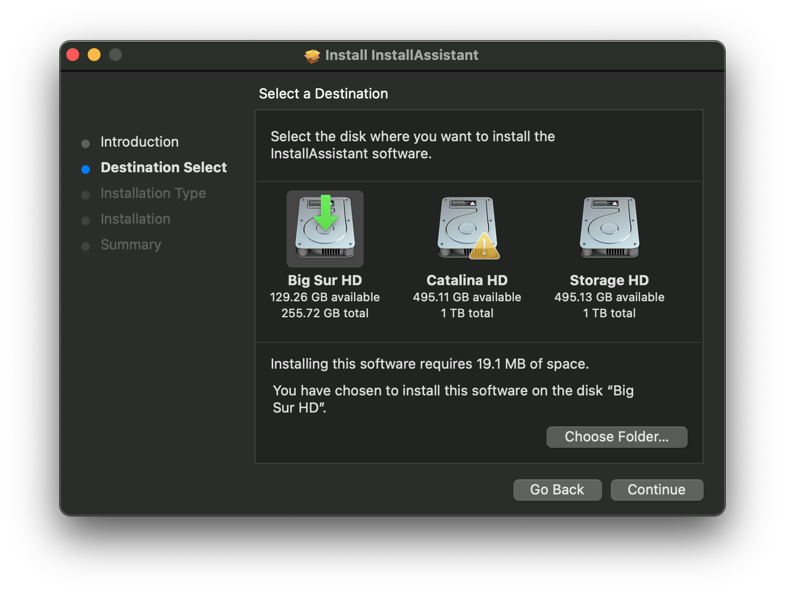

一旦完成，你应该可以在你的应用程序目录中找到它：

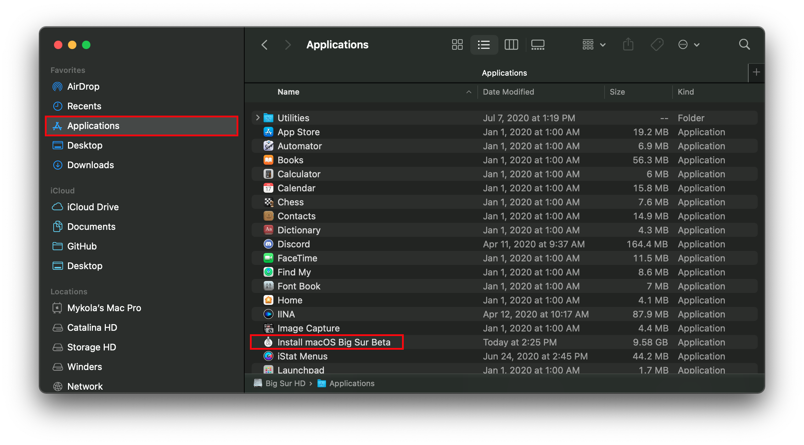

这样就可以跳转至[创建安装器](#创建安装器)以完成你的工作了。

### 构建安装程序

对于 macOS 10.15 和更低版本，安装器将会被作为多个部分下载，所以需要被构建。此处我们需要运行 `BuildmacOSInstallApp.command`：

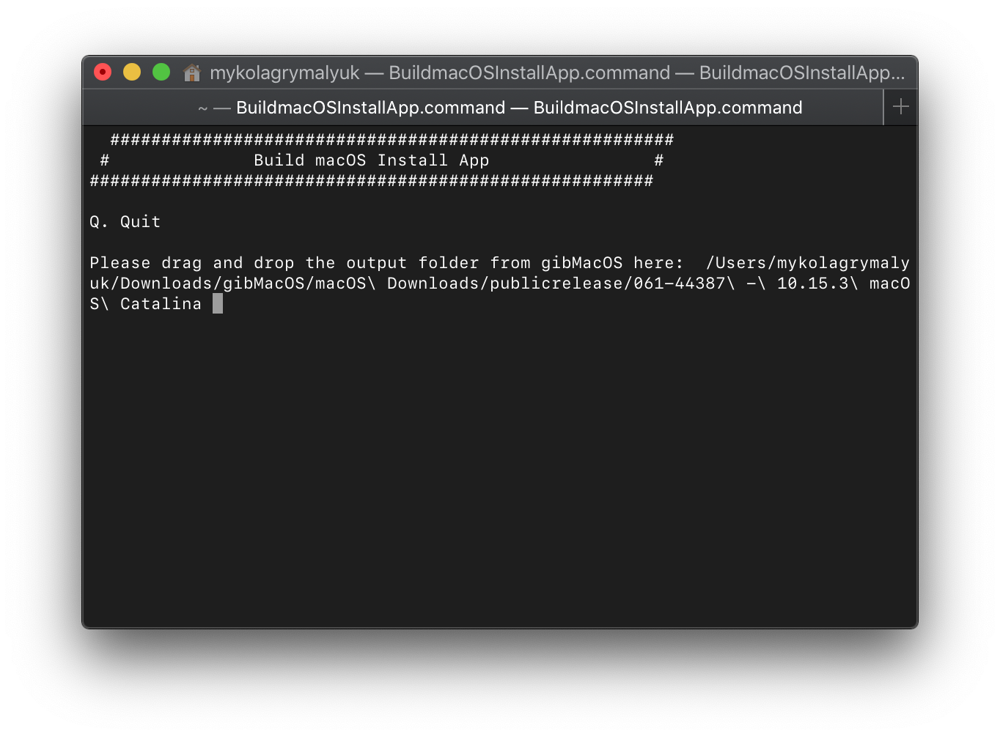

程序将会提示您放入已经下载到 gibMacOS 目录中的 `macOS Downloads` 下的文件。

在访达中，进入下载了文件的目录然后把它拖放到命令行中，或者“Cmd+C”并将它粘贴至终端内。

一旦任务完成，退出这个实用工具。你将会在目录中找到安装文件。

将新构建的安装程序移动到应用程序目录——这将简化下一个部分。

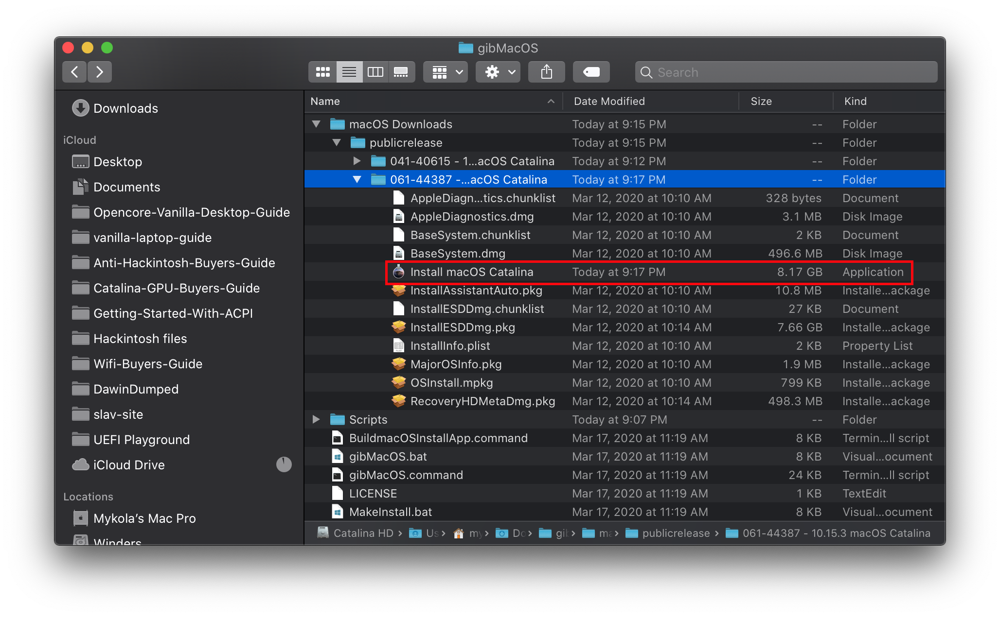

这样就可以跳转至[创建安装器](#创建安装器)以完成你的工作了。

## 下载 macOS：经典版本

* 此方式允许你下载很多的旧版本 OS X，当前支持所有 OS X 的英特尔版本（10.4 至当前版本）

::: details 获取经典版本的 macOS：离线方式（支持 10.10-10.12）

### 经典版本 macOS：离线方式

此方式允许我们从 Apple 下载完整的安装器，但是限制到了 10.10 Yosemite，所以更旧的操作系统需要通过下方提到的“在线方式”获取。

跳转到下方的其中一个链接以开始：

* [How to upgrade to OS X Yosemite](https://support.apple.com/en-ca/HT210717)（如何升级到 OS X Yosemite）
* [How to upgrade to OS X El Capitan](https://support.apple.com/en-us/HT206886)（如何升级到 OS X EI Capitan）
* [How to upgrade to macOS Sierra](https://support.apple.com/en-us/HT208202)（如何升级到 macOS Sierra）

> 译者注：上方链接页面暂时只有英文版本。如果您想获得中文文档，请点击[这里](https://support.apple.com/zh-cn/HT211683)。但是，中文版本的页面可能与英文版本有一些出入。

在第 4 步中，你将会看到 Sierra 的 `InstallOS.dmg` 或 EI Capitan 及更旧操作系统的 `InstallMacOSX.dmg`。下载你需要的版本，一个 .pkg 文件将会提供给你。

取决于你在什么操作系统中，你可以运行脚本并跳转到[创建安装器](#创建安装器)，但如果你遇到了此错误：


这说明我们需要手动提取安装程序。

### 提取安装程序

获取 InstallMacOSX/InstallOS.dmg 并挂载以开始：

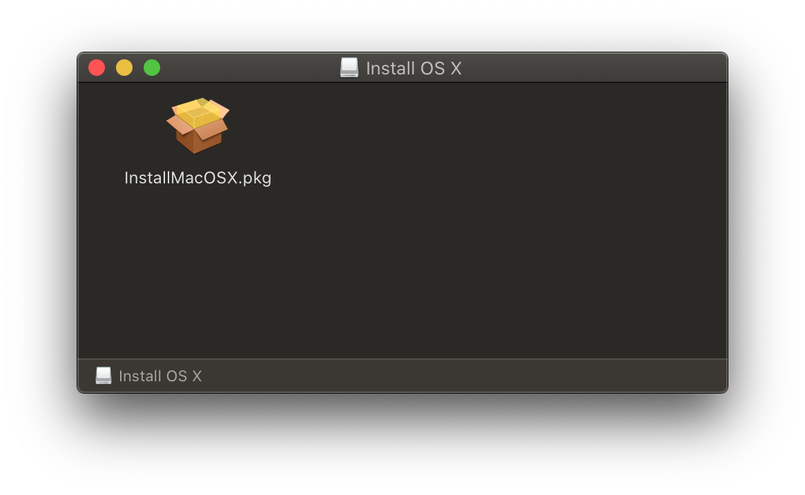

下一步，我们来打开终端窗口，然后在我们的桌面创建一个文件夹来做准备。每次运行一行：

```sh
cd ~/Desktop
mkdir MacInstall && cd MacInstall
```

现在我们到了好玩的部分了，解压安装器（记注，这可能需要花费一些时间）：

* 对于 EI Capitan（10.11）和更旧的操作系统：

```sh
xar -xf /Volumes/Install\ OS\ X/InstallMacOSX.pkg
```

* 对于 Sierra（10.12）：

```sh
xar -xf /Volumes/Install\ macOS/InstallOS.pkg
```

接下来，运行下面的命令（一次一行）：

* Yosemite：

```sh
cd InstallMacOSX.pkg
tar xvzf Payload
mv InstallESD.dmg Install\ OS\ X\ Yosemite.app/Contents/SharedSupport/
mv Install\ OS\ X\ Yosemite.app /Applications
```

* El Capitan：

```sh
cd InstallMacOSX.pkg
tar xvzf Payload
mv InstallESD.dmg Install\ OS\ X\ El\ Capitan.app/Contents/SharedSupport/
mv Install\ OS\ X\ El\ Capitan.app /Applications
```

* Sierra：

```sh
cd InstallOS.pkg
tar xvzf Payload
mv InstallESD.dmg Install\ macOS\ Sierra.app/Contents/SharedSupport/
mv Install\ macOS\ Sierra.app /Applications
```

一旦完成，你就可以跳转到[创建安装器](#创建安装器)了！

:::

::: details 获取经典版本的 macOS：在线方式（支持 10.7-10.15）

### 经典版本 macOS：在线方式

此方式允许我们从 Apple 下载经典版本的 macOS，包括 10.7 到当前版本，但是这些支持恢复模式的安装器，所以需要安装器内部有互联网连接

你将会使用 macrecovery.py 作为替代以开始。此工具实际上已经捆绑在了 OpenCorePkg 中：

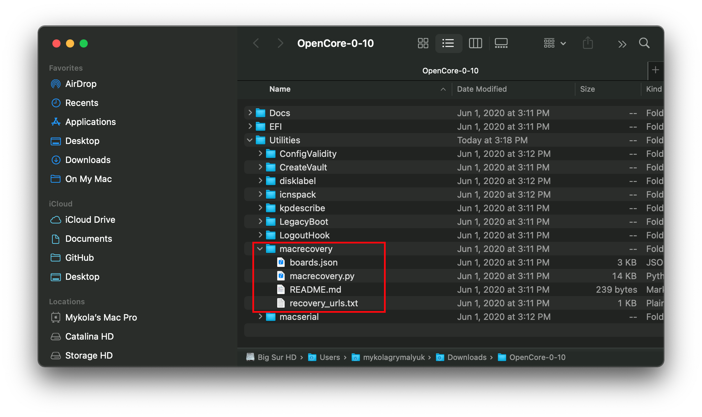

对于运行的说明非常简单，选择下方的其中一个命令，具体取决于你想要下载哪一个操作系统：

* 注意：0.6.4 和更旧的 macrecovery.py 的构建已损坏，你需要从[下载 master 分支的副本](https://github.com/acidanthera/OpenCorePkg/archive/master.zip)下载它并使用置于 `Utilities/macrecovery/` 目录下的那一个

```sh
# Lion（10.7）：
python ./macrecovery.py -b Mac-2E6FAB96566FE58C -m 00000000000F25Y00 download
python ./macrecovery.py -b Mac-C3EC7CD22292981F -m 00000000000F0HM00 download

# Mountain Lion（10.8）：
python ./macrecovery.py -b Mac-7DF2A3B5E5D671ED -m 00000000000F65100 download

# Mavericks（10.9）：
python ./macrecovery.py -b Mac-F60DEB81FF30ACF6 -m 00000000000FNN100 download

# Yosemite（10.10）：
python ./macrecovery.py -b Mac-E43C1C25D4880AD6 -m 00000000000GDVW00 download

# El Capitan（10.11）：
python ./macrecovery.py -b Mac-FFE5EF870D7BA81A -m 00000000000GQRX00 download

# Sierra（10.12）：
python ./macrecovery.py -b Mac-77F17D7DA9285301 -m 00000000000J0DX00 download

# High Sierra（10.13）
python ./macrecovery.py -b Mac-7BA5B2D9E42DDD94 -m 00000000000J80300 download
python ./macrecovery.py -b Mac-BE088AF8C5EB4FA2 -m 00000000000J80300 download

# Mojave（10.14）
python ./macrecovery.py -b Mac-7BA5B2DFE22DDD8C -m 00000000000KXPG00 download

# Catalina（10.15）
python ./macrecovery.py -b Mac-00BE6ED71E35EB86 -m 00000000000000000 download

# 最新版本
# 例如：Big Sur（11）
python ./macrecovery.py -b Mac-E43C1C25D4880AD6 -m 00000000000000000 download
```

在终端中运行此处的一行命令，一旦完成，你将会得到类似下面的输出：


一旦这项工作完成，使用 GUID 分区表将你的 USB 驱动器格式化为 FAT32 格式：


最后，在此驱动器的根目录创建一个名为 `com.apple.recovery.boot` 的文件夹，并且将新下载的 BaseSystem 或恢复模式映像（RecoveryImage）文件放进去：


至此，你可以跳转到[配置 OpenCore 的 EFI 源](#配置-opencore-的-efi-源)了

:::

::: details 获取经典版本的 macOS：磁盘映像（支持 10.4-10.6）

### 经典版本 macOS：磁盘映像

此方式依赖从 Apple 或 Acidanthera 的托管映像，并将其恢复到您的驱动器。

#### Acidanthera 的映像

以下的安装器是从真正的 Mac 的还原磁盘中拉取出的，其 SMBIOS 锁已移除，OS X 本身的内容未以任何方式进行修改。

* [OS X 10.4.10(8R4088)](https://mega.nz/folder/D3ASzLzA#7sjYXE2X09f6aGjol_C7dg)

* [OS X 10.5.7(9J3050)](https://mega.nz/folder/inRBTarD#zanf7fUbviwz3WHBU5xpCg)

* [OS X 10.6.7(10J4139)](https://mega.nz/folder/z5YUhYTb#gA_IRY5KMuYpnNCg7kR3ug/file/ioQkTagI)

#### Apple 的映像

注意，这些镜像需要你有一个 Apple 开发者账号以访问。

* [OS X 10.5.0 Golden Master（最终版本）(9a581)](https://download.developer.apple.com/Mac_OS_X/mac_os_x_v10.5_leopard_9a581/leopard_9a581_userdvd.dmg)

* [OS X 10.6.0 Golden Master（最终版本）(10a432)](https://download.developer.apple.com/Mac_OS_X/mac_os_x_version_10.6_snow_leopard_build_10a432/mac_os_x_v10.6_build_10a432_user_dvd.dmg)

### 恢复驱动器

现在来到了有趣的部分，你需要首先打开你刚刚下载的 dmg 并挂载它。现在打开磁盘工具并将你的驱动器格式化为使用 GUID 分区表的 macOS 扩展（HFS+）格式：


接下来有 2 个可以跟随的选项：

* [ASR 恢复](#asr)（Apple Software Restore，Apple 软件恢复）
  * 基于终端，在系统完整性保护打开的情况下使用
* [磁盘工具恢复](#磁盘工具)
  * 在较新的系统中可能需要关闭系统完整性保护
  
#### ASR

在这里，您只需简单地打开终端并运行以下命令：

```sh
sudo asr restore -source /Volumes/Mac\ OS\ X\ Install\ DVD  -target /Volumes/MyVolume -erase -noverify
```

* **注意**：这可能与您的配置不一致，请对照更改：
  * 将 `/Volumes/Mac\ OS\ X\ Install\ DVD` 更改为你所挂载的磁盘镜像的名称
  * 将 `/Volumes/MyVolume` 更改为你的 USB 上宗卷的名称

这将会花费一定的时间，但你一旦完成，即可跳转到[配置 OpenCore 的 EFI 源](#配置-opencore-的-efi-源)
  
#### 磁盘工具

由于磁盘工具的一些让人讨厌的问题，在系统完整性保护打开的情况下，很多的恢复都会失败。如果你遇到问题，我们推荐你使用 [ASR 方式](#asr)或者关闭系统完整性保护。

打开磁盘工具以开始，你应该在侧边栏中同时看到你的 USB 驱动器和磁盘映像。在这种情况下，选择恢复


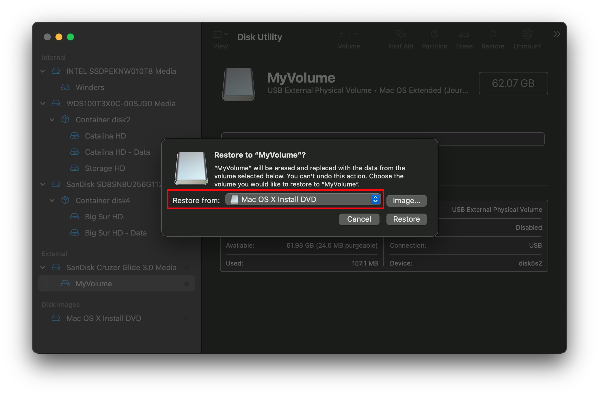

这将会花费一定的时间，但你一旦完成，即可跳转到[配置 OpenCore 的 EFI 源](#配置-opencore-的-efi-源)

::: details 故障排除

如果你遇到了错误，比如在恢复时出现这种情况：

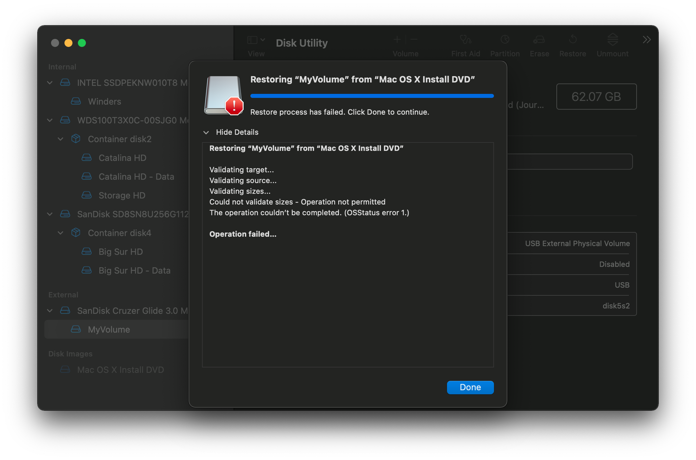

这很可能表示系统完整性保护需要关闭，但是我们推荐以 [ASR 方式](#asr)来代替。

:::

## 创建安装器

现在我们将要格式化 USB 驱动器以准备 macOS 安装程序和 OpenCore。我们要使用 GUID 分区表和 macOS 扩展（HFS+）分区格式。这将会创建两个分区：主要的 `MyVolume` 和另一个用于让你的固件获取引导文件以启动的，名为 `EFI` 的分区。

* 注意：默认情况下，磁盘工具只会显示分区——按 Cmd/Win+2 以显示所有设备（或者你也可以点按“视图”按钮）
* 注意 2：跟随“经典版本的 macOS：在线方式”部分的用户可以跳转到[配置 OpenCore 的 EFI 源](#配置-opencore-的-efi-源)


然后运行 [Apple](https://support.apple.com/en-us/HT201372) 提供的 `createinstallmedia` 命令。注意，此命令是为已经格式化，并且名称为 `MyVolume` 的 USB 驱动器准备的：

> 译者注：上方链接页面的简体中文版本请点击[这里](https://support.apple.com/zh-cn/HT201372)。

```sh
sudo /Applications/Install\ macOS\ Big\ Sur.app/Contents/Resources/createinstallmedia --volume /Volumes/MyVolume
```

这将会花费一些时间，所以你可能会需要获得一杯咖啡或者继续阅读指南（说句公道话，你真的不应该在没有阅读整篇指南前一步一步地跟随这份指南）。

你也可以将 `createinstallmedia` 中的路径替换为你的安装程序所在的路径（驱动器的名称也一样）。

::: details 经典版本的 createinstallmedia 命令

从 Apple 自己的网站上拉取的：[How to create a bootable installer for macOS](https://support.apple.com/en-us/HT201372)

> 译者注：上方链接页面的简体中文版本：[如何创建可引导的 macOS 安装器](https://support.apple.com/zh-cn/HT201372)

```sh
# Catalina
sudo /Applications/Install\ macOS\ Catalina.app/Contents/Resources/createinstallmedia --volume /Volumes/MyVolume

# Mojave
sudo /Applications/Install\ macOS\ Mojave.app/Contents/Resources/createinstallmedia --volume /Volumes/MyVolume

# High Sierra
sudo /Applications/Install\ macOS\ High\ Sierra.app/Contents/Resources/createinstallmedia --volume /Volumes/MyVolume

# Sierra
sudo /Applications/Install\ macOS\ Sierra.app/Contents/Resources/createinstallmedia --volume /Volumes/MyVolume

# El Capitan
sudo /Applications/Install\ OS\ X\ El\ Capitan.app/Contents/Resources/createinstallmedia --volume /Volumes/MyVolume --applicationpath /Applications/Install\ OS\ X\ El\ Capitan.app

# Yosemite
sudo /Applications/Install\ OS\ X\ Yosemite.app/Contents/Resources/createinstallmedia --volume /Volumes/MyVolume --applicationpath /Applications/Install\ OS\ X\ Yosemite.app

# Mavericks
sudo /Applications/Install\ OS\ X\ Mavericks.app/Contents/Resources/createinstallmedia --volume /Volumes/MyVolume --applicationpath /Applications/Install\ OS\ X\ Mavericks.app --nointeraction
```

:::

## 经典设置

对于不支持 UEFI 启动的系统，查看下面的部分：

::: details 配置经典启动

你需要跟随下面的说明来开始：

* BootInstall_IA32.tool 或者 BootInstall_X64.tool
  * 这可以在 OpenCorePkg 中的 `/Utilties/LegacyBoot/` 目录下找到
* USB 安装器（在之前创建的）

在你的 OpenCore 构建的文件夹中，打开 `Utilities/LegacyBoot`。你会找到一个名为 `BootInstall_ARCH.tool` 的文件。这是用来在你需要的驱动器上安装 DuetPkg 的工具。

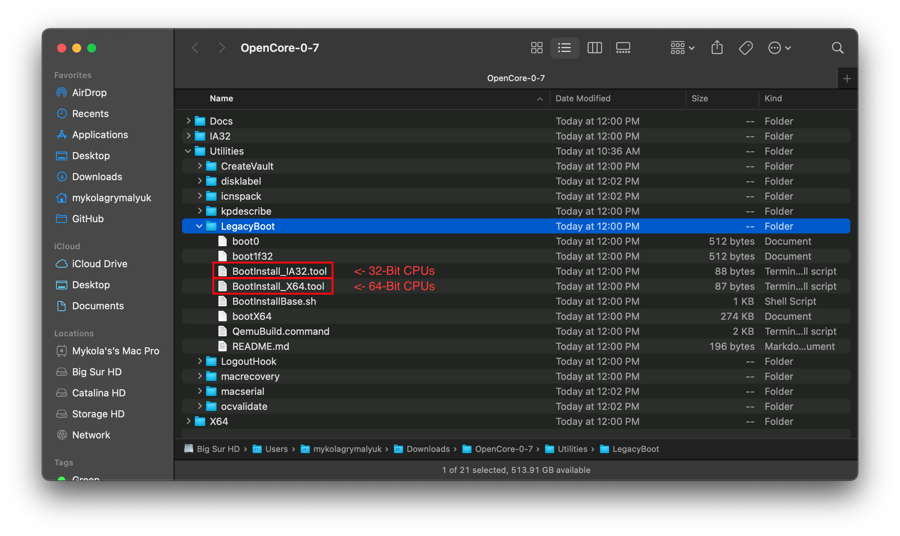

现在**配合 sudo**运行此命令（否则此工具很可能无法使用）：

```sh
# 如果你的 CPU 是 32 位的，请将 X64 替换为 IA32
sudo ~/Downloads/OpenCore/Utilities/legacyBoot/BootInstall_X64.tool
```

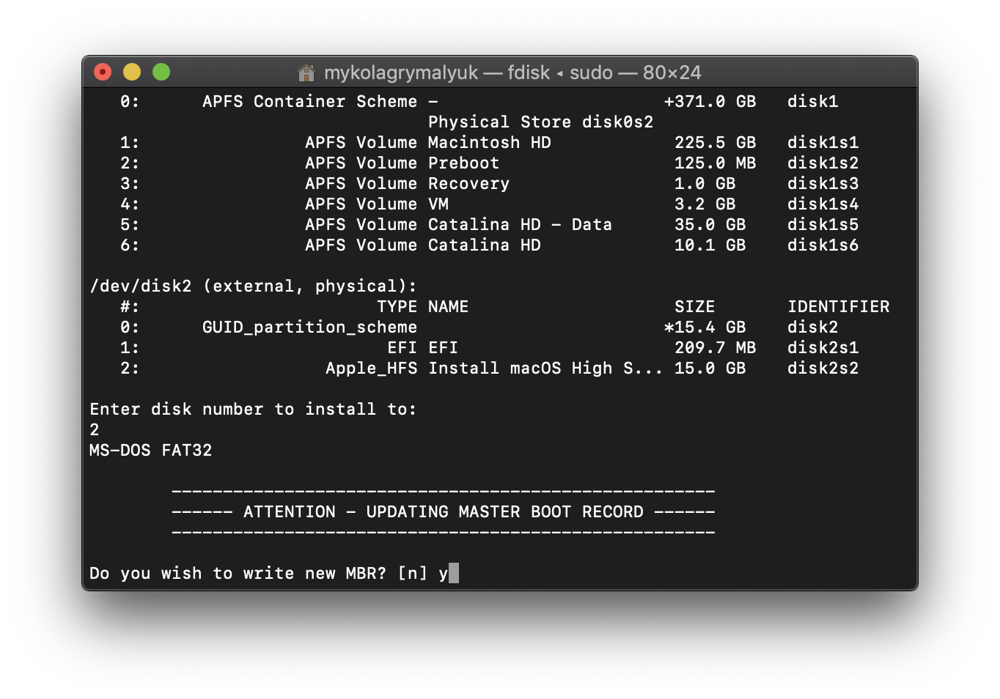

这将会给你一个可用磁盘的列表，选择你需要的，你将会被提示要写入一个新的主引导记录。按 `[y]` 以选择“确定”，然后你就完成了。

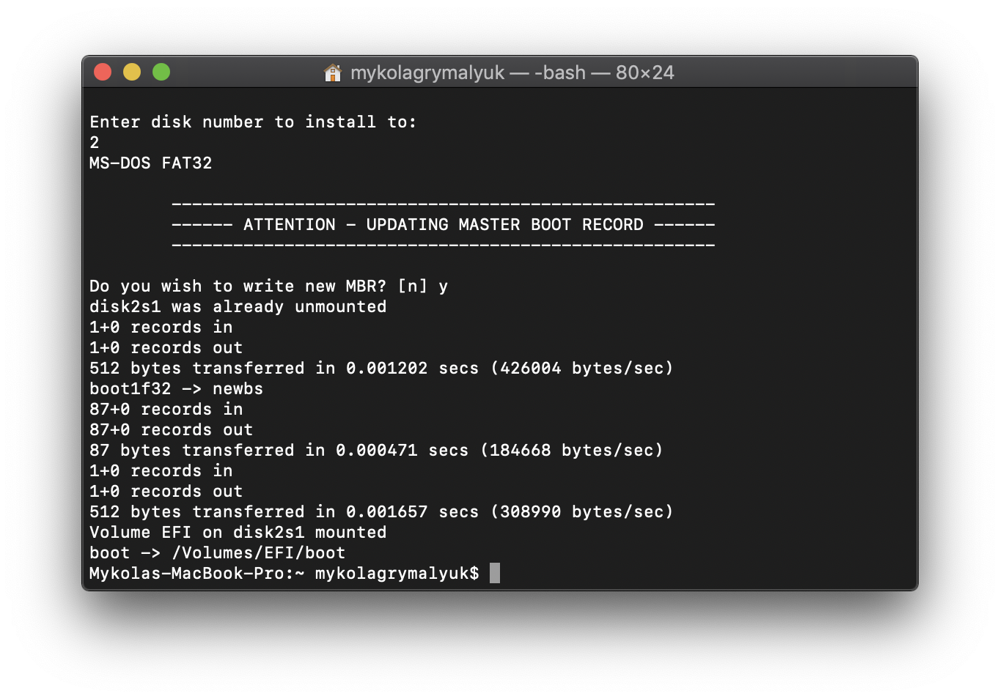


这将会为你提供一个带有 **bootia32** 或 **bootx64** 文件的 EFI 分区

:::

## 设置 OpenCore 的 EFI 环境

设置 OpenCore 的 EFI 环境很简单——你需要做的就是挂载我们的 EFI 分区。EFI 分区会在我们使用 GUID 分区表格式化的时候就被创建好，但是默认情况下不会被挂载，这时我们的朋友 [MountEFI](https://github.com/corpnewt/MountEFI) 就要出场了：

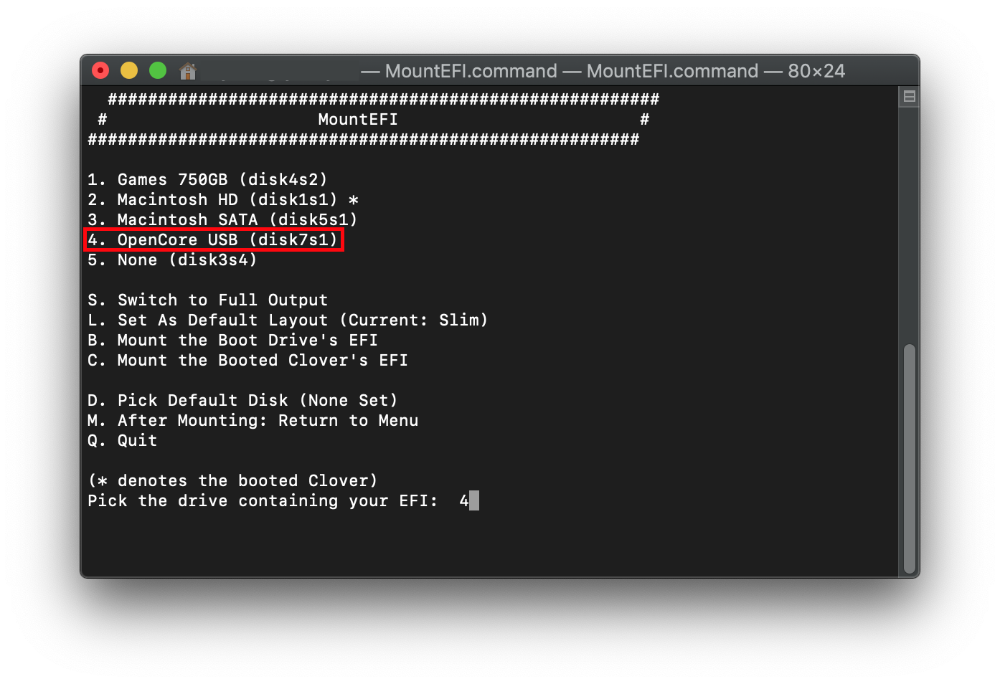

你会注意到当我们打开 EFI 分区的时候，它是空的。这也就是快乐开始的地方。

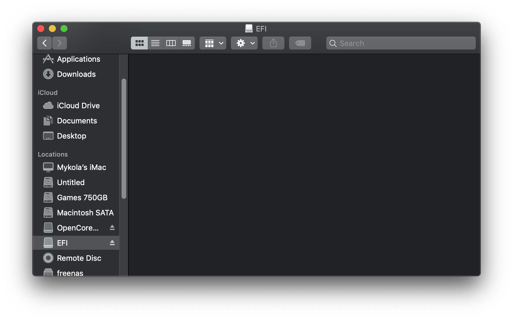

## 现在所有事项都已完成，跳转到[设置 EFI](./opencore-efi.md) 以完成你的工作
