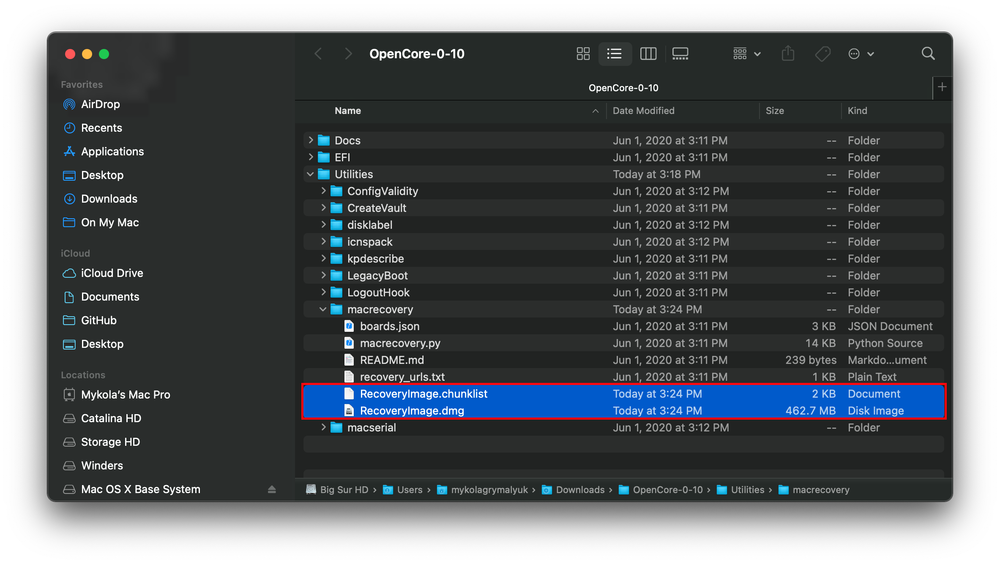
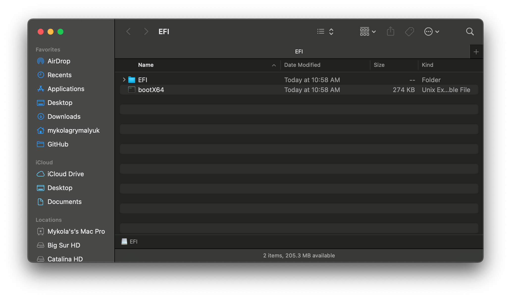

# 在 macOS 中制作安装器

* 支持的版本：0.6.4

虽然你不需要进行一次完全重新安装以使用 OpenCore，但是建议一些用户对他们的引导管理器升级进行完全的重新安排。

我们将会以获得一份 macOS 副本为开始。如果你只是想制作一个 OpenCore 启动盘，你可以跳过这个部分并跳转到格式化 USB。对其他的人，你可以从 App Store 下载 macOS 或者使用 gibMacOS。

## 下载 macOS：较新版本

* 这个方式允许你下载 macOS 10.13 和更高版本，对于 10.12 和更低版本请查看 [Downloading macOS: Legacy OS](#下载-macos-经典版本)

在一台安装了 macOS 的设备上，获取你想要安装的 macOS 版本，只需直接进入 App Store 并下载想要的操作系统发行版，然后继续查看 [**配置安装器**](#配置安装器)。

如果需要明确的操作系统发行版，或者无法从 App Store 下载，你可以使用实用工具 gibMacOS。

那么现在我们来获取 [gibMacOS](https://github.com/corpnewt/gibMacOS)，然后将它解压到一个本地的目录。

然后运行 `gibMacOS.command`：


就如你所看到的一样，我们获得了 macOS 安装器的一个优质列表。如果你需要测试版的 macOS，你可以选择 `C. Change Catalog`。在这个示例中我们将选择 1：


* **macOS 11 Big Sur 注意事项**：因为这个操作系统太新了，依然有一些确定的问题需要系统来解决。对于更多的信息，参阅此处：[OpenCore 和 macOS 11：Big Sur](../extras/big-sur/README.md)
  * 对于第一次使用的用户，我们推荐 10.15 Catalina
* **Nvidia 显卡注意事项**：记得确认你的硬件是否支持较新的操作系统，请参阅 [硬件限制](../macos-limits.md)

这会需要一定的时间，因为我们正在下载总共 8GB+ 的 macOS 安装器，所以强烈推荐在你等待的时候阅读剩下的指南。

一旦完成，我们必须解压安装器或者编译它：

* [解压安装器](#解压安装器)
  * For macOS 11+
* [编译安装器](#编译安装器)
  * For 10.15 and older

### 解压安装器

对于 macOS 11 和更高版本，Apple 现在将安装器打包在了 InstallAssistant（安装助理）包中。它会位于 `gibMacOS/macOS Downloads/`：


运行 InstallAssistant.pkg 然后选择你要用于启动的驱动器，这将是 Install.app 被放置到的位置：


一旦完成，你应该可以在你的应用程序目录中找到它：


这样就可以跳转至[配置安装器](#配置安装器)以完成你的工作了。

### 编译安装器

对于 macOS 10.15 和更低版本，安装器将会被作为多个部分下载，所以需要被编译。此处我们需要运行 `BuildmacOSInstallApp.command`：


程序将会提示您放入已经下载到 gibMacOS 目录中的 `macOS Downloads` 下的文件。

在访达中，进入下载了文件的目录然后把它拖放到命令行中，或者“Cmd+C”并将它粘贴至终端内。

一旦任务完成，退出这个实用工具。你将会在目录中找到安装文件。

将新创建的镜像移动到应用程序目录——这将简化下一个部分。


这样就可以跳转至[配置安装器](#配置安装器)以完成你的工作了。

## 下载 macOS：经典版本

* This method allows you to download much older versions of OS X, currently supporting all Intel versions of OS X(10.4 to current)

::: details Grabbing legacy versions of macOS: Offline method(10.10-10.12 Supported)

### Legacy macOS: Offline method

This method allows us to download full installers from Apple, however is limited to 10.10, Yosemite, so older OSes will need to be grabbed via the "Online Method" mentioned below.

To start, head to one of the following links:

* [How to upgrade to OS X Yosemite](https://support.apple.com/en-ca/HT210717)
* [How to upgrade to OS X El Capitan](https://support.apple.com/en-us/HT206886)
* [How to upgrade to macOS Sierra](https://support.apple.com/en-us/HT208202)

On step 4, you'll see either `InstallOS.dmg` for Sierra or `InstallMacOSX.dmg` for El Capitan and older. Download your desired version and a .pkg file should be provided.

Depending on what OS you're on, you can run this script and head to [Setting up the installer](#setting-up-the-installer) however if you receive this error:


This means we'll need to manually extract the installer.

### Extracting the Installer

To start, grab the InstallMacOSX/InstallOS.dmg and mount it:


Next, let's open up terminal window and make a folder on our desktop to break things. Run one at a time:

```sh
cd ~/Desktop
mkdir MacInstall && cd MacInstall
```

Now we get to the fun part, extracting the installer(Note this may take a few minutes):

* For El Capitan(10.11) and older:

```sh
xar -xf /Volumes/Install\ OS\ X/InstallMacOSX.pkg
```

* For Sierra(10.12):

```sh
xar -xf /Volumes/Install\ macOS/InstallOS.pkg
```

Next, run the following(one at a time):

* Yosemite:

```sh
cd InstallMacOSX.pkg
tar xvzf Payload
mv InstallESD.dmg Install\ OS\ X\ Yosemite.app/Contents/SharedSupport/
mv Install\ OS\ X\ Yosemite.app /Applications
```

* El Capitan:

```sh
cd InstallMacOSX.pkg
tar xvzf Payload
mv InstallESD.dmg Install\ OS\ X\ El\ Capitan.app/Contents/SharedSupport/
mv Install\ OS\ X\ El\ Capitan.app /Applications
```

* Sierra:

```sh
cd InstallOS.pkg
tar xvzf Payload
mv InstallESD.dmg Install\ macOS\ Sierra.app/Contents/SharedSupport/
mv Install\ macOS\ Sierra.app /Applications
```

Once this is done, you can head to [Setting up the installer](#setting-up-the-installer)!

:::

::: details Grabbing legacy versions of macOS: Online method(10.7-10.15 Supported)

### Legacy macOS: Online method

This method allows us to download legacy versions of macOS including 10.7 to current, however these are only recovery installers so require an internet connection inside the installer itself

To start, you'll want to use macrecovery.py instead. This tool is actually already bundled in OpenCorePkg:


Instructions for running are quite simple, choose from one of the below commands depending on which OS you want to download:

* Note: 0.6.4 and older's macrecovery.py build is broken, you'll want to [download master's copy](https://github.com/acidanthera/OpenCorePkg/archive/master.zip) and use the one located under `Utilities/macrecovery/`

```sh
# Lion(10.7):
python ./macrecovery.py -b Mac-2E6FAB96566FE58C -m 00000000000F25Y00 download
python ./macrecovery.py -b Mac-C3EC7CD22292981F -m 00000000000F0HM00 download

# Mountain Lion(10.8):
python ./macrecovery.py -b Mac-7DF2A3B5E5D671ED -m 00000000000F65100 download

# Mavericks(10.9):
python ./macrecovery.py -b Mac-F60DEB81FF30ACF6 -m 00000000000FNN100 download

# Yosemite(10.10):
python ./macrecovery.py -b Mac-E43C1C25D4880AD6 -m 00000000000GDVW00 download

# El Capitan(10.11):
python ./macrecovery.py -b Mac-FFE5EF870D7BA81A -m 00000000000GQRX00 download

# Sierra(10.12):
python ./macrecovery.py -b Mac-77F17D7DA9285301 -m 00000000000J0DX00 download

# High Sierra(10.13)
python ./macrecovery.py -b Mac-7BA5B2D9E42DDD94 -m 00000000000J80300 download
python ./macrecovery.py -b Mac-BE088AF8C5EB4FA2 -m 00000000000J80300 download

# Mojave(10.14)
python ./macrecovery.py -b Mac-7BA5B2DFE22DDD8C -m 00000000000KXPG00 download

# Catalina(10.15)
python ./macrecovery.py -b Mac-00BE6ED71E35EB86 -m 00000000000000000 download

# Latest version
# ie. Big Sur(11)
python ./macrecovery.py -b Mac-E43C1C25D4880AD6 -m 00000000000000000 download
```

From here, run one of those commands in terminal and once finished you'll get an output similar to this:



Once this is done, format your USB as FAT32 with GUID Partition Scheme:


And finally, create folder on the root of this drive called `com.apple.recovery.boot` and place the newly downloaded BaseSystem/RecoveryImage files in:


From here, you can skip to [Setting up OpenCore's EFI environment](#setting-up-opencore-s-efi-environment)

:::

::: details Legacy macOS: Disk Images(10.4-10.6 Supported)

### Legacy macOS: Disk Images

This method instead relies on hosted images either from Apple or Acidanthera, and restoring onto your drive.

#### Acidanthera Images

The below installers were pulled from genuine Mac restore disks with their SMBIOS lock removed, contents of OS X itself have not been modified in any way.

* [OS X 10.4.10(8R4088)](https://mega.nz/folder/D3ASzLzA#7sjYXE2X09f6aGjol_C7dg)

* [OS X 10.5.7(9J3050)](https://mega.nz/folder/inRBTarD#zanf7fUbviwz3WHBU5xpCg)

* [OS X 10.6.7(10J4139)](https://mega.nz/folder/z5YUhYTb#gA_IRY5KMuYpnNCg7kR3ug/file/ioQkTagI)

#### Apple Images

Note that these images require you to have an Apple Developer account to access.

* [OS X 10.5.0 Golden Master(9a581)](https://download.developer.apple.com/Mac_OS_X/mac_os_x_v10.5_leopard_9a581/leopard_9a581_userdvd.dmg)

* [OS X 10.6.0 Golden Master(10a432)](https://download.developer.apple.com/Mac_OS_X/mac_os_x_version_10.6_snow_leopard_build_10a432/mac_os_x_v10.6_build_10a432_user_dvd.dmg)

### Restoring the drive

Now comes the fun part, you'll first want to open the dmg you just downloaded and have it mounted. Now open Disk Utility and format your drive as macOS Extended(HFS+) with a GUID partition map:


Next we have 2 options to follow:

* [ASR Restore](#asr)(Apple Software Restore)
  * Terminal based, works with SIP enabled
* [Disk Utility Restore](#disk-utility)
  * May require SIP disabled in newer OSes
  
#### ASR

Here you'll simply want to open terminal and run the following:

```sh
sudo asr restore -source /Volumes/Mac\ OS\ X\ Install\ DVD  -target /Volumes/MyVolume -erase -noverify
```

* **Note**: This may not align with your setup, please change accordingly:
  * Change `/Volumes/Mac\ OS\ X\ Install\ DVD` to what your mounted Disk Image is called
  * Change `/Volumes/MyVolume` to what your USB is called

This will take some time but once you're finished, you can skip to [Setting up OpenCore's EFI environment](#setting-up-opencore-s-efi-environment)
  
#### Disk Utility

Due to some pesky issues with Disk Utility, many restores can fail if SIP is enabled. If you have issues we recommend either using the [ASR Method](#asr) or disable SIP.

To start, open Disk Utility and you should see both your USB drive and the Disk Image in the sidebar. From here, select restore


This will take some time but once you're finished, you can skip to [Setting up OpenCore's EFI environment](#setting-up-opencore-s-efi-environment)

::: details Troubleshooting

If you get an error such as this one during restore:


This likely means SIP needs to be disabled, however we recommend using [ASR Method](#asr) instead.

:::

## 配置安装器

Now we'll be formatting the USB to prep for both the macOS installer and OpenCore. We'll want to use macOS Extended (HFS+) with a GUID partition map. This will create two partitions: the main `MyVolume` and a second called `EFI` which is used as a boot partition where your firmware will check for boot files.

* Note: By default, Disk Utility only shows partitions – press Cmd/Win+2 to show all devices (alternatively you can press the View button)
* Note 2: Users following "Legacy macOS: Online method" section can skip to [Setting up OpenCore's EFI environment](#setting-up-opencore-s-efi-environment)


Next run the `createinstallmedia` command provided by [Apple](https://support.apple.com/en-us/HT201372). Note that the command is made for USB's formatted with the name `MyVolume`:

```sh
sudo /Applications/Install\ macOS\ Big\ Sur.app/Contents/Resources/createinstallmedia --volume /Volumes/MyVolume
```

This will take some time so you may want to grab a coffee or continue reading the guide (to be fair you really shouldn't be following this guide step by step without reading the whole thing first).

You can also replace the `createinstallmedia` path with that of where your installer's located (same idea with the drive name).

::: details Legacy createinstallmedia Commands

Pulled from Apple's own site: [How to create a bootable installer for macOS](https://support.apple.com/en-us/HT201372)

```sh
# Catalina
sudo /Applications/Install\ macOS\ Catalina.app/Contents/Resources/createinstallmedia --volume /Volumes/MyVolume

# Mojave
sudo /Applications/Install\ macOS\ Mojave.app/Contents/Resources/createinstallmedia --volume /Volumes/MyVolume

# High Sierra
sudo /Applications/Install\ macOS\ High\ Sierra.app/Contents/Resources/createinstallmedia --volume /Volumes/MyVolume

# Sierra
sudo /Applications/Install\ macOS\ Sierra.app/Contents/Resources/createinstallmedia --volume /Volumes/MyVolume

# El Capitan
sudo /Applications/Install\ OS\ X\ El\ Capitan.app/Contents/Resources/createinstallmedia --volume /Volumes/MyVolume --applicationpath /Applications/Install\ OS\ X\ El\ Capitan.app

# Yosemite
sudo /Applications/Install\ OS\ X\ Yosemite.app/Contents/Resources/createinstallmedia --volume /Volumes/MyVolume --applicationpath /Applications/Install\ OS\ X\ Yosemite.app

# Mavericks
sudo /Applications/Install\ OS\ X\ Mavericks.app/Contents/Resources/createinstallmedia --volume /Volumes/MyVolume --applicationpath /Applications/Install\ OS\ X\ Mavericks.app --nointeraction
```

:::

## Legacy Setup

For systems not supporting UEFI boot, see below:

::: details Setting up Legacy Boot

To start, you need the following:

* BootInstall_IA32.tool or BootInstall_X64.tool
  * This can be found in OpenCorePkg under `/Utilties/LegacyBoot/`
* Install USB(Created above)

Within your OpenCore build folder, navigate to `Utilities/LegacyBoot`. Here you'll find a file called `BootInstall_ARCH.tool`. What this does is install DuetPkg to your desired drive.


Now run this tool in terminal **with sudo**(This tool will likely fail otherwise):

```sh
# Replace X64 with IA32 if you have a 32-Bit CPU
sudo ~/Downloads/OpenCore/Utilities/legacyBoot/BootInstall_X64.tool
```


This will give you a list of available disks, choose yours and you will be prompted to write a new MBR. Choose yes`[y]` and you'll be finished.




This will provide you with an EFI partition with either a **bootia32** or **bootx64** file

:::

## Setting up OpenCore's EFI environment

Setting up OpenCore's EFI environment is simple – all you need to do is mount our EFI system partition. This is automatically made when we format with GUID but is unmounted by default, this is where our friend [MountEFI](https://github.com/corpnewt/MountEFI) comes in:


You'll notice that once we open the EFI partition, it's empty. This is where the fun begins.


## Now with all of this done, head to [Setting up the EFI](./opencore-efi.md) to finish up your work
