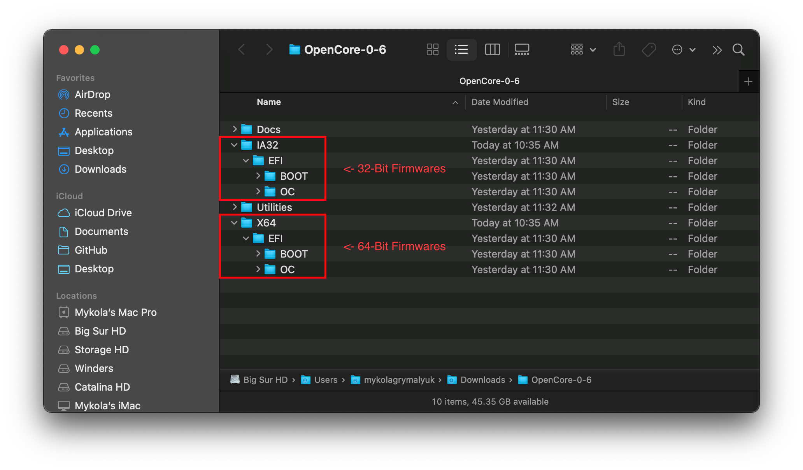
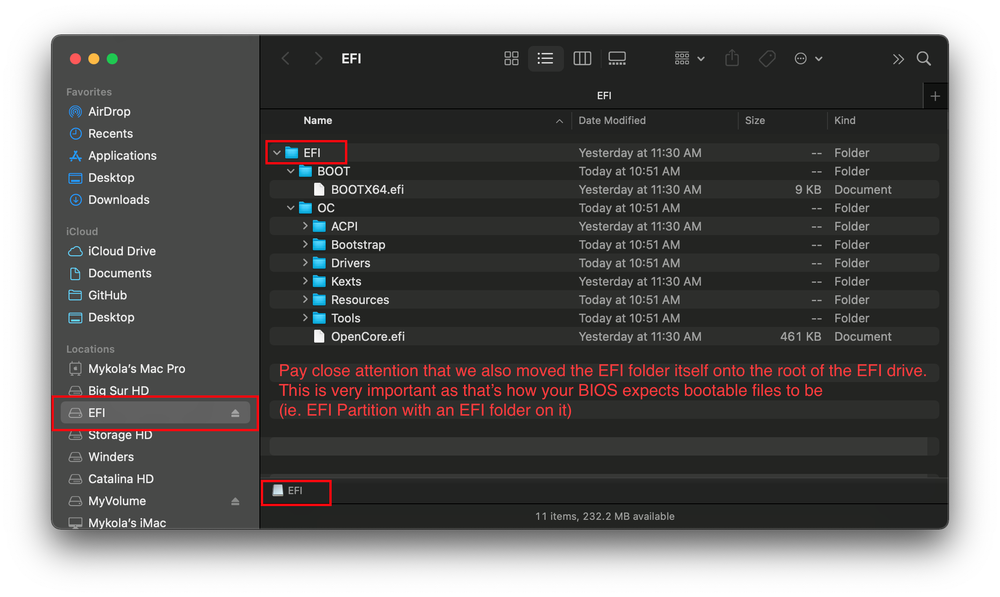
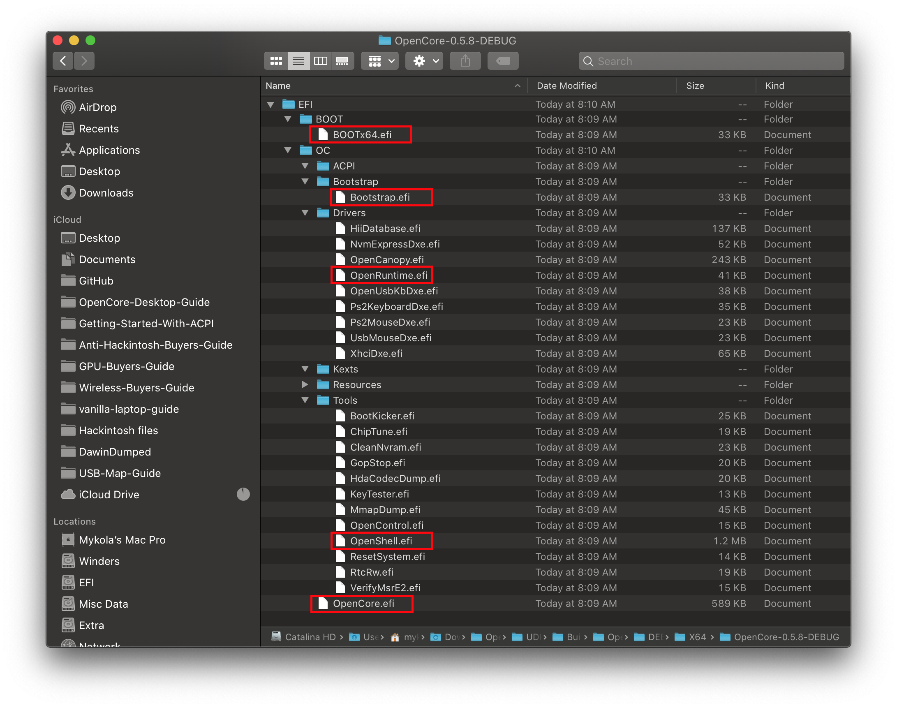
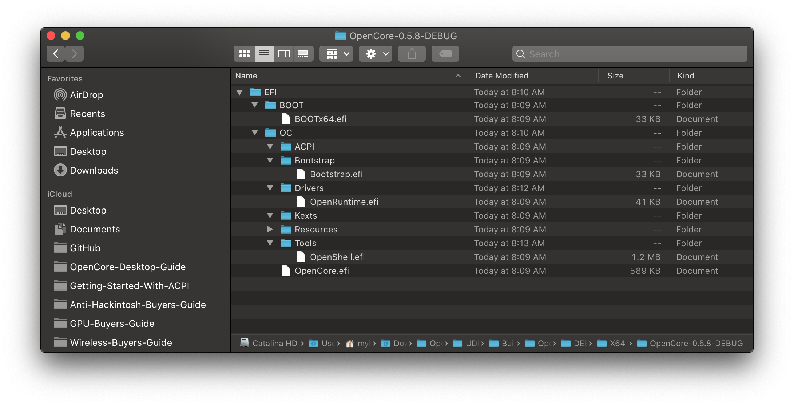
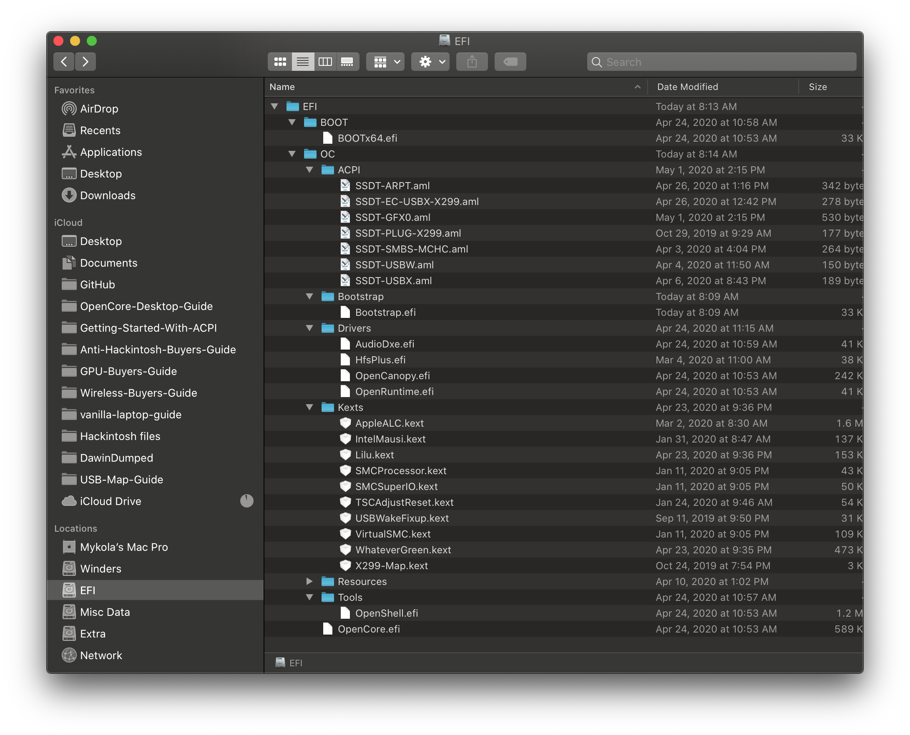

# 添加 OpenCore 的基本文件

* 支持的版本：0.6.4

你需要在 [OpenCorePkg 的发布](https://github.com/acidanthera/OpenCorePkg/releases/)中获取 EFI 文件夹以配置 OpenCore 的目录结构。注意，它将会在 IA32 或 X64 目录下，分别用于前期的 32 位硬件和后期的 64 位硬件：

关于 DEBUG 与 RELEASE 版本：

* **DEBUG**：可以很好地帮助调试启动问题，不过会增加一些明显的延迟启动时间（例如：进入引导菜单之前的 3-5 秒）。一旦安装好，你可以轻松的切换到 RELEASE 版本
* **RELEASE**：启动时间更快，但是事实上 OpenCore 没有提供有用的 DEBUG 信息，所以进行故障排除会变得更加困难。

一旦你下载好以后，将 EFI 文件夹（来自 OpenCorePkg）放置到你的 EFI 分区的根目录下：

**注意**：

* **Windows 用户：**您需要将 EFI 文件夹放在您之前制作的 USB 驱动器的根目录下
* **Linux 用户：**这就是我们之前创建的 `OPENCORE` 分区
  * 注意，方法 1 只创建 1 个分区，而方法 2 创建 2 个分区

现在打开我们的 EFI 文件夹然后看看里面有些什么：

现在你会注意，它在`Drivers` 和 `Tools` 文件夹中有一些文件，我们大多数情况下不需要这些：

* **从 Drivers 文件夹删除：**
  * AudioDxe.efi
    * 与 macOS 中的音频支持无关
  * CrScreenshotDxe.efi
    * 用于在 UEFI 中创建截图，我们不需要
  * OpenUsbKbDxe.efi
    * 用于在**经典系统上运行 DuetPkg** 的 OpenCore 引导菜单，[不推荐，甚至在 Ivy Bridge 和更新的平台上是有害的](https://applelife.ru/threads/opencore-obsuzhdenie-i-ustanovka.2944066/page-176#post-856653)
  * UsbMouseDxe.efi
    * 和 OpenUsbKbDxe 一样，应当只有使用 DuetPkg 的经典系统才需要
  * NvmExpressDxe.efi
    * 当 NVMe 驱动程序没有内建在固件中时，用于 Haswell 和更旧的平台
  * XhciDxe.efi
    * 当 XHCI 驱动程序没有内建在固件中时，用于 Sandy Bridge 和更旧的平台
    * 仅在你在一台较旧的设备上使用一个 USB 3.0 扩展卡情况下才需要
  * HiiDatabase.efi
    * 用于修复图形界面支持，用于Sandy Bridge 和更旧的平台上，例如 OpenShell.efi
    * 启动时不需要
  * OpenCanopy.efi
    * 这是 OpenCore 的可选图形界面，我们将在[安装后指南](https://dortania.github.io/OpenCore-Post-Install/cosmetic/gui.html)中讨论如何设置它，所以现在先删除它
  * Ps2KeyboardDxe.efi + Ps2MouseDxe.efi
    * 十分明显能知道你什么时候需要它，USB 键鼠的用户不需要它
    * 记住：PS2 ≠ USB

* **从 Tools 文件夹删除所有文件：**
  * 很多人都会把它们全部保留，但我建议只保留 OpenShell.efi 用于故障排除

一份清理后的 EFI：

现在你可以放置**你的**必需的固件驱动到（.efi）_Drivers_ 文件夹中，还有内核扩展/ACPI 也放置到它们各自的文件夹中。查看[收集文件](../ktext.md)以获得关于你需要使用哪些文件的更多信息。

* 请注意，Clover 的 UEFI 驱动不支持 OpenCore！（EmuVariableUEFI、AptioMemoryFix、OsxAptioFixDrv 等等）。请查看[从 Clover 的固件驱动转换到 OpenCore 的固件驱动](https://github.com/dortania/OpenCore-Install-Guide/blob/master/clover-conversion/clover-efi.md)以获得更多关于被支持的驱动以及合并到 OpenCore 的驱动的信息。

这是一份添加好文件的 EFI ***可能***的样子（你的也许不一样）：

**记住**：

* SSDT 和自定义的 DSDT（`.aml`）放入 ACPI 文件夹
* 内核扩展（`.kext`）放入 Kexts 文件夹 
* 固件驱动（`.efi`）放入 Drivers 文件夹

# 现在所有事项都已完成，跳转到[收集文件](../ktext.md)以获得需要的内核扩展和固件驱动
