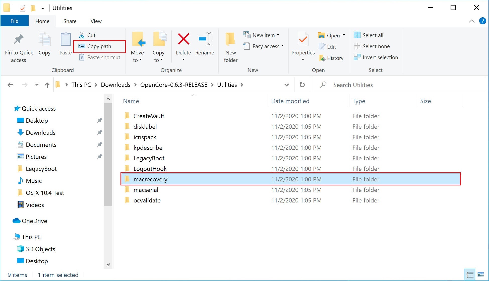
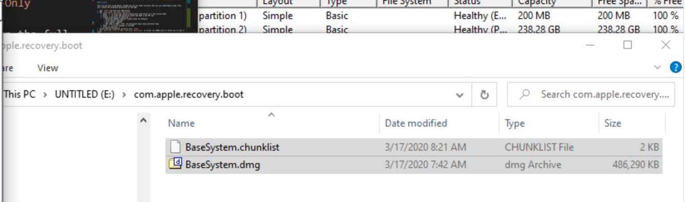
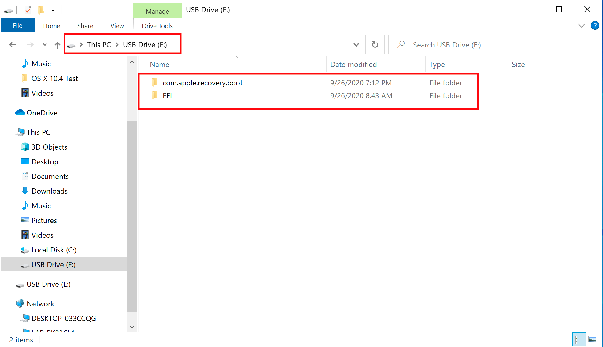

# 在 Windows 中制作安装器

* 支持的版本：0.6.4

虽然你不需要进行一次完全重新安装以使用 OpenCore，但是建议一些用户对他们的引导管理器升级进行完全的重新安排。

你需要依赖这些来开始：

* 4GB USB 驱动器
* [macrecovery.py](https://github.com/acidanthera/OpenCorePkg/releases)
  * 这将会需要[已安装的 Python](https://www.python.org/downloads/)

## 下载 macOS

获取经典安装程序真的非常简单，首先获取一份 [OpenCorePkg](https://github.com/acidanthera/OpenCorePkg/releases) 的副本，然后进入 `/Utilities/macrecovery/` 目录。接着，拷贝 macrecovery 所在文件夹的路径： 

* 注意：0.6.4 和更低版本的 macrecovery.py 构建是损坏的，你需要[下载 master 分支的副本](https://github.com/acidanthera/OpenCorePkg/archive/master.zip)并使用放置于 `Utilities/macrecovery/` 目录下的那一个



在此，你需要打开一个命令提示符并 cd 到我们刚才拷贝的 macrecovery 的目录下：

```sh
cd Paste_Folder_Path
```


现在，取决于你想要哪个版本的 macOS，运行下方的其中一组命令（注意，这些脚本依赖于 [Python](https://www.python.org/downloads/) 支持，如果你没有准备好它，请先安装）：

```sh
# Lion（10.7）：
python macrecovery.py -b Mac-2E6FAB96566FE58C -m 00000000000F25Y00 download
python macrecovery.py -b Mac-C3EC7CD22292981F -m 00000000000F0HM00 download

# Mountain Lion（10.8）：
python macrecovery.py -b Mac-7DF2A3B5E5D671ED -m 00000000000F65100 download

# Mavericks（10.9）：
python macrecovery.py -b Mac-F60DEB81FF30ACF6 -m 00000000000FNN100 download

# Yosemite（10.10）：
python macrecovery.py -b Mac-E43C1C25D4880AD6 -m 00000000000GDVW00 download

# El Capitan（10.11）：
python macrecovery.py -b Mac-FFE5EF870D7BA81A -m 00000000000GQRX00 download

# Sierra（10.12）：
python macrecovery.py -b Mac-77F17D7DA9285301 -m 00000000000J0DX00 download

# High Sierra（10.13）
python macrecovery.py -b Mac-7BA5B2D9E42DDD94 -m 00000000000J80300 download
python macrecovery.py -b Mac-BE088AF8C5EB4FA2 -m 00000000000J80300 download

# Mojave（10.14）
python macrecovery.py -b Mac-7BA5B2DFE22DDD8C -m 00000000000KXPG00 download

# Catalina（10.15）
python macrecovery.py -b Mac-00BE6ED71E35EB86 -m 00000000000000000 download

# 最新版本
# 例如：Big Sur（11）
python macrecovery.py -b Mac-E43C1C25D4880AD6 -m 00000000000000000 download
```

* **macOS 11 Big Sur 注意事项**：因为这个操作系统太新了，依然有一些确定的问题需要系统来解决。对于更多的信息，参阅此处：[OpenCore 和 macOS 11: Big Sur](../extras/big-sur/README.md)
  * 对于第一次使用的用户，我们推荐 10.15 Catalina
* **Nvidia 显卡注意事项**：记得确认你的硬件是否支持较新的操作系统，请参阅[硬件限制](../macos-limits.md)

这将会花费一些时间，但是一旦你完成，你应该会得到 BaseSystem 或 RecoveryImage：


| BaseSystem | RecoveryImage |
| :--- | :--- |
| |  |

现在我们的安装程序已经下载好了，我们需要继续格式化 USB。

## 创建安装器

这里我们将会格式化我们的 USB 驱动器并将 macOS 添加到里面，你有 2 个选项：

* [磁盘管理方式](#磁盘管理方式)
  * 基于 GUI，最简单的方式
  * 只有 UEFI 系统支持（例如：2012 年及以后的系统）
* [diskpart 方式](#diskpart-方式)
  * 基于命令行，工作量稍大
  * 需要经典系统（例如：无 UEFI 支持，2012 年以前的系统）

### 磁盘管理方式

简单地启动磁盘管理，并将你的 USB 驱动器格式化为 FAT32 文件系统：

1. 右键单击任务栏上的开始菜单，并选择磁盘管理。
2. 你应该能看到你的所有分区和磁盘。在界面的下半部分，你会看到你的设备，找到你的 USB 设备。
3. 你需要格式化 USB 驱动器以拥有一个 FAT32 分区。

* 如果你的 USB 驱动器上有多个分区，为你的 USB 驱动器右键单击每个分区并单击删除卷（这将会删除数据，确保你有备份并且只删除了 USB 驱动器上的分区）
  * 右键单击未分配的空间并创建一个新的简单卷。确保它是 FAT32 格式，并且至少有 1G 或 2G 的大小。将它命名为“EFI”。
* 否则，右键单击 USB 驱动器上的分区并选择格式化，将其调整为 FAT32 文件系统。Otherwise, right click the partition on the USB and click Format and set it to FAT32.


接下来，进入 USB 驱动器的根目录并创建一个名为 `com.apple.recovery.boot` 的文件夹。然后移动下载好的 BaseSystem 或 RecoveryImage 文件到这个文件夹中。请保证你同时拷贝了 .dmg 和 .chunklist 文件到此文件夹中：



现在，找到你刚才下载的 OpenCorePkg 并打开它：


在这里我们可以同时看到 IA32（32 位 CPU）和 X64（64 位 CPU）文件夹，选择最适合你的硬件的那一个并打开它。然后找到 EFI 文件夹，将它放置于 USB 驱动器的根目录，与 com.apple.recovery.boot 在一起。完成后应该看起来像这样：



### diskpart 方式

::: details diskpart 方式

按下 Windows + R 并输入 `diskpart`。

现在运行下面的命令：

```sh
# 列出可用的磁盘
list disk
# 选择你的磁盘（例如：disk 1）
select disk 1
# 格式化驱动器
clean
# 转换到 GPT
# 由于 BOOTICE 和 DuetPkg 的一个奇怪的问题，MBR 磁盘将不能启动
convert gpt
# 创建一个新分区
create partition primary
# 选择你的分区
# 运行 clean 以保证我们只有 1 个分区，所以它将会是“partition 1”
select partition 1
# 将它格式化为 FAT32 文件系统
format fs=fat32 quick
# 分配一个新盘符（例如：驱动器 E，确保你想要分配的盘符现在不在使用中）
ASSIGN LETTER=E
```

接下来，进入 USB 驱动器的根目录并创建一个名为 `com.apple.recovery.boot` 的文件夹。然后移动下载好的 BaseSystem 或 RecoveryImage 文件到这个文件夹中。请保证你同时拷贝了 .dmg 和 .chunklist 文件到此文件夹中：


现在，找到你刚才下载的 OpenCorePkg 并打开它：


在这里我们可以同时看到 IA32（32 位 CPU）和 X64（64 位 CPU）文件夹，选择最适合你的硬件的那一个并打开它。然后找到 EFI 文件夹，将它放置于 USB 驱动器的根目录，与 com.apple.recovery.boot 在一起。完成后应该看起来像这样：


::: details 设置经典安装

如果你的固件不支持 UEFI，查看下面的说明：

你需要依赖这些来开始：

* [7-Zip](https://www.7-zip.org)
* [BOOTICE](https://www.majorgeeks.com/files/details/bootice_64_bit.html)
* [OpenCorePkg](https://github.com/acidanthera/OpenCorePkg/releases)

接下来，打开 BOOTICE 并保证你选择了正确的驱动器。


下一步，点击“处理 MBR（Process MBR）”并选择“恢复 MBR（Restore MBR）”，然后选择 OpenCorePkg 中位于 `Utilities/LegacyBoot/` 目录下的 **boot0** 文件：

| 恢复 MBR | 恢复 boot0 文件 |
| :--- | :--- |
|  |  |

接着回到主页面并选择“处理 PBR”然后“恢复 PBR”。在这里，选择 OpenCorePkg 中位于 `Utilities/LegacyBoot/` 目录下 的 **Boot1f32** 文件：

| 恢复 PBR | 恢复 boot1f32 文件 |
| :--- | :--- |
|  |  |

一旦完成，回到你的 USB 驱动器并完成最后一件事情。在 `Utilities/LegacyBoot/` 目录下找到 **bootx64**（64 位 CPU）或 **bootia32** （32 位 CPU）文件，然后将其放置到你的驱动器的根目录。**将这个文件重命名为 boot** 以保证 DuetPkg 能正常运行：


:::

## 现在所有事项都已完成，跳转到[设置 EFI](./opencore-efi.md) 以完成你的工作
