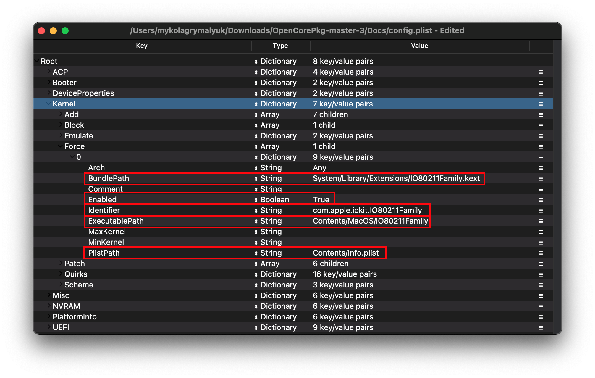

# 收集需要的文件

* 支持的版本：0.6.6

本章节主要讨论正常启动 macOS 所需的各种文件。在开始之前，我们希望您已经对您自己的硬件有了充分的了解，并在之前成功制作过一台黑苹果，因为我们不会在这里提供太过深层的信息。

> 判断 macOS 是否支持我的硬件的最好办法是什么?

查看 [硬件限制](macos-limits.md) 来了解 macOS 需要什么来启动，Clover 和 OpenCore 支持的硬件范围相差无几

> 有什么方法来弄清楚我的电脑的具体硬件信息吗?

请查阅之前的章节：[查找您的硬件](./find-hardware.md)

## 固件驱动

OpenCore 会在 UEFI 环境下使用固件驱动。启动系统需要这些驱动，同时它们可以拓展 OpenCore 的修补能力，或使 OpenCore 选择器支持显示不同类型的驱动器（如：HFS 驱动器）。

* **注意位置**：这些文件 **必须** 被放置在 `EFI/OC/Drivers/`

### 通用

::: tip 需要的驱动

对于大部分机器来说，只需要两个 `.efi` 驱动：

* [HfsPlus.efi](https://github.com/acidanthera/OcBinaryData/blob/master/Drivers/HfsPlus.efi)
  * 用于识别 HFS 分区（如：macOS 安装器、恢复环境分区/镜像）。**不要把这个驱动和其他 HFS 驱动相混淆**
  * 对于 Sandy Bridge 及更旧的架构（以及一些低端的 Ivy Bridge（i3 和 Celerons）），请查看下面的“传统用户”章节
* [OpenRuntime.efi](https://github.com/acidanthera/OpenCorePkg/releases)
  * 作为 [AptioMemoryFix.efi](https://github.com/acidanthera/AptioFixPkg) 的替代品, 作为 OpenCore 的一个扩展，帮助 OpenCore 向 boot.efi 打补丁以此来修复 NVRAM 和提供更好的内存管理
  * 我们刚刚下载的 OpenCorePkg 已经包含了这个文件

:::

### 传统用户

在以上几点之外，如果您的主板不支持 UEFI（2011 及更早时期），您将需要以下驱动。 请仔细阅读每一项，因为大部分情况下你并不需要全部 4 个驱动:

* [OpenUsbKbDxe.efi](https://github.com/acidanthera/OpenCorePkg/releases)
  * 用于 OpenCore 选择器，**适用于使用 DuetPkg 的传统平台**，[不推荐在支持 UEFI 的架构上使用，甚至有害（Ivy Bridge 及更新的架构）](https://applelife.ru/threads/opencore-obsuzhdenie-i-ustanovka.2944066/page-176#post-856653)
* [HfsPlusLegacy.efi](https://github.com/acidanthera/OcBinaryData/blob/master/Drivers/HfsPlusLegacy.efi)
  * 传统版本的 HfsPlus，用于缺失 RDRAND 指令支持的平台。这种情况通常见于 Sandy Bridge 及更旧的架构（以及一些低端的 Ivy Bridge（i3 和 Celerons））
  * 不要将此驱动与 HfsPlus.efi 相混淆，请根据您的硬件来选择
* [PartitionDxe](https://github.com/acidanthera/OcBinaryData/blob/master/Drivers/PartitionDxe.efi)
  * 用于启动 OS X 10.7 到 10.9 版本的恢复环境
  * 适用于 Sandy Bridge 及更旧的架构（以及一些低端的 Ivy Bridge（i3 和 Celerons）），由于 RDRAND 命令的缺失，您还可能需要使用 [PartitionDxeLegacy](https://github.com/acidanthera/OcBinaryData/blob/master/Drivers/PartitionDxeLegacy.efi)
  * 自 OS X 10.10 Yosemite 起，不再需要此驱动

这些文件需要被放置到 EFI 的 Drivers 文件夹下

::: details 32-Bit 专用

对于这些使用 32 位 CPU 的电脑，您需要这些驱动：

* [HfsPlus32](https://github.com/acidanthera/OcBinaryData/blob/master/Drivers/HfsPlus32.efi)
  * HfsPlusLegacy 的另一个版本，不过是 32 位 CPU 专用的，不要将此驱动和其他 HFS .efi 相混淆
* [PartitionDxe32](https://github.com/acidanthera/OcBinaryData/blob/master/Drivers/PartitionDxe32.efi)
  * PartitionDxeLegacy 的另一个版本，不过是 32 位 CPU 专用的，不要将此驱动和 PartitionDxe.efi 相混淆

:::

## 内核扩展

.kext 文件是内核扩展（**K**ernel **Ext**ension），您可以把这个当作是 macOS 的驱动，这些文件需要放置在 EFI 分区里的 Kexts 文件夹

* **Windows 或 Linux 要注意**：在这些系统上，内核扩展看起来更像一个文件夹，请**重复检查** 这些文件夹是否带有一个可见的 .kext 后缀，如果没有，也请不要手动添加。
  * 如果您下载的内核扩展带有扩展名为 `.dSYM` 的文件，您可以直接将其删除。它只用于调试作用
* **注意位置**：这些文件 **must** 被放置在 `EFI/OC/Kexts/`.

所有在下方列出的内核扩展都能在 [Kext Repo](http://kexts.goldfish64.com/) 找到 **编译后的** 文件. 这里的内核扩展会在每一次提交后更新

### 必须使用

::: tip 需要的内核扩展

缺少以下两个内核扩展，任何版本的 macOS 都无法启动

* [VirtualSMC](https://github.com/acidanthera/VirtualSMC/releases)
  * 模拟白苹果上的 SMC 芯片，缺少这个 macOS 将无法启动
  * 一个可选项是 FakeSMC ，可能会提供更好或者更坏的支持，主要用于传统硬件
  * 需要 OS X 10.6 或更新版本
* [Lilu](https://github.com/acidanthera/Lilu/releases)
  * 一个用于向许多进程打补丁的内核扩展，为 AppleALC、WhateverGreen、VirtualSMC 以及许多其他内核扩展所依赖。缺少 Lilu，这些内核扩展将无法正常工作
  * Lilu 以及依赖它的插件都需要 OS X 10.8 或更新版本
  
::: details 传统“必须使用”的内核扩展

对于这些打算在 32 位硬件上运行 OS X 10.7 及更旧版本的用户，您可能需要使用以下内核扩展来替代 VirtualSMC:

* [FakeSMC-32](https://github.com/khronokernel/Legacy-内核扩展/blob/master/32Bit-only/Zip/FakeSMC-32.kext.zip?raw=true)

如果您不打算安装这些旧版本系统，您可以忽略掉这个内核扩展

* **OS X 10.4 和 10.5 要注意**：即使是 64 位的 CPU , OS X 的内核空间也是 32 位的。所以我们推荐您使用 FakeSMC-32 来替代 VirtualSMC，特别是将 FakeSMC-32 的 `Arch` 项设为 `i386` 并且将 VirtualSMC 的设为 `x86_64`。这个向导会在之后深入讨论这些项的设置

:::

### VirtualSMC 的插件

启动 macOS 并不依赖于以下内核扩展，它们只用于提供附加功能，如硬件监控（要注意虽然 VirtualSMC 支持 10.6，这些插件需要 10.8 及更新版本)：

* SMCProcessor.kext
  * 用于监控 CPU 温度，**不会在基于 AMD CPU 的电脑上工作**
* SMCSuperIO.kext
  * 用于监控风扇速度，**不会在基于 AMD CPU 的电脑上工作**
* SMCLightSensor.kext
  * 用于驱动笔记本电脑上的环境光传感器，**台式机可以忽略这个**
  * 如果您的电脑没有环境光传感器，请不要使用这个内核扩展，否则会导致一些问题
* SMCBatteryManager.kext
  * 用于读取笔记本电脑的当前电池电量，**台式机可以忽略这个**
  * 除非您的电池经过修复，否则不要使用这个内核扩展，会导致问题。对于初次安装，请忽略这个内核扩展。安装后您可以遵循这个页面的方法来配置：[修复电量读取](https://dortania.github.io/OpenCore-Post-Install/laptop-specific/battery.html)
* SMCDellSensors.kext
  * 用于支持系统控制模式（System Management Mode，SMM）从而更好地监控和控制戴尔品牌电脑的风扇
  * **如果您没有一台受支持的戴尔品牌电脑，请不要使用这个内核扩展**，大多数戴尔品牌的电脑都能从这个内核扩展受益

### 图形卡/显示卡

* [WhateverGreen](https://github.com/acidanthera/WhateverGreen/releases)
  * 用于修复 DRM、boardID、缓冲帧补丁等图形卡相关内容，所有的 GPU 都能从这个内核扩展中受益
  * 需要 OS X 10.8 或更新版本

### 音频

* [AppleALC](https://github.com/acidanthera/AppleALC/releases)
  * 用于给 AppleHDA 打补丁，使其能够支持大部分板载音频控制器
  * 在 AMD 15h/16h 平台上存在问题，以及 Ryzen/Threadripper 平台很少能得到麦克风支持
  * 需要 OS X 10.8 或更新版本
  
::: details 传统音频内核扩展

对于这些打算启动 10.7 及更旧版本的用户，可能需要选择这些内核扩展来代替：

* [VoodooHDA](https://sourceforge.net/projects/voodoohda/)
  * 需要 OS X 10.6 或更新版本
  
* [VoodooHDA-FAT](https://github.com/khronokernel/Legacy-内核扩展/blob/master/FAT/Zip/VoodooHDA.kext.zip)
  * 和前者相似，但是同时支持 32 和 64 位内核，所以对于启动 OS X 10.4-5 以及 32 位 CPU 是完美的

:::

### 以太网

我们假设您已经知道自己的以太网卡的型号，要记住商品详情页面通常会列出网卡的类型.

* [IntelMausi](https://github.com/acidanthera/IntelMausi/releases)
  * 用于驱动大多数英特尔（Intel）网络接口控制器，基于 I211 芯片组的网络接口控制器则需要使用 `SmallTreeIntel82576.kext`
  * Intel 82578、82579、i217、i218 和 i219 网卡免驱
  * 需要 OS X 10.9 或更新版本，10.6-10.8 版本的用户请使用 IntelSnowMausi 来支持更旧版本的系统
* [SmallTreeIntel82576 kext](https://github.com/khronokernel/SmallTree-I211-AT-patch/releases)
  * 用于驱动 i211 网卡，基于 SmallTree 内核扩展修改
  * 大多数 AMD 主板都需要此内核扩展来驱动英特尔网络接口控制器
  * 需要 OS X 10.9-12(v1.0.6), macOS 10.13-14(v1.2.5), macOS 10.15+(v1.3.0)
* [AtherosE2200Ethernet](https://github.com/Mieze/AtherosE2200Ethernet/releases)
  * 用于驱动 Atheros 和 Killer 网络接口控制器
  * 需要 OS X 10.8 或更新版本
  * 注意：Atheros Killer E2500 实际上是基于 Realtek 芯片的，对于这些电脑请使用 [RealtekRTL8111](https://github.com/Mieze/RTL8111_driver_for_OS_X/releases) 来代替
* [RealtekRTL8111](https://github.com/Mieze/RTL8111_driver_for_OS_X/releases)
  * 用于瑞昱（Realtek）的千兆以太网卡
  * 需要 OS X 10.8-11(2.2.0)、10.12-13(v2.2.2)、10.14+(2.3.0)
  * **注意: 当您在使用 RealtekRTL8111 v2.3.0 时，以太网有时会无法正确地工作。如果您遇到了这个问题，请尝试回退到 2.2.2 版本**
* [LucyRTL8125Ethernet](https://www.insanelymac.com/forum/files/file/1004-lucyrtl8125ethernet/)
  * 用于驱动 Realtek 2.5Gb 以太网卡
  * 需要 macOS 10.15 或更新版本
* 对于 Intel i225-V NICs，Comet Lake 的 DeviceProperties 章节中给出了将其驱动的补丁。不需要额外的内核扩展
  * 需要 macOS 10.15 或更新版本

::: details 传统以太网内核扩展

主要和传统 macOS 安装或老旧 PC 硬件相关

* [AppleIntele1000e](https://github.com/chris1111/AppleIntelE1000e/releases)
  * 主要用于英特尔 10/100MBe 以太网控制器
  * 需要 10.6 或更新版本
* [RealtekRTL8100](https://www.insanelymac.com/forum/files/file/259-realtekrtl8100-binary/)
  * 主要用于瑞昱 10/100MBe 以太网控制器
  * 需要 macOS 10.12 或更新版本，并使用 v2.0.0 以上版本的内核扩展
* [BCM5722D](https://github.com/chris1111/BCM5722D/releases)
  * 主要用于博通 BCM5722 以太网控制器
  * 需要 OS X 10.6 或更新版本

:::

还要注意的时，部分 NIC 被 macOS 原生支持：

::: details 原生以太网卡控制器

#### Aquantia 系列

```md
# AppleEthernetAquantiaAqtion.kext
pci1d6a,1    = Aquantia AQC107
pci1d6a,d107 = Aquantia AQC107
pci1d6a,7b1  = Aquantia AQC107
pci1d6a,80b1 = Aquantia AQC107
pci1d6a,87b1 = Aquantia AQC107
pci1d6a,88b1 = Aquantia AQC107
pci1d6a,89b1 = Aquantia AQC107
pci1d6a,91b1 = Aquantia AQC107
pci1d6a,92b1 = Aquantia AQC107
pci1d6a,c0   = Aquantia AQC113
pci1d6a,4c0  = Aquantia AQC113
```

**注意**：由于许多 Aquantia NIC 主控芯片的固件较为过时，您可能需要通过 Linux/Windows 更新其固件来确保它能兼容 macOS。

#### Intel 系列

```md
# AppleIntel8254XEthernet.kext
pci8086,1096 = Intel 80003ES2LAN
pci8086,100f = Intel 82545EM
pci8086,105e = Intel 82571EB/82571GB

# AppleIntelI210Ethernet.kext
pci8086,1533 = Intel I210
pci8086,15f2 = Intel I225LM (Added in macOS 10.15)

# Intel82574L.kext
pci8086,104b = Intel 82566DC
pci8086,10f6 = Intel 82574L

```

#### Broadcom 系列

```md
# AppleBCM5701Ethernet.kext
pci14e4,1684 = Broadcom BCM5764M
pci14e4,16b0 = Broadcom BCM57761
pci14e4,16b4 = Broadcom BCM57765
pci14e4,1682 = Broadcom BCM57762
pci14e4,1686 = Broadcom BCM57766
```

:::

### USB

* [USBInjectAll](https://bitbucket.org/RehabMan/os-x-usb-inject-all/downloads/)
  * 为没有在 ACPI 中定义 USB 接口的主板注入 Intel USB 控制器
  * 台式机 Skylake 及更新的架构应该不需要这个
    * 华擎主板比较特别，需要这个
    * 但是 Coffee Lake 及更旧的架构的笔记本推荐使用这个内核扩展
  * **完全**无法在 AMD 平台上工作
  * 需要 OS X 10.11 或更新版本

* [XHCI-unsupported](https://github.com/RehabMan/OS-X-USB-Inject-All)
  * 用于修复非原生支持的 USB 控制器
  * 基于 AMD CPU 的电脑不需要使用这个
  * 常见的需要此内核扩展的主板芯片组有：
    * H370
    * B360
    * H310
    * Z390（Mojave 及更新版本不再需要）
    * X79
    * X99
    * 华擎主板（主要是 Intel 主板，但是 B460/Z490 及更新的主板却不再需要这个）

### Wi-Fi 与蓝牙

#### 英特尔 Intel

* [AirportItlwm](https://github.com/OpenIntelWireless/itlwm/releases)
  * 为大量 Intel 无线网卡提供支持，由于整合了 IO80211Family，还能在 Recovery 中使用
  * 需要 macOS 10.13 或更新版本并需要 Apple 安全启动来提供功能支持
* [IntelBluetoothFirmware](https://github.com/OpenIntelWireless/IntelBluetoothFirmware/releases)
  * 为 Intel 无线网卡提供 macOS 的蓝牙支持
  * 需要 macOS 10.13 或更新版本

::: details 如何正确使用 AirportItlwm

如果要在 OpenCore 启用 AirportItlwm 支持，您需要以下操作:

* 请将 `Misc -> Security -> SecureBootModel` 设为 `Default` 或其他有效值
  * 这部分会在下文与安装后指南讨论：[Apple 安全启动](https://dortania.github.io/OpenCore-Post-Install/universal/security/applesecureboot.html)
* 如果您无法启用 SecureBootModel，您依然可以尝试强制注入 IO80211Family（**极度不推荐**）
  * 在 config.plist 中的 `Kernel -> Force` 下添加以下内容 (详情会在下文讨论):
  


:::

#### 博通 Broadcom

* [AirportBrcmFixup](https://github.com/acidanthera/AirportBrcmFixup/releases)
  * 用来为非 Apple、Fenvi 品牌的博通网卡打补丁，**无法驱动英特尔、Killer 或 瑞昱等品牌的网卡**
  * 需要 OS X 10.10 或更新版本
  * 如果您在使用 Big Sur 版本的系统，请查看 [已知 Big Sur 上存在的问题](./extras/big-sur#known-issues) 来了解更多有关 AirPortBrcm4360 驱动的详情.
* [BrcmPatchRAM](https://github.com/acidanthera/BrcmPatchRAM/releases)
  * 用于为 Broadcom 蓝牙芯片组上传固件，所有非 Apple、Fenvi 品牌的支持隔空功能的网卡都需要这个内核扩展
  * 与 BrcmFirmwareData.kext 一起使用
    * BrcmPatchRAM3 用于 10.15+（必须和 BrcmBluetoothInjector 一起使用）
    * BrcmPatchRAM2 用于 10.11-10.14
    * BrcmPatchRAM 用于 10.8-10.10

::: details BrcmPatchRAM 的加载顺序

这些内核扩展在 config 中 `Kernel -> Add` 的顺序应该是：

1. BrcmBluetoothInjector
2. BrcmFirmwareData
3. BrcmPatchRAM3

但是 ProperTree 会自动为您处理这个问题，所以您无需过于担心

:::

### AMD CPU 专用内核扩展

* [XLNCUSBFIX](https://cdn.discordapp.com/attachments/566705665616117760/566728101292408877/XLNCUSBFix.kext.zip)
  * 用于修复 AMD FX 平台的 USB，Ryzen 平台不推荐使用
  * 需要 macOS 10.13 或更新版本
* [VoodooHDA](https://sourceforge.net/projects/voodoohda/)
  * 用于提供对 FX 平台的音频支持和对 Ryzen 平台的前面板麦克风和耳机孔支持，不要与 AppleALC 相混淆。在 Zen 架构 CPU 上的音频质量比 AppleALC 要差
  * 需要 OS X 10.6 或更新版本

### 其它内核扩展

* [AppleMCEReporterDisabler](https://github.com/acidanthera/bugtracker/files/3703498/AppleMCEReporterDisabler.kext.zip)
  * 用来在 Catalina 版本禁用 AppleMCEReporter 内核扩展。AppleMCEReporter 会在多 CPU 接口的主板和 AMD CPU 的电脑上导致内核崩溃
  * 受影响的 SMBIOS:
    * MacPro6,1
    * MacPro7,1
    * iMacPro1,1
  * 需要 macOS 10.15 或更新版本
* [CpuTscSync](https://github.com/lvs1974/CpuTscSync/releases)
  * 用于在一些 Intel 的 HEDT 和服务器主板上同步 TSC ，缺少这个 macOS 可能会反应缓慢甚至无法启动
  * **无法在 AMD 平台上工作**
  * 需要 OS X 10.8 或更新版本
* [NVMeFix](https://github.com/acidanthera/NVMeFix/releases)
  * 用来初始化和修复非 Apple 官方 NVMe 的电源管理
  * 需要 macOS 10.14 或更新版本
* [SATA-Unsupported](https://github.com/khronokernel/Legacy-内核扩展/blob/master/Injectors/Zip/SATA-unsupported.kext.zip)
  * 为大量的 SATA 控制器提供支持，主要用于解决笔记本无法在 macOS 看到 SATA 驱动器的问题. 推荐先不使用该内核扩展来测试是否可以看到 SATA 驱动器
  * **macOS Big Sur 注意**：由于该版本的 AppleAHCIPort 移除了对许多 SATA 控制器的支持，您可能需要使用 [CtlnaAHCIPort](https://github.com/dortania/OpenCore-Install-Guide/blob/master/extra-files/CtlnaAHCIPort.kext.zip) 来修复
    * Catalina 及更旧的版本可以忽略这个

::: details 传统 SATA 内核扩展

* [AHCIPortInjector](https://github.com/khronokernel/Legacy-内核扩展/blob/master/Injectors/Zip/AHCIPortInjector.kext.zip)
  * 传统 SATA/AHCI 注入器，主要和 Penryn 时期的老旧机器有关
* [ATAPortInjector](https://github.com/khronokernel/Legacy-内核扩展/blob/master/Injectors/Zip/ATAPortInjector.kext.zip)
  * 传统 ATA 注入器，主要和 IDE 和 ATA 设备相关（如：BIOS 里缺少 AHCI 选项）
  
:::

### 笔记本电脑专用

要弄清楚您的键盘和触控板是什么类型，请查看 Windows 设备管理器或在 Linux 执行 `dmesg | grep input`

#### 输入设备驱动

* [VoodooPS2](https://github.com/acidanthera/VoodooPS2/releases)
  * 用于带有 PS2 键盘、鼠标或触控板的电脑
  * 需要 macOS 10.11 或更新版本，以此来支持 MT2 (妙控板 2) 功能
* [RehabMan 开发的 VoodooPS2](https://bitbucket.org/RehabMan/os-x-voodoo-ps2-controller/downloads/)
  * 用于带有 PS2 键盘、鼠标或触控板的较旧的电脑，如果你不想使用 VoodooInput 也可以更换为此内核扩展
  * 需要 macOS 10.6 或更新版本
* [VoodooRMI](https://github.com/VoodooSMBus/VoodooRMI/releases/)
  * 用于带有基于 SMBus 的 Synaptics 触控板的电脑，主要和触控板和小红点（Trackpoint）有关
  * 需要 macOS 10.11 或更新版本，以此来支持 MT2 (妙控板 2) 功能
* [VoodooSMBus](https://github.com/VoodooSMBus/VoodooSMBus/releases)
  * 用于带有基于 SMBus 的 ELAN 触控板的电脑，主要和触控板和小红点（Trackpoint）有关
  * 支持 macOS 10.14 或更新版本
* [VoodooI2C](https://github.com/VoodooI2C/VoodooI2C/releases)
  * 用于修复 I2C 设备，可以在一些较新的电脑上看见
  * 需要 macOS 10.11 或更新版本，以此来支持 MT2 (妙控板 2) 功能

::: details VoodooI2C 插件

| 连接类型 | 插件名 | 描述 |
| :--- | :--- | :--- |
| Microsoft HID | VoodooI2CHID | 也支持 USB 连接的触控屏 |
| ELAN Proprietary | VoodooI2CElan | ELAN1200+ 需要使用 VoodooI2CHID 来代替 |
| Synaptics Proprietary | VoodooI2CSynaptics | Synaptics F12 协议需要使用 VoodooI2CHID 来代替 |
| ^^ | VoodooRMI | 支持 Synaptics 协议 F12/F3A ，它们通常也支持 Microsoft 的 HID 标准，所以您应该先尝试 VoodooI2CHID |
| FTE1001 touchpad | VoodooI2CFTE | |
| Atmel Multitouch Protocol | VoodooI2CAtmelMXT | |
:::

#### 杂项

请访问 [Kext.md](https://github.com/acidanthera/OpenCorePkg/blob/master/Docs/内核扩展.md) 来获取完整的受支持内核扩展列表

## SSDT 热补丁

您会在 AcpiSamples 文件夹看到许多样板 SSDT，并且可能好奇需要哪些 SSDT。因为 SSDT 需要根据平台来选择，所以我们会在 **配置 config.plist 的 ACPI 部分** 讨论您所需要的 SSDT。 还有一些专用的 SSDT 需要根据您的电脑来配置，如果我直接列出所有的 SSDT 来让您选择，您很有可能会被弄得晕头转向。

[ACPI 入门](https://dortania.github.io/Getting-Started-With-ACPI/) 会讨论为不同系统编写 SSDT 的相关内容

一个快速而又繁琐 SSDT 查询表（这些都是未编译的源文件，您需要将他们编译为 .aml 文件）：

### 台式电脑

| 架构 | **CPU** | **EC** | **AWAC** | **NVRAM** | **USB** |
| :-------: | :-----: | :----: | :------: | :-------: | :-----: |
| Penryn | N/A | [SSDT-EC](https://dortania.github.io/Getting-Started-With-ACPI/Universal/ec-fix.html) | N/A | N/A | N/A |
| Lynnfield and Clarkdale | ^^ | ^^ | ^^ | ^^ | ^^ |
| SandyBridge | [CPU-PM](https://dortania.github.io/OpenCore-Post-Install/universal/pm.html#sandy-and-ivy-bridge-power-management) (安装后使用) | ^^ | ^^ | ^^ | ^^ |
| Ivy Bridge | ^^ | ^^ | ^^ | ^^ | ^^ |
| Haswell | [SSDT-PLUG](https://dortania.github.io/Getting-Started-With-ACPI/Universal/plug.html) | ^^ | ^^ | ^^ | ^^ |
| Broadwell | ^^ | ^^ | ^^ | ^^ | ^^ |
| Skylake | ^^ | [SSDT-EC-USBX](https://dortania.github.io/Getting-Started-With-ACPI/Universal/ec-fix.html) | ^^ | ^^ | ^^ |
| Kaby Lake | ^^ | ^^ | ^^ | ^^ | ^^ |
| Coffee Lake | ^^ | ^^ | [SSDT-AWAC](https://dortania.github.io/Getting-Started-With-ACPI/Universal/awac.html) | [SSDT-PMC](https://dortania.github.io/Getting-Started-With-ACPI/Universal/nvram.html) | ^^ |
| Comet Lake | ^^ | ^^ | ^^ | N/A | [SSDT-RHUB](https://dortania.github.io/Getting-Started-With-ACPI/Universal/rhub.html) |
| AMD (15/16h) | N/A | ^^ | N/A | ^^ | N/A |
| AMD (17/19h) | [B550 和 A520 需要 SSDT-CPUR](https://github.com/dortania/Getting-Started-With-ACPI/blob/master/extra-files/compiled/SSDT-CPUR.aml) | ^^ | ^^ | ^^ | ^^ |

### 高性能台式电脑

| 架构 | **CPU** | **EC** | **RTC** | **PCI** |
| :-------: | :-----: | :----: | :-----: | :-----: |
| Nehalem and Westmere | N/A | [SSDT-EC](https://dortania.github.io/Getting-Started-With-ACPI/Universal/ec-fix.html) | N/A | N/A |
| Sandy Bridge-E | ^^ | ^^ | ^^ | [SSDT-UNC](https://dortania.github.io/Getting-Started-With-ACPI/Universal/unc0) |
| Ivy Bridge-E | [SSDT-PLUG](https://dortania.github.io/Getting-Started-With-ACPI/Universal/plug.html) | ^^ | ^^ | ^^ |
| Haswell-E | ^^ | [SSDT-EC-USBX](https://dortania.github.io/Getting-Started-With-ACPI/Universal/ec-fix.html) | [SSDT-RTC0-RANGE](https://dortania.github.io/Getting-Started-With-ACPI/Universal/awac.html) | ^^ |
| Broadwell-E | ^^ | ^^ | ^^ | ^^ |
| Skylake-X | ^^ | ^^ | ^^ | N/A |

### 笔记本电脑

| 架构 | **CPU** | **EC** | **Backlight** | **I2C 触控板** | **AWAC** | **USB** | **IRQ** |
| :-------: | :-----: | :----: | :-----------: | :--------------: | :------: | :-----: | :-----: |
| Clarksfield 或 Arrandale | N/A | [SSDT-EC](https://dortania.github.io/Getting-Started-With-ACPI/Universal/ec-fix.html) | [SSDT-PNLF](https://dortania.github.io/Getting-Started-With-ACPI/Laptops/backlight.html) | N/A | N/A | N/A | [IRQ SSDT](https://dortania.github.io/Getting-Started-With-ACPI/Universal/irq.html) |
| SandyBridge | [CPU-PM](https://dortania.github.io/OpenCore-Post-Install/universal/pm.html#sandy-and-ivy-bridge-power-management) (安装后使用) | ^^ | ^^ | ^^ | ^^ | ^^ | ^^ |
| Ivy Bridge | ^^ | ^^ | ^^ | ^^ | ^^ | ^^ | ^^ |
| Haswell | [SSDT-PLUG](https://dortania.github.io/Getting-Started-With-ACPI/Universal/plug.html) | ^^ | ^^ | [SSDT-GPI0](https://dortania.github.io/Getting-Started-With-ACPI/Laptops/触控板.html) | ^^ | ^^ | ^^ |
| Broadwell | ^^ | ^^ | ^^ | ^^ | ^^ | ^^ | ^^ |
| Skylake | ^^ | [SSDT-EC-USBX](https://dortania.github.io/Getting-Started-With-ACPI/Universal/ec-fix.html) | ^^ | ^^ | ^^ | ^^ | N/A |
| Kaby Lake | ^^ | ^^ | ^^ | ^^ | ^^ | ^^ | ^^ |
| Coffee Lake (8 代) 或 Whiskey Lake | ^^ | ^^ | [SSDT-PNLF-CFL](https://dortania.github.io/Getting-Started-With-ACPI/Laptops/backlight.html) | ^^ | [SSDT-AWAC](https://dortania.github.io/Getting-Started-With-ACPI/Universal/awac.html) | ^^ | ^^ |
| Coffee Lake (9 代) | ^^ | ^^ | ^^ | ^^ | ^^ | ^^ | ^^ |
| Comet Lake | ^^ | ^^ | ^^ | ^^ | ^^ | ^^ | ^^ |
| Ice Lake | ^^ | ^^ | ^^ | ^^ | ^^ | [SSDT-RHUB](https://dortania.github.io/Getting-Started-With-ACPI/Universal/rhub.html) | ^^ |

续上表：

| 架构 | **NVRAM** | **IMEI** |
| :-------: | :-------: | :------: |
|  Clarksfield 或 Arrandale | N/A | N/A |
| Sandy Bridge | ^^| [SSDT-IMEI](https://dortania.github.io/Getting-Started-With-ACPI/Universal/imei.html) |
| Ivy Bridge | ^^ | ^^ |
| Haswell | ^^ | N/A |
| Broadwell | ^^ | ^^ |
| Skylake | ^^ | ^^ |
| Kaby Lake | ^^ | ^^ |
| Coffee Lake (8 代) 或 Whiskey Lake | ^^ | ^^ |
| Coffee Lake (9 代) | [SSDT-PMC](https://dortania.github.io/Getting-Started-With-ACPI/Universal/nvram.html) | ^^ |
| Comet Lake | N/A | ^^ |
| Ice Lake | ^^ | ^^ |

# 这一部分的工作已经完成，现在请前往 [ACPI 快速入门](https://dortania.github.io/Getting-Started-With-ACPI/)

* Supported version: 0.6.5

This section is for gathering miscellaneous files for booting macOS, we do expect you to know your hardware well before starting and hopefully made a Hackintosh before as we won't be deep diving in here.

> What's the best way to figure out if my hardware is supported?

See the [**Hardware Limitations page**](macos-limits.md) for some better insight into what macOS requires to boot, hardware support between Clover and OpenCore are quite similar.

> What are some ways to figure out what hardware I have?

See the page before: [Finding your hardware](./find-hardware.md)

## Firmware Drivers

Firmware drivers are drivers used by OpenCore in the UEFI environment. They're mainly required to boot a machine, either by extending OpenCore's patching ability or showing you different types of drives in the OpenCore picker(ie. HFS drives).

* **Location Note**: These files **must** be placed under `EFI/OC/Drivers/`

### Universal

::: tip Required Drivers

For the majority of systems, you'll only need 2 `.efi` drivers to get up and running:

* [HfsPlus.efi](https://github.com/acidanthera/OcBinaryData/blob/master/Drivers/HfsPlus.efi)
  * Needed for seeing HFS volumes(ie. macOS Installers and Recovery partitions/images). **Do not mix other HFS drivers**
  * For Sandy Bridge and older(as well as low end Ivy Bridge(i3 and Celerons), see the legacy section below
* [OpenRuntime.efi](https://github.com/acidanthera/OpenCorePkg/releases)
  * Replacement for [AptioMemoryFix.efi](https://github.com/acidanthera/AptioFixPkg), used as an extension for OpenCore to help with patching boot.efi for NVRAM fixes and better memory management.
  * Reminder this was bundled in OpenCorePkg we downloaded earlier

:::

### Legacy users

In addition to the above, if your hardware doesn't support UEFI(2011 and older era) then you'll need the following. Pay close attention to each entry as you may not need all 4:

* [OpenUsbKbDxe.efi](https://github.com/acidanthera/OpenCorePkg/releases)
  * Used for OpenCore picker on **legacy systems running DuetPkg**, [not recommended and even harmful on UEFI(Ivy Bridge and newer)](https://applelife.ru/threads/opencore-obsuzhdenie-i-ustanovka.2944066/page-176#post-856653)
* [HfsPlusLegacy.efi](https://github.com/acidanthera/OcBinaryData/blob/master/Drivers/HfsPlusLegacy.efi)
  * Legacy variant of HfsPlus, used for systems that lack RDRAND instruction support. This is generally seen on Sandy Bridge and older(as well as low end Ivy Bridge(i3 and Celerons))
  * Don't mix this with HfsPlus.efi, choose one or the other depending on your hardware
* [PartitionDxe](https://github.com/acidanthera/OcBinaryData/blob/master/Drivers/PartitionDxe.efi)
  * Required to boot recovery on OS X 10.7 through 10.9
  * For Sandy Bridge and older(as well as low end Ivy Bridge(i3 and Celerons)), you'll want to use [PartitionDxeLegacy](https://github.com/acidanthera/OcBinaryData/blob/master/Drivers/PartitionDxeLegacy.efi) due to missing RDRAND instruction.
  * Not required for OS X 10.10, Yosemite and newer

These files will go in your Drivers folder in your EFI

::: details 32-Bit specifics

For those with 32-Bit CPUs, you'll want to grab these drivers as well

* [HfsPlus32](https://github.com/acidanthera/OcBinaryData/blob/master/Drivers/HfsPlus32.efi)
  * Alternative to HfsPlusLegacy but for 32-bit CPUs, don't mix this with other HFS .efi drivers
* [PartitionDxe32](https://github.com/acidanthera/OcBinaryData/blob/master/Drivers/PartitionDxe32.efi)
  * Alternative to PartitionDxeLegacy but for 32-bit CPUs, don't mix this with other PartitionDxe .efi drivers

:::

## Kexts

A kext is a **k**ernel **ext**ension, you can think of this as a driver for macOS, these files will go into the Kexts folder in your EFI.

* **Windows and Linux note**: Kexts will look like normal folders in your OS, **double check** that the folder you are installing has a .kext extension visible(and do not add one manually if it's missing).
  * If any kext also includes a `.dSYM` file, you can simply delete it. They're only for debugging purposes.
* **Location Note**: These files **must** be placed under `EFI/OC/Kexts/`.

All kext listed below can be found **pre-compiled** in the [Kext Repo](http://kexts.goldfish64.com/). Kexts here are compiled each time there's a new commit.

### Must haves

::: tip Required Kexts

Without the below 2, no system is bootable:

* [VirtualSMC](https://github.com/acidanthera/VirtualSMC/releases)
  * Emulates the SMC chip found on real macs, without this macOS will not boot
  * Alternative is FakeSMC which can have better or worse support, most commonly used on legacy hardware.
  * Requires OS X 10.6 or newer
* [Lilu](https://github.com/acidanthera/Lilu/releases)
  * A kext to patch many processes, required for AppleALC, WhateverGreen, VirtualSMC and many other kexts. Without Lilu, they will not work.
  * Note that Lilu and plugins requires OS X 10.8 or newer to function
  
::: details Legacy "Must haves" kexts

For those planning to boot OS X 10.7 and older on 32 bit hardware, you'll want to use the below instead of VirtualSMC:

* [FakeSMC-32](https://github.com/khronokernel/Legacy-Kexts/blob/master/32Bit-only/Zip/FakeSMC-32.kext.zip?raw=true)

Reminder if you don't plan to boot these older OSes, you can ignore this kext.

* **OS X 10.4 and 10.5 note**: Even on 64-bit CPUs, OS X's kernel space is still 32-bit. So we recommend using FakeSMC-32 in tandem with VirtualSMC, specifically by setting FakeSMC-32's `Arch` entry to `i386` and VirtualSMC's to `x86_64`. This is discussed further on in the guide.

:::

### VirtualSMC Plugins

The below plugins are not required to boot, and merely add extra functionality to the system like hardware monitoring(Note while VirtualSMC supports 10.6, plugins may require 10.8+):

* SMCProcessor.kext
  * Used for monitoring CPU temperature, **doesn't work on AMD CPU based systems**
* SMCSuperIO.kext
  * Used for monitoring fan speed, **doesn't work on AMD CPU based systems**
* SMCLightSensor.kext
  * Used for the ambient light sensor on laptops, **desktops can ignore**
  * Do not use if you don't have an ambient light sensor, can cause issues otherwise
* SMCBatteryManager.kext
  * Used for measuring battery readouts on laptops, **desktops can ignore**
  * Do not use until battery has been properly patched, can cause issues otherwise. So for initial setup, please omit this kext. After install you can follow this page for setup: [Fixing Battery Read-outs](https://dortania.github.io/OpenCore-Post-Install/laptop-specific/battery.html)
* SMCDellSensors.kext
  * Allows for finer monitoring and control of the fans on Dell machines supporting System Management Mode(SMM)
  * **Do not use if you do not have a supported Dell machine**, mainly Dell laptops can benefit from this kext

### Graphics

* [WhateverGreen](https://github.com/acidanthera/WhateverGreen/releases)
  * Used for graphics patching DRM, boardID, framebuffer fixes, etc, all GPUs benefit from this kext.
  * Note the SSDT-PNLF.dsl file included is only required for laptops and AIOs, see [Getting started with ACPI](https://dortania.github.io/Getting-Started-With-ACPI/) for more info
  * Requires OS X 10.8 or newer

### Audio

* [AppleALC](https://github.com/acidanthera/AppleALC/releases)
  * Used for AppleHDA patching, allowing support for the majority of on-board sound controllers
  * AMD 15h/16h may have issues with this and Ryzen/Threadripper systems rarely have mic support
  * Requires OS X 10.8 or newer
  
::: details Legacy Audio Kext

For those who plan to boot 10.7 and older may want to opt for these kexts instead:

* [VoodooHDA](https://sourceforge.net/projects/voodoohda/)
  * Requires OS X 10.6 or newer
  
* [VoodooHDA-FAT](https://github.com/khronokernel/Legacy-Kexts/blob/master/FAT/Zip/VoodooHDA.kext.zip)
  * Similar to the above, however supports 32 and 64-Bit kernels so perfect for OS X 10.4-5 booting and 32-Bit CPUs

:::

### Ethernet

Here we're going to assume you know what ethernet card your system has, reminder that product spec pages will most likely list the type of network card.

* [IntelMausi](https://github.com/acidanthera/IntelMausi/releases)
  * Required for the majority of Intel NICs, chipsets that are based off of I211 will need the SmallTreeIntel82576 kext
  * Intel's 82578, 82579, i217, i218 and i219 NICs are officially supported
  * Requires OS X 10.9 or newer, 10.6-10.8 users can use the IntelSnowMausi instead for older OSes
* [SmallTreeIntel82576 kext](https://github.com/khronokernel/SmallTree-I211-AT-patch/releases)
  * Required for i211 NICs, based off of the SmallTree kext but patched to support I211
  * Required for most AMD boards running Intel NICs
  * Requires OS X 10.9-12(v1.0.6), macOS 10.13-14(v1.2.5), macOS 10.15+(v1.3.0)
* [AtherosE2200Ethernet](https://github.com/Mieze/AtherosE2200Ethernet/releases)
  * Required for Atheros and Killer NICs
  * Requires OS X 10.8 or newer
  * Note: Atheros Killer E2500 models are actually Realtek based, for these systems please use [RealtekRTL8111](https://github.com/Mieze/RTL8111_driver_for_OS_X/releases) instead
* [RealtekRTL8111](https://github.com/Mieze/RTL8111_driver_for_OS_X/releases)
  * For Realtek's Gigabit Ethernet
  * Requires OS X 10.8-11(2.2.0), 10.12-13(v2.2.2), 10.14+(2.3.0)
  * **NOTE: Sometimes Realtek's Gigabit Ethernet may not work correctly if you have RealtekRTL8111 v2.3.0. If you see this issue, try reverting to version 2.2.2**
* [LucyRTL8125Ethernet](https://www.insanelymac.com/forum/files/file/1004-lucyrtl8125ethernet/)
  * For Realtek's 2.5Gb Ethernet
  * Requires macOS 10.15 or newer
* For Intel's i225-V NICs, patches are mentioned in the desktop Comet Lake DeviceProperty section. No kext is required.
  * Requires macOS 10.15 or newer

::: details Legacy Ethernet Kexts

Relevant for either legacy macOS installs or older PC hardware.

* [AppleIntele1000e](https://github.com/chris1111/AppleIntelE1000e/releases)
  * Mainly relevant for 10/100MBe based Intel Ethernet controllers
  * Requires 10.6 or newer
* [RealtekRTL8100](https://www.insanelymac.com/forum/files/file/259-realtekrtl8100-binary/)
  * Mainly relevant for 10/100MBe based Realtek Ethernet controllers
  * Requires macOS 10.12 or newer with v2.0.0+
* [BCM5722D](https://github.com/chris1111/BCM5722D/releases)
  * Mainly relevant for BCM5722 based Broadcom Ethernet controllers
  * Requires OS X 10.6 or newer

:::

And also keep in mind certain NICs are actually natively supported in macOS:

::: details Native Ethernet Controllers

#### Aquantia Series

```md
# AppleEthernetAquantiaAqtion.kext
pci1d6a,1    = Aquantia AQC107
pci1d6a,d107 = Aquantia AQC107
pci1d6a,7b1  = Aquantia AQC107
pci1d6a,80b1 = Aquantia AQC107
pci1d6a,87b1 = Aquantia AQC107
pci1d6a,88b1 = Aquantia AQC107
pci1d6a,89b1 = Aquantia AQC107
pci1d6a,91b1 = Aquantia AQC107
pci1d6a,92b1 = Aquantia AQC107
pci1d6a,c0   = Aquantia AQC113
pci1d6a,4c0  = Aquantia AQC113
```

**Note**: Due to some outdated firmware shipped on many Aquantia NICs, you may need to update the firmware in Linux/Windows to ensure it's macOS-compatible.

#### Intel Series

```md
# AppleIntel8254XEthernet.kext
pci8086,1096 = Intel 80003ES2LAN
pci8086,100f = Intel 82545EM
pci8086,105e = Intel 82571EB/82571GB

# AppleIntelI210Ethernet.kext
pci8086,1533 = Intel I210
pci8086,15f2 = Intel I225LM (Added in macOS 10.15)

# Intel82574L.kext
pci8086,104b = Intel 82566DC
pci8086,10f6 = Intel 82574L

```

#### Broadcom Series

```md
# AppleBCM5701Ethernet.kext
pci14e4,1684 = Broadcom BCM5764M
pci14e4,16b0 = Broadcom BCM57761
pci14e4,16b4 = Broadcom BCM57765
pci14e4,1682 = Broadcom BCM57762
pci14e4,1686 = Broadcom BCM57766
```

:::

### USB

* [USBInjectAll](https://bitbucket.org/RehabMan/os-x-usb-inject-all/downloads/)
  * Used for injecting Intel USB controllers on systems without defined USB ports in ACPI
  * Shouldn't be needed on Desktop Skylake and newer
    * AsRock is dumb and does need this
    * Coffee Lake and older laptops are however recommended to use this kext
  * Does not work on AMD CPUs **at all**
  * Requires OS X 10.11 or newer

* [XHCI-unsupported](https://github.com/RehabMan/OS-X-USB-Inject-All)
  * Needed for non-native USB controllers
  * AMD CPU based systems don't need this
  * Common chipsets needing this:
    * H370
    * B360
    * H310
    * Z390(Not needed on Mojave and newer)
    * X79
    * X99
    * AsRock boards(On Intel motherboards specifically, B460/Z490+ boards do not need it however)

### WiFi and Bluetooth

#### Intel

* [AirportItlwm](https://github.com/OpenIntelWireless/itlwm/releases)
  * Adds support for a large variety of Intel wireless cards and works natively in recovery thanks to IO80211Family integration
  * Requires macOS 10.13 or newer and requires Apple's Secure Boot to function correctly
* [IntelBluetoothFirmware](https://github.com/OpenIntelWireless/IntelBluetoothFirmware/releases)
  * Adds Bluetooth support to macOS when paired with an Intel wireless card
  * Requires macOS 10.13 or newer

::: details More info on enabling AirportItlwm

To enable AirportItlwm support with OpenCore, you'll need to either:

* Enable `Misc -> Security -> SecureBootModel` by either setting it as `Default` or some other valid value
  * This is discussed both later on in this guide and in the post-install guide: [Apple Secure Boot](https://dortania.github.io/OpenCore-Post-Install/universal/security/applesecureboot.html)
* If you cannot enable SecureBootModel, you can still force inject IO80211Family(**Highly discouraged**)
  * Set the following under `Kernel -> Force` in your config.plist(discussed later in this guide):
  


:::

#### Broadcom

* [AirportBrcmFixup](https://github.com/acidanthera/AirportBrcmFixup/releases)
  * Used for patching non-Apple/non-Fenvi Broadcom cards, **will not work on Intel, Killer, Realtek, etc**
  * Requires OS X 10.10 or newer
  * For Big Sur see [Big Sur Known Issues](./extras/big-sur#known-issues) for extra steps regarding AirPortBrcm4360 drivers.
* [BrcmPatchRAM](https://github.com/acidanthera/BrcmPatchRAM/releases)
  * Used for uploading firmware on Broadcom Bluetooth chipset, required for all non-Apple/non-Fenvi Airport cards.
  * To be paired with BrcmFirmwareData.kext
    * BrcmPatchRAM3 for 10.15+ (must be paired with BrcmBluetoothInjector)
    * BrcmPatchRAM2 for 10.11-10.14
    * BrcmPatchRAM for 10.8-10.10

::: details BrcmPatchRAM Load order

The order in `Kernel -> Add` should be:

1. BrcmBluetoothInjector
2. BrcmFirmwareData
3. BrcmPatchRAM3

However ProperTree will handle this for you, so you need not concern yourself

:::

### AMD CPU Specific kexts

* [XLNCUSBFIX](https://cdn.discordapp.com/attachments/566705665616117760/566728101292408877/XLNCUSBFix.kext.zip)
  * USB fix for AMD FX systems, not recommended for Ryzen
  * Requires macOS 10.13 or newer
* [VoodooHDA](https://sourceforge.net/projects/voodoohda/)
  * Audio for FX systems and front panel Mic+Audio support for Ryzen system, do not mix with AppleALC. Audio quality is noticeably worse than AppleALC on Zen CPUs
  * Requires OS X 10.6 or newer

### Extras

* [AppleMCEReporterDisabler](https://github.com/acidanthera/bugtracker/files/3703498/AppleMCEReporterDisabler.kext.zip)
  * Useful starting with Catalina to disable the AppleMCEReporter kext which will cause kernel panics on AMD CPUs and dual-socket systems
  * Affected SMBIOS:
    * MacPro6,1
    * MacPro7,1
    * iMacPro1,1
  * Requires macOS 10.15 or newer
* [CpuTscSync](https://github.com/lvs1974/CpuTscSync/releases)
  * Needed for syncing TSC on some of Intel's HEDT and server motherboards, without this macOS may be extremely slow or even unbootable.
  * **Does not work on AMD CPUs**
  * Requires OS X 10.8 or newer
* [NVMeFix](https://github.com/acidanthera/NVMeFix/releases)
  * Used for fixing power management and initialization on non-Apple NVMe
  * Requires macOS 10.14 or newer
* [SATA-Unsupported](https://github.com/khronokernel/Legacy-Kexts/blob/master/Injectors/Zip/SATA-unsupported.kext.zip)
  * Adds support for a large variety of SATA controllers, mainly relevant for laptops which have issues seeing the SATA drive in macOS. We recommend testing without this first.
  * macOS Big Sur Note: [CtlnaAHCIPort](https://github.com/dortania/OpenCore-Install-Guide/blob/master/extra-files/CtlnaAHCIPort.kext.zip) will need to be used instead due to numerous controllers being dropped from the binary itself
    * Catalina and older need not concern

::: details Legacy SATA Kexts

* [AHCIPortInjector](https://github.com/khronokernel/Legacy-Kexts/blob/master/Injectors/Zip/AHCIPortInjector.kext.zip)
  * Legacy SATA/AHCI injector, mainly relevant for older machines of the Penryn era
* [ATAPortInjector](https://github.com/khronokernel/Legacy-Kexts/blob/master/Injectors/Zip/ATAPortInjector.kext.zip)
  * Legacy ATA injector, mainly relevant for IDE and ATA devices(ie. when no AHCI option is present in the BIOS)
  
:::

### Laptop Specifics

To figure out what kind of keyboard and trackpad you have, check Device Manager in Windows or `dmesg | grep input` in Linux

#### Input drivers

* [VoodooPS2](https://github.com/acidanthera/VoodooPS2/releases)
  * For systems with PS2 keyboards, mice, and trackpads
  * Requires macOS 10.11 or newer for MT2 (Magic Trackpad 2) functions
* [RehabMan's VoodooPS2](https://bitbucket.org/RehabMan/os-x-voodoo-ps2-controller/downloads/)
  * For older systems with PS2 keyboards, mice, and trackpads, or when you don't want to use VoodooInput
  * Supports macOS 10.6+ support
* [VoodooRMI](https://github.com/VoodooSMBus/VoodooRMI/releases/)
  * For systems with Synaptics SMBus-based devices, mainly for trackpads and trackpoints.
  * Requires macOS 10.11 or newer for MT2 functions
* [VoodooSMBus](https://github.com/VoodooSMBus/VoodooSMBus/releases)
  * For systems with ELAN SMBus-based devices, mainly for trackpads and trackpoints.
  * Supports macOS 10.14 or newer currently
* [VoodooI2C](https://github.com/VoodooI2C/VoodooI2C/releases)
  * Used for fixing I2C devices, found with some fancier touchpads and touchscreen machines
  * Requires macOS 10.11 or newer for MT2 functions
::: details VoodooI2C Plugins
| Connection type | Plugin | Notes |
| :--- | :--- | :--- |
| Microsoft HID | VoodooI2CHID | Can be used to support some USB touchscreens as well |
| ELAN Proprietary | VoodooI2CElan | ELAN1200+ require VoodooI2CHID instead |
| Synaptics Proprietary | VoodooI2CSynaptics | Synaptics F12 protocol require VoodooI2CHID instead |
| ^^ | VoodooRMI | Supports Synaptics protocols F12/F3A - These generally support Microsoft's HID standard so you should attempt using VoodooI2CHID first |
| FTE1001 touchpad | VoodooI2CFTE | |
| Atmel Multitouch Protocol | VoodooI2CAtmelMXT | |
:::

#### Misc

Please refer to [Kexts.md](https://github.com/acidanthera/OpenCorePkg/blob/master/Docs/Kexts.md) for a full list of supported kexts

## SSDTs

So you see all those SSDTs in the AcpiSamples folder and wonder whether you need any of them. For us, we will be going over what SSDTs you need in **your specific ACPI section of the config.plist**, as the SSDTs you need are platform specific. With some even system specific where they need to be configured and you can easily get lost if I give you a list of SSDTs to choose from now.

[Getting started with ACPI](https://dortania.github.io/Getting-Started-With-ACPI/) has an extended section on SSDTs including compiling them on different platforms.

A quick TL;DR of needed SSDTs(This is source code, you will have to compile them into a .aml file):

### Desktop

| Platforms | **CPU** | **EC** | **AWAC** | **NVRAM** | **USB** |
| :-------: | :-----: | :----: | :------: | :-------: | :-----: |
| Penryn | N/A | [SSDT-EC](https://dortania.github.io/Getting-Started-With-ACPI/Universal/ec-fix.html) | N/A | N/A | N/A |
| Lynnfield and Clarkdale | ^^ | ^^ | ^^ | ^^ | ^^ |
| SandyBridge | [CPU-PM](https://dortania.github.io/OpenCore-Post-Install/universal/pm.html#sandy-and-ivy-bridge-power-management) (Run in Post-Install) | ^^ | ^^ | ^^ | ^^ |
| Ivy Bridge | ^^ | ^^ | ^^ | ^^ | ^^ |
| Haswell | [SSDT-PLUG](https://dortania.github.io/Getting-Started-With-ACPI/Universal/plug.html) | ^^ | ^^ | ^^ | ^^ |
| Broadwell | ^^ | ^^ | ^^ | ^^ | ^^ |
| Skylake | ^^ | [SSDT-EC-USBX](https://dortania.github.io/Getting-Started-With-ACPI/Universal/ec-fix.html) | ^^ | ^^ | ^^ |
| Kaby Lake | ^^ | ^^ | ^^ | ^^ | ^^ |
| Coffee Lake | ^^ | ^^ | [SSDT-AWAC](https://dortania.github.io/Getting-Started-With-ACPI/Universal/awac.html) | [SSDT-PMC](https://dortania.github.io/Getting-Started-With-ACPI/Universal/nvram.html) | ^^ |
| Comet Lake | ^^ | ^^ | ^^ | N/A | [SSDT-RHUB](https://dortania.github.io/Getting-Started-With-ACPI/Universal/rhub.html) |
| AMD (15/16h) | N/A | ^^ | N/A | ^^ | N/A |
| AMD (17/19h) | [SSDT-CPUR for B550 and A520](https://github.com/dortania/Getting-Started-With-ACPI/blob/master/extra-files/compiled/SSDT-CPUR.aml) | ^^ | ^^ | ^^ | ^^ |

### High End Desktop

| Platforms | **CPU** | **EC** | **RTC** | **PCI** |
| :-------: | :-----: | :----: | :-----: | :-----: |
| Nehalem and Westmere | N/A | [SSDT-EC](https://dortania.github.io/Getting-Started-With-ACPI/Universal/ec-fix.html) | N/A | N/A |
| Sandy Bridge-E | ^^ | ^^ | ^^ | [SSDT-UNC](https://dortania.github.io/Getting-Started-With-ACPI/Universal/unc0) |
| Ivy Bridge-E | [SSDT-PLUG](https://dortania.github.io/Getting-Started-With-ACPI/Universal/plug.html) | ^^ | ^^ | ^^ |
| Haswell-E | ^^ | [SSDT-EC-USBX](https://dortania.github.io/Getting-Started-With-ACPI/Universal/ec-fix.html) | [SSDT-RTC0-RANGE](https://dortania.github.io/Getting-Started-With-ACPI/Universal/awac.html) | ^^ |
| Broadwell-E | ^^ | ^^ | ^^ | ^^ |
| Skylake-X | ^^ | ^^ | ^^ | N/A |

### Laptop

| Platforms | **CPU** | **EC** | **Backlight** | **I2C Trackpad** | **AWAC** | **USB** | **IRQ** |
| :-------: | :-----: | :----: | :-----------: | :--------------: | :------: | :-----: | :-----: |
| Clarksfield and Arrandale | N/A | [SSDT-EC](https://dortania.github.io/Getting-Started-With-ACPI/Universal/ec-fix.html) | [SSDT-PNLF](https://dortania.github.io/Getting-Started-With-ACPI/Laptops/backlight.html) | N/A | N/A | N/A | [IRQ SSDT](https://dortania.github.io/Getting-Started-With-ACPI/Universal/irq.html) |
| SandyBridge | [CPU-PM](https://dortania.github.io/OpenCore-Post-Install/universal/pm.html#sandy-and-ivy-bridge-power-management) (Run in Post-Install) | ^^ | ^^ | ^^ | ^^ | ^^ | ^^ |
| Ivy Bridge | ^^ | ^^ | ^^ | ^^ | ^^ | ^^ | ^^ |
| Haswell | [SSDT-PLUG](https://dortania.github.io/Getting-Started-With-ACPI/Universal/plug.html) | ^^ | ^^ | [SSDT-GPI0](https://dortania.github.io/Getting-Started-With-ACPI/Laptops/trackpad.html) | ^^ | ^^ | ^^ |
| Broadwell | ^^ | ^^ | ^^ | ^^ | ^^ | ^^ | ^^ |
| Skylake | ^^ | [SSDT-EC-USBX](https://dortania.github.io/Getting-Started-With-ACPI/Universal/ec-fix.html) | ^^ | ^^ | ^^ | ^^ | N/A |
| Kaby Lake | ^^ | ^^ | ^^ | ^^ | ^^ | ^^ | ^^ |
| Coffee Lake (8th Gen) and Whiskey Lake | ^^ | ^^ | [SSDT-PNLF-CFL](https://dortania.github.io/Getting-Started-With-ACPI/Laptops/backlight.html) | ^^ | [SSDT-AWAC](https://dortania.github.io/Getting-Started-With-ACPI/Universal/awac.html) | ^^ | ^^ |
| Coffee Lake (9th Gen) | ^^ | ^^ | ^^ | ^^ | ^^ | ^^ | ^^ |
| Comet Lake | ^^ | ^^ | ^^ | ^^ | ^^ | ^^ | ^^ |
| Ice Lake | ^^ | ^^ | ^^ | ^^ | ^^ | [SSDT-RHUB](https://dortania.github.io/Getting-Started-With-ACPI/Universal/rhub.html) | ^^ |

Continuing:

| Platforms | **NVRAM** | **IMEI** |
| :-------: | :-------: | :------: |
|  Clarksfield and Arrandale | N/A | N/A |
| Sandy Bridge | ^^| [SSDT-IMEI](https://dortania.github.io/Getting-Started-With-ACPI/Universal/imei.html) |
| Ivy Bridge | ^^ | ^^ |
| Haswell | ^^ | N/A |
| Broadwell | ^^ | ^^ |
| Skylake | ^^ | ^^ |
| Kaby Lake | ^^ | ^^ |
| Coffee Lake (8th Gen) and Whiskey Lake | ^^ | ^^ |
| Coffee Lake (9th Gen) | [SSDT-PMC](https://dortania.github.io/Getting-Started-With-ACPI/Universal/nvram.html) | ^^ |
| Comet Lake | N/A | ^^ |
| Ice Lake | ^^ | ^^ |

# Now with all this done, head to [Getting Started With ACPI](https://dortania.github.io/Getting-Started-With-ACPI/)
