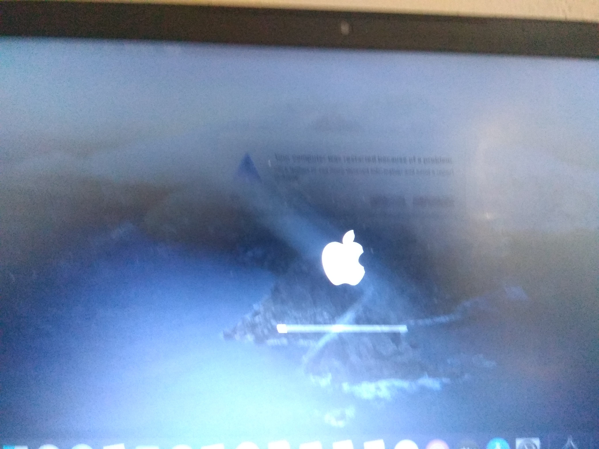

# 内核错误

* 支持的版本：0.6.5

在初次启动**macOS 安装程序**到**出现安装器界面**时候会出现的部分问题

* [卡在 [EB|#LOG:EXITBS:START]](#卡在-eblogexitbsstart)
* [卡在 EndRandomSeed](#卡在-endrandomseed)
* [在 OpenCore 中选择 macOS 分区后卡住](#在-opencore-中选择-macos-分区后卡住)
* [内核崩溃：Invalid frame pointer](#内核崩溃invalid-frame-pointer)
* [启动 Preboot 分区时卡在 [EB|LD:OFS] Err(0xE)](#启动-preboot-分区时卡在-ebldofs-err0xe)
* [卡在 OCB: LoadImage failed - Security Violation](#卡在-ocb-loadimage-failed-security-violation)
* [卡在 OCABC: Memory pool allocation failure - Not Found](#卡在-ocabc-memory-pool-allocation-failure-not-found)
* [卡在 Buffer Too Small](#卡在-buffer-too-small)
* [卡在 Plist only kext has CFBundleExecutable key](#卡在-plist-only-kext-has-cfbundleexecutable-key)
* [卡在 This version of Mac OS X is not supported: Reason Mac...](#卡在-this-version-of-mac-os-x-is-not-supported-reason-mac)
* [Couldn't allocate runtime area 错误](#couldnt-allocate-runtime-area-错误)
* [卡在 RTC..., PCI ConfigurationBegins, Previous Shutdown..., HPET, HID: Legacy...](#卡在-rtc-pci-configuration-begins-previous-shutdown-hpet-hid-legacy)
* [B550 主板卡在 ACPI Table loading](#b550-主板卡在-acpi-table-loading)
* [“Waiting for root device”和禁止符号](#waiting-for-root-device-和禁止符号)
* [X99 主板在 IOPCIFamily 发生内核崩溃](#x99-主板在-iopcifamily-发生内核崩溃)
* [卡在 IOConsoleUsers: gIOScreenLock... 或附近](#卡在-ioconsoleusers-gioscreenlockgiolockstate-3-或附近)
* [笔记本花屏问题](#笔记本花屏问题)
* [采用 Navi 核心的显卡在出现 IOConsoleUsers: gIOScreenLock... 之后黑屏](#black-screen-after-ioconsoleusers-gioscreenlock-on-navi)
* [内核崩溃：Cannot perform kext summary](#内核崩溃-cannot-perform-kext-summary)
* [内核崩溃：AppleIntelMCEReporter](#内核崩溃-appleintelmcereporter)
* [内核崩溃：AppleIntelCPUPowerManagement](#内核崩溃-appleintelcpupowermanagement)
* [笔记本电脑的键盘正常但触控板无法工作](#笔记本的键盘正常但触控板无法工作)

* [kextd stall[0]: AppleACPICPU](#卡在-kextd-stall0-appleacpicpu)
* [内核崩溃：AppleIntelI210Ethernet](#%E5%86%85%E6%A0%B8%E5%B4%A9%E6%BA%83-appleinteli210ethernet)
* [Icelake 笔记本上的内核崩溃：“Wrong CD Clock Frequency”](#icelake-笔记本上的内核崩溃wrong-cd-clock-frequency)
* [安装 macOS Big Sur 时卡在 Forcing CS_RUNTIME for entitlement](#安装-macos-big-sur-时卡在-forcing-cs_runtime-for-entitlement)
* [卡在 ramrod(^^^^^^^^^^^^^)](#卡在-ramrod)

## 卡在 [EB|#LOG:EXITBS:START]

本章节将分为三部分进行说明，请注意:

* [Booter 配置问题](#booter-配置问题)
* [Kernel 配置问题](#kernel-配置问题)
* [UEFI 配置问题](#uefi-配置问题)
* [虚拟机问题](#虚拟机问题)

### Booter 配置问题

在 Booter 部分的主要问题是:

* **DevirtualiseMmio**
  * 某些特定的 MMIO 区域仍然需要正常工作，因此您需要在 `Booter -> MmioWhitelist` 中排除这些区域，或者直接禁用这个设置项。 详情请参考: [如何使用 DevirtualiseMmio](../../extras/kaslr-fix.md#using-devirtualisemmio)
  * 对于 TRx40 用户，请启用这个设置项
  * 对于 X99 用户，因为一些固件会使其失效，所以请禁用这个设置项

* **SetupVirtualMap**
  * 在大多数固件上都需要启用这个设置项，如果禁用它很容易会导致内核崩溃, 除了以下情况：
    * 主要是 Z390 以及更早的主板需要启用这个开关
    * 然而，某些固件（主要出现在 2020 年后的新产品）与该设置项不兼容，启用这个设置项反而会导致内核崩溃，如果您拥有以下机器或主板，请禁用此 Quirk：
      * Intel Ice Lake 架构笔记本
      * Intel Comet Lake 架构主板（B460、H470、Z490 等）
      * AMD 的 B550 和 A520（更新了最新版本的 BIOS 的 X570 主板也包括在内）
        * 许多带有 2020 年底 BIOS 更新的 B450 和 X470 主板也包括在内
      * AMD TRx40
      * 虚拟机（如：QEMU）
      * X299 2020+ BIOS 更新（2019 年末或 2020 年后发布的最新 BIOS）

* **EnableWriteUnprotector**

  * 另一个原因可能是 macOS 与 CR0 寄存器的写保护相冲突, 我们有两种方法来解决这个问题：
    * 如果您的固件支持 MATs(主要是 2018 年后发布的固件):
      * EnableWriteUnprotector -> False
      * RebuildAppleMemoryMap -> True
      * SyncRuntimePermissions -> True
    * 对于发布较早而不支持 MATs 的固件:
      * EnableWriteUnprotector -> True
      * RebuildAppleMemoryMap -> False
      * SyncRuntimePermissions -> False
    * 注：一些笔记本电脑（例如：戴尔灵感 5370）即使支持 MATs 但是依然会遇到启动问题。在这种情况下，您将有两种选择：
      * 像不支持 MAT 机器的情况一样处理（启用 `EnableWriteUnprotector` 然后禁用 `RebuildAppleMemoryMap` 和 `SyncRuntimePermissions`）
      * 或启用 `DevirtualiseMmio` 然后遵循 [MmioWhitelist 向导](https://dortania.github.io/OpenCore-Install-Guide/extras/kaslr-fix.html)

关于 MATs 支持：使用 EDK 2018 以后版本编译的固件会支持 MAT ，许多 OEM 甚至向 SkyLake 笔记本提供了支持 MAT 的固件。但是我们很难去知晓 OEM 是否更新了固件，您可以检查 OpenCore 日志来确定您的固件是否支持 MAT（[如何获取 OpenCore 调试日志](../debug.html)）：

```Shell
OCABC: MAT support is 1
```

* 注意: 输出为 `1` 意味着固件支持 MATs，如果是 `0` 则意味着不支持

### Kernel 配置问题

本章节分为 Intel 和 AMD 部分：

#### AMD 用户

* 缺少 [内核补丁](https://github.com/AMD-OSX/AMD_Vanilla/tree/opencore)(只用于 AMD CPU，确保他们是适用于 OpenCore 的补丁而不是适用于 Clover 的。Clover 使用 `MatchOS` 而 OpenCore 使用 `MinKernel` 和 `Maxkernel` 来指定系统版本范围)
  * 过时的内核补丁也会导致相同的问题，请确保您从 AMD OS X 获取并使用了最新的内核补丁

#### Intel 用户

* **AppleXcpmCfgLock** 和 **AppleCpuPmCfgLock**
  * 缺少 CFG 或 XCPM 补丁，请启用 `AppleXcpmCfgLock` 和 `AppleCpuPmCfgLock`
    * Haswell 及更新的架构只需要 `AppleXcpmCfgLock`
    * Ivy Bridge 及更旧的架构 `AppleCpuPmCfgLock`
      * 如果安装 10.11 或旧版本的 macOS，Broadwell 及更旧的架构需要 `AppleCpuPmCfgLock`
  * 此外，你也可以选择关闭 CFG Lock: [关闭 CFG Lock](https://dortania.github.io/OpenCore-Post-Install/misc/msr-lock.html)
* **AppleXcpmExtraMsrs**
  * 可能需要，主要用于奔腾、HEDT 和其他不被 macOS 原生支持的老旧架构.

#### 经典 Intel 用户

对于 macOS Big Sur, 许多固件在确定 CPU 核心数量上存在问题，这会导致早期启动错误和内核崩溃。从串口输出中，你可以看到崩溃信息：

```bash
max_cpus_from_firmware not yet initialized
```

解决办法：

* 启用位于 Booter -> Quirks 的 `AvoidRuntimeDefrag`
  * 对大多数主板固件都有效

但在一些特别的机器如 HP Compaq DC 7900 上，即使启用了这个设置项，它们的固件依然会导致内核崩溃。所以我们要强制指定 CPU 核心数量。只有在 `AvoidRuntimeDefrag` 失效时才应该使用以下补丁：

::: details 经典 CPU 核心数量补丁

添加以下补丁（将 B8 04 00 00 00 C3 中的 **04** 更换为你硬件支持的 CPU 线程数
目）

| Key | Type | Value |
| :--- | :--- | :--- |
| Base | String | _acpi_count_enabled_logical_processors |
| Count | Integer | 1 |
| Enabled | Boolean | True |
| Find | Data | |
| Identifier | String | Kernel |
| Limit | Integer | 0 |
| Mask | Data | |
| MaxKernel | String | |
| MinKernel | String | 20.0.0 |
| Replace | Data | B804000000C3 |
| ReplaceMask | Data | |
| Skip | Integer | 0 |

:::

### UEFI 配置问题

* **ProvideConsoleGop**
  * 这个设置项用于过渡到下一个界面。这起初是 AptioMemoryFix 的一部分，但现在已经合并到 OpenCore，位于 `config.plist -> UEFI-> Output`
  * 从 0.5.6 版本开始，`sample.plist` 中的这个开关默认是被启用的
* **IgnoreInvalidFlexRatio**
  * Broadwell 和更老的平台需要。**不适用于 AMD 或 Intel Skylake 及更新的平台**

### 虚拟机问题

* 已知 VMWare 15 会卡在 `[EB|#LOG:EXITBS:START]`，VMWare 16 修复了这个问题。

## 卡在 EndRandomSeed

和上文提到过的问题一致: [卡在 [EB|#LOG:EXITBS:START]](#卡在-eblogexitbsstart)

## 在 OpenCore 中选择 macOS 分区后卡住

和上文提到过的问题一致: [卡在 [EB|#LOG:EXITBS:START]`](#卡在-eblogexitbsstart)

* 注: 使用 [DEBUG 版本的 OpenCore](../debug.html) 可以让你更加轻松地发现问题的原因

## 内核崩溃：Invalid frame pointer

这个问题和 `Booter -> Quirks` 的配置有关，请您检查这些项：

* **DevirtualiseMmio**
  * 某些特定的 MMIO 区域仍然需要正常工作，因此您需要在 `Booter -> MmioWhitelist` 中排除这些区域，或者直接禁用这个开关。 详情请参考: [如何使用 DevirtualiseMmio](../../extras/kaslr-fix.md#using-devirtualisemmio)
  * 对于 TRx40 用户，启用这个 Quirk
  * 对于 X99 用户，因为一些固件会使其失效，所以请禁用这个 Quirk

* **SetupVirtualMap**
  * 在大多数固件都需要启用这个 Quirk，如果禁用它很容易会导致内核崩溃, 除了以下情况：
    * 主要是 Z390 以及更早的主板需要启用这个开关
    * 然而，某些固件（主要出现在 2020 年后的新产品）与该设置项不兼容，启用这个设置项反而会导致内核崩溃，如果您拥有以下机器或主板，请禁用此 Quirk：
      * Intel Ice Lake 架构笔记本
      * Intel Comet Lake 架构主板（B460、H470、Z490 等）
      * AMD 的 B550 和 A520（更新了最新版本的 BIOS 的 X570 主板也包括在内）
        * 许多带有 2020 年底 BIOS 更新的 B450 和 X470 主板也包括在内
      * AMD TRx40
      * 虚拟机（如：QEMU）
      * X299 2020+ BIOS 更新（2019 年末或 2020 年后发布的最新 BIOS）

* **EnableWriteUnprotector**

  * 另一个原因可能是 macOS 与 CR0 寄存器的写保护相冲突, 我们有两种方法来解决这个问题：
    * 如果您的固件支持 MATs(主要是 2018 年后发布的固件):
      * EnableWriteUnprotector -> False
      * RebuildAppleMemoryMap -> True
      * SyncRuntimePermissions -> True
    * 对于发布较早而不支持 MATs 的固件:
      * EnableWriteUnprotector -> True
      * RebuildAppleMemoryMap -> False
      * SyncRuntimePermissions -> False
    * 注：一些笔记本电脑（例如：戴尔灵感 5370）即使支持 MATs 但是依然会遇到启动问题。在这种情况下，您将有两种选择：
      * 像不支持 MAT 机器的情况一样处理（启用 `EnableWriteUnprotector` 然后禁用 `RebuildAppleMemoryMap` 和 `SyncRuntimePermissions`）
      * 或启用 `DevirtualiseMmio` 然后遵循 [MmioWhitelist 使用向导](https://dortania.github.io/OpenCore-Install-Guide/extras/kaslr-fix.html)

关于 MATs 支持：使用 EDK 2018 以后版本编译的固件会支持 MAT ，许多 OEM 甚至向基于 SkyLake 架构的笔记本提供了支持 MAT 的固件。但是我们很难去知晓 OEM 是否更新了固件，您可以检查 OpenCore 日志来确定您的固件是否支持 MAT（[如何获取 OpenCore 调试日志](../debug.html)）：

```Shell
OCABC: MAT support is 1
```

* 注意: 输出为 `1` 意味着固件支持 MATs，如果是 `0` 则意味着不支持

## 启动 Preboot 分区时卡在 `[EB|LD:OFS] Err(0xE)`

完整的错误:

```bash
[EB|`LD:OFS] Err(0xE) @ OPEN (System\\Library\\PrelinkedKernels\\prelinkedkernel)
```

这是由于 preboot 分区没有被正确地更新，你需要进入到 Recovery 来修复它：

1. 启用位于 `UEFI -> APFS` 的 `JumpstartHotplug` （如果没有启用这个 Quirk， macOS Big Sur 的 Recovery 可能无法启动）
2. 启动进入 macOS Recovery
3. 打开终端，按照如下操作:

```bash
# 首先，找出您的 Preboot 分区
diskutil list

# 从下表可以看出，Preboot 分区的标识符（Identifier）是 disk5s2
/dev/disk5 (synthesized):
   #:                       TYPE NAME                    SIZE       IDENTIFIER
   0:      APFS Container Scheme -                      +255.7 GB   disk5
                                 Physical Store disk4s2
   1:                APFS Volume ⁨Big Sur HD - Data⁩       122.5 GB   disk5s1
   2:                APFS Volume ⁨Preboot⁩                 309.4 MB   disk5s2
   3:                APFS Volume ⁨Recovery⁩                887.8 MB   disk5s3
   4:                APFS Volume ⁨VM⁩                      1.1 MB     disk5s4
   5:                APFS Volume ⁨Big Sur HD⁩              16.2 GB    disk5s5
   6:              APFS Snapshot ⁨com.apple.os.update-...⁩ 16.2 GB    disk5s5s

# 现在挂载 Preboot 分区
diskutil mount disk5s2

# 接下来执行 updatePreboot 命令
diskutil apfs updatePreboot /volume/disk5s2
```

最后，请重启您的机器

## 卡在 `OCB: LoadImage failed - Security Violation`

```bash
OCSB: No suitable signature - Security Violation
OCB: Apple Secure Boot prohibits this boot entry, enforcing!
OCB: LoadImage failed - Security Violation
```

这是因为 Preboot 分区里缺少或使用了过时的 Apple 安全启动清单（Secure Boot manifests），同时如果您为 `SecureBootModel` 设定了有效的值，就会导致启动加载失败。这些清单的缺失实际上是 macOS 的一个 Bug

我们有以下方法来解决这个问题:

* 禁用 SecureBootModel
  * 将 `Misc -> Secuirty -> SecureBootModel` 设为 `Disabled`
* 重新安装 macOS
* 或将 `/usr/standalone/i386` 的安全启动清单（Secure Boot manifests）复制到  `/Volumes/Preboot/<UUID>/System/Library/CoreServices`
  * 由于 Preboot 分区不容易通过“访达”编辑，您需要通过终端完成此操作：

```bash
# 首先，找出 Preboot 分区
diskutil list

# 从下表可以看出 Preboot 的标识符（IDENTIFIER）为 disk5s2
/dev/disk5 (synthesized):
   #:                       TYPE NAME                    SIZE       IDENTIFIER
   0:      APFS Container Scheme -                      +255.7 GB   disk5
                                 Physical Store disk4s2
   1:                APFS Volume ⁨Big Sur HD - Data⁩       122.5 GB   disk5s1
   2:                APFS Volume ⁨Preboot⁩                 309.4 MB   disk5s2
   3:                APFS Volume ⁨Recovery⁩                887.8 MB   disk5s3
   4:                APFS Volume ⁨VM⁩                      1.1 MB     disk5s4
   5:                APFS Volume ⁨Big Sur HD⁩              16.2 GB    disk5s5
   6:              APFS Snapshot ⁨com.apple.os.update-...⁩ 16.2 GB    disk5s5s

# 现在挂载 Preboot 分区
diskutil mount disk5s2

# CD 进入 Preboot 分区
# 注意实际路径是在 /System/Volumes/Preboot
cd /System/Volumes/Preboot

# 获取 UUID
ls
 46923F6E-968E-46E9-AC6D-9E6141DF52FD
 CD844C38-1A25-48D5-9388-5D62AA46CFB8

# 如果出现多个 UUID (如：安装过多个版本的 macOS), 您将需要判断哪一个 UUID 是正确的
# 最简单的方法是打印出每个硬盘的 .disk_label.contentDetails
cat ./46923F6E-968E-46E9-AC6D-9E6141DF52FD/System/Library/CoreServices/.disk_label.contentDetails
 Big Sur HD%

cat ./CD844C38-1A25-48D5-9388-5D62AA46CFB8/System/Library/CoreServices/.disk_label.contentDetails
 Catalina HD%

# 然后拷贝安全启动文件
# 将下文 CD844C38-1A25-48D5-9388-5D62AA46CFB8 替换为您找到的 UUID 
cd ~
sudo cp -a /usr/standalone/i386/. /System/Volumes/Preboot/CD844C38-1A25-48D5-9388-5D62AA46CFB8/System/Library/CoreServices
```

## 卡在 `OCABC: Memory pool allocation failure - Not Found`

这通常是由错误的 BIOS 设定导致的:

* 请启用 `Above4GDecoding`
* 禁用 `CSM` 兼容性模块(某些主板上也可以选择启用 `Windows8.1/10 WHQL` 模式)
  * 需要注意的是，有些笔记本必须启用 `CSM`
* 更新 BIOS 到最新版本（Z390 和 HEDT 以固件编写不良而闻名）

## 卡在 `Buffer Too Small`

* 请启用 BIOS 设置中的 `Above4GDecoding`

## 卡在 `Plist only kext has CFBundleExecutable key`

这是由于 config.plist 中缺失或配置了错误的 Kext 可执行文件路径，可以使用
ProperTree 快照添加 (Cmd/Ctrl+R) 来修复

## 卡在 `This version of Mac OS X is not supported: Reason Mac...`

这个错误是由于当前设置的 SMBIOS 机型与将要安装的 macOS 版本不兼容。请您确
认 `PlatformInfo -> Generic` 中填写了合适的机型信息，并勾选了 `Automatic`

如果您想查询完整的 SMBIOS 列表和 macOS 系统支持详情，请访问：[Choosing the right SMBIOS](../../extras/smbios-support.md)

::: details macOS 10.15, Catalina 支持的 SMBIOS

* iMac13,x+
* iMacPro1,1
* MacPro6,1+
* Macmini6,x+
* MacBook8,1+
* MacBookAir5,x+
* MacBookPro9,x+

:::

::: details macOS 11, Big Sur 支持的 SMBIOS

* iMac14,4+
* iMacPro1,1
* MacPro6,1+
* Macmini7,1+
* MacBook8,1+
* MacBookAir6,x+
* MacBookPro11,x+

:::

## `Couldn't allocate runtime area` 错误

请参考 [修复 KASLR slide 值](../../extras/kaslr-fix.md)

## 卡在 `RTC...`, `PCI Configuration Begins`, `Previous Shutdown...`, `HPET`, `HID: Legacy...`

这一部分是 PCI 设备初始化和配置的过程，也是大多数启动问题会出现的时候。其他可能的位置：

* `apfs_module_start...`,
* `Waiting for Root device`,
* `Waiting on...IOResources...`,
* `previous shutdown cause...`

检查以下内容:

* **缺少 EC 补丁**:
  * 确保 `EFI/OC/ACPI` 里有 `SSDT-EC.aml` 并检查 config.plist 的 `ACPI -> Add` 中**是否被启用**
  * 如果您找不到这个补丁，可以从这里获取： [Getting started with ACPI](https://dortania.github.io/Getting-Started-With-ACPI/)
* **IRQ 冲突**:
  * 在老旧的笔记本电脑和机器上最常见，可以运行 SSDTTime 的 FixHPET 选项，并将生成的 SSDT-HPET.aml 和 ACPI 重命名补丁添加到您的配置中（如果缺少 ACPI 重命名补丁，SSDT 将无法工作）
* **PCI 分配问题**:
  * 更新您的 BIOS 固件并确保它是最新版本。一些 OEM 的固件的 PCI 分配存在问题，特别是 AMD
  * 请启用 BIOS 设定中的 `Above4GDecoding`。如果找不到可用的选项，则在
boot-args 中添加 `npci=0x2000`
    * 一些 X99 和 X299 主板（如：GA-X299-UD4）可能需要同时添加 `npci=0x200` 启动参数和启用 `Above4G Decoding`
    * AMD CPU 请注意: **不要在启用 `Above4G Decoding` 的同时添加 `npci=0x2000` 到 boot-args，它们会互相冲突**
  * 一些重要的 BIOS 设定: 禁用 `CSM`, 启用 `Windows 8.1/10 UEFI` 模式
* **NVMe 或 SATA 问题**:
  * 有时候使用糟糕的 SATA 控制器或不受支持的 NVMe 驱动器会让你卡在这里。部分已知解决办法：
    * 不要使用 `Samsung PM981` 或 `Mircon 2200S NVMe SSD`
    * 更新 `Samsung 970 Evo Plus` 的固件至最新版本（旧固件存在不稳定和失速的问题，更多信息 [请查阅此处](https://www.samsung.com/semiconductor/minisite/ssd/download/tools/))
    * BIOS 设定中禁用 SATA 热插拔（在基于 AMD CPU 的机器上更容易导致问题)
    * 确保 NVMe 驱动器在 BIOS 中是设置为工作在 NVMe 模式（一些 BIOS 会错误地将 NVMe 驱动器设置为 SATA 模式）
* **NVRAM 写入失败**:
  * 常见于 HEDT 和 300 系主板，以下为解决办法：
    * 300 系消费级 Intel 主板：添加 `SSDT-PMC.aml`，查阅 [ACPI入门](https://dortania.github.io/Getting-Started-With-ACPI/) 来获取 SSDT-PMC.aml
    * HEDT（如： X99）： See [Emulating NVRAM](https://dortania.github.io/OpenCore-Post-Install/misc/nvram.html) on how to stop NVRAM write, note that for install you do not need to run the script. Just setup the config.plist

* **缺失 RTC 时钟**:
  * Intel 300 系以后的主板(如： Z370, Z490) 默认禁用 RTC 时钟。查阅 [ACPI 入门](https://dortania.github.io/Getting-Started-With-ACPI/) 来获取 SSDT-AWAC.aml
  * X99 和 X299 主板的 RTC 设备基本都是损坏的, 您需要 SSDT-RTC0-RANGE 来修复它。 查询 [ACPI 入门](https://dortania.github.io/Getting-Started-With-ACPI/) 来获取相关文件
  * HP 的一些的固件甚至禁用了 RTC ，也没有办法来重新启用它
    * 已知受影响的机型：`HP 15-DA0014dx`, `HP 250 G6`
    * 对于拥有这些机器的用户来说，您将需要创建一个仿冒的 RTC 时钟供 macOS 使用。更多详情请查看 ACPI 入门，或者查看下面的图片

一个被禁用的而且无法被启用的 RTC 时钟的例子（注意到这里没有用于重新启用它的值 `STAS`）：


## B550 主板卡在 ACPI table loading


当您使用 B550 或 A520 主板在启动时卡在 ACPI table loading，请添加以下 SSDT：

* [SSDT-CPUR.aml](https://github.com/dortania/Getting-Started-With-ACPI/blob/master/extra-files/compiled/SSDT-CPUR.aml)

请记确保添加此 SSDT 到 `EFI/OC/ACPI` **和**您的 `config.plist -> ACPI -> Add` 下（ProperTree 的 `快照添加` 可以帮助您填写 config）

## "Waiting for Root Device" 和禁止符号

* 其他名称: 停止符号、花屏、禁行

这主要是 USB 或 SATA 错误，有许多方法来修复这个问题：

### USB 问题

现在假设您是在尝试从 USB 启动 macOS 安装器，而不是启动 macOS 系统本身

* 如果您的机器达到了 15 个 USB 端口上限, 你可以启用 `XhciPortLimit` 来规避这个问题，但不推荐长期使用。您应该进行 [USB 端口定制](https://dortania.github.io/OpenCore-Post-Install/usb/)
  * `Kernel -> Quirks -> XhciPortLimit` 设为 `True`

* 另一个原因可能是固件不能正确传递 USB ownership 给 macOS
  * `UEFI -> Quirks -> ReleaseUsbOwnership` 设为 `True`
  * 在 BIOS 设定中启用 `XHCI Handoff` 也能修复这个问题

* 有时候，当 USB 插到了 3.x 接口时启动会遇到这个问题，将其接入 2.0 接口就能避免这个问题

* 对于 AMD 15h 和 16h CPU，你可能需要以下扩展驱动：
  * [XLNCUSBFix.kext](https://cdn.discordapp.com/attachments/566705665616117760/566728101292408877/XLNCUSBFix.kext.zip)

* 如果 `XLNCUSBFix.kext` 不起作用，再尝试以下方法:
  * [AMD StopSign-fixv5](https://cdn.discordapp.com/attachments/249992304503291905/355235241645965312/StopSign-fixv5.zip)

* X299 主板：启用 `Above4G Decoding`
  * 一些 X299 的老旧固件存在 bug，无法正常通过 USB 启动

* ACPI 表缺失 USB 接口内容：
  * 对于 Intel Coffee Lake 及更早的架构，推荐使用 [USBInjectAll](https://bitbucket.org/RehabMan/os-x-usb-inject-all/downloads/)
  * 对于 Intel Ice Lake 和 Comet Lake 架构，推荐使用 [SSDT-RHUB](https://github.com/dortania/Getting-Started-With-ACPI/blob/master/extra-files/compiled/SSDT-RHUB.aml)
    * SSDTTime 的 `7. USB Reset` 选项也能生成 SSDT-RHUB
  * 对于 AMD，使用 SSDTTime 的 `7. USB Reset` 选项来生成 SSDT-RHUB
  
### SATA 问题

在少数情况下（笔记本居多），主板的 SATA 控制器不被 macOS 所支持。为解决这个问题，请确认以下内容：

* 在 BIOS 设定中将 SATA 控制器设置为 AHCI 模式
  * macOS 不支持 RAID 或者 IDE 模式
  * 使用英特尔快速存储技术（Intel Rapid Storage Technology，简称 RST，Windows 或 Linux 下使用的一种软 RAID）的硬盘将无法在 macOS 访问
* 使用 [SATA-unsupported.kext](https://github.com/khronokernel/Legacy-Kexts/blob/master/Injectors/Zip/SATA-unsupported.kext.zip)
  * 为不原生支持的 SATA 控制器提供支持，这个问题在笔记本上更常见
  * 对于一些传统的 SATA 控制器，使用 [AHCIPortInjector.kext](https://www.insanelymac.com/forum/files/file/436-ahciportinjectorkext/) 可能更合适
* [从 Catalina 提取并修改后的 AppleAHCIPort.kext](https://github.com/dortania/OpenCore-Install-Guide/blob/master/extra-files/CtlnaAHCIPort.kext.zip)
  * 适用于安装 macOS Big Sur 11 的用户，这实际上是把 Catalina 能正常使用的 kext 向后移植到了 Big Sur。无需和 `SATA-unsupported.kext` 一起使用

要注意的是，您只有在安装 macOS 后才会遇到这些问题。SATA 问题不会影响启动 macOS 安装器

## X99 主板在 IOPCIFamily 发生内核崩溃

对于这些使用 X99 主板的用户，请遵循以下解决办法：

* 请确保以下 Kernel设置项被启用:
  * `AppleCpuPmCfgLock`
  * `AppleXcpmCfgLock`
  * `AppleXcpmExtraMsrs`
* 请确保您的引导拥有以下 SSDT:
  * SSDT-UNC（如果没有，从 [ACPI 入门](https://dortania.github.io/Getting-Started-With-ACPI/) 获取一个）

## 卡在 `IOConsoleUsers: gIOScreenLock...`/`gIOLockState (3...` 或附近

这个问题发生的位置是 GPU 初始化之前，请确保:

* GPU 支持 UEFI (GTX 7XX/2013+)
* CSM 已经被关闭
  * 但在一些笔记本上可能需要被启用
* 强制 PCIe 3.0 连接速度
* 如果有核显，检查是否使用了正确的 `ig-platform-id` 和 `device-id`
  * 桌面端 UHD630 可能需要使用 `00009B3E` 来代替
* 使用不同的 [WhateverGreen 补丁](https://github.com/acidanthera/WhateverGreen/blob/master/Manual/FAQ.IntelHD.en.md)
  * 如 `-igfxmlr` 启动参数。 这可能适用于显示为 "Divide by Zero" 的错误
* 当启动 macOS 10.15.4 或更新版本，Coffee Lake 的核芯显卡可能还需要 `igfxonln=1`

## 笔记本花屏问题

请在 UEFI 设定启用 CSM。该选项可能会出现在 "Boot legacy ROMs" 或其他的启动设置

## 采用 Navi 核心的显卡在出现 IOConsoleUsers: gIOScreenLock... 之后黑屏

* 添加 `agdpmod=pikera` 到 boot-args，并关闭 BIOS 中的 `Serial/COM Port`（位于 SuperIO）
* 切换不同的显示输出
* 尝试 `MacPro7,1` SMBIOS 并且使用 boot-arg `agdpmod=ignore`

对于微星 Navi 核心显卡用户, 你需要添加如下补丁: [Installer not working with 5700XT #901](https://github.com/acidanthera/bugtracker/issues/901)

向 `Kernel -> Patch` 添加以下内容：

::: details 微星 Navi 核心显卡补丁

```bash
Base:
Comment: Navi VBIOS Bug Patch
Count: 1
Enabled: YES
Find: 4154592C526F6D2300
Identifier: com.apple.kext.AMDRadeonX6000Framebuffer
Limit: 0
Mask:
MinKernel: 19.00.00
MaxKernel: 19.99.99
Replace: 414D442C526F6D2300
ReplaceMask:
Skip: 0
```

:::

注：macOS 11 Big Sur 不再需要此补丁

## 内核崩溃 `Cannot perform kext summary`

通常在预连接内核时见到，特别是在 macOS 加载我们注入的 Kext 的时候，请确认：

* 您的 kexts 是否按照正确的顺序排列（先是主驱动再到插件，Lilu 永远位于其他插件之前)
* 忘记为带有可执行文件的 Kext 填写二进制文件路径，或错误地为没有可执行文件的 Kext 填写了二进制文件路径（如 `USBPort.kext`, `XHCI-unspported.kext` 没有可执行文件）
* 不要重复添加相同的 kext 到 `config.plist`(如： including multiple copies of VoodooInput from multiple kexts, 我们推荐启用顺序在前的那个，然后禁用后面的那个)

注：这个错误看起来非常像 [内核崩溃：Invalid frame pointer](#内核崩溃invalid-frame-pointer)

## 内核崩溃 `AppleIntelMCEReporter`

macOS Catalina 对多 CPU 接口的支持存在问题。一个有趣的事实是：一些 AMD 主板的固件会报告存在多个 CPU 接口。添加 [AppleMCEReporterDisabler](https://github.com/acidanthera/bugtracker/files/3703498/AppleMCEReporterDisabler.kext.zip) 到 `EFI/OC/Kexts` 和 `config.plist -> Kernel -> Add` 来修复这个问题

## 内核崩溃 `AppleIntelCPUPowerManagement`

这通常是因为缺失或配置了错误的 `NullCPUPowerManagement`。请从 `Kernel -> Add` 和 `EFI/OC/Kexts` 中移除 `NullCPUPowerManagement`，然后启用 `Kernel -> Emulate` 下的 `DummyPowerManagement`

* **注意**: 对于一些旧版 Intel CPU (如： Penryn 或更早之前的架构)，这可能是由于 IRQ 冲突或者 HPET 设备被禁用所导致。如果要解决这个问题，以下二选一:
  * [SSDTTime 的 FixHPET 选项](https://dortania.github.io/Getting-Started-With-ACPI/ssdt-methods/ssdt-easy.html)
  * 强制启用 HPET 设备
  
::: details 强制启用 HPET 设备

在 ACPI -> Patch:

| Comment | String | Force HPET Online |
| :--- | :--- | :--- |
| Enabled | Boolean | YES |
| Count | Number | 0 |
| Limit | Number | 0 |
| Find | Data | A010934F53464C00 |
| Replace | Data | A40A0FA3A3A3A3A3 |

:::

## macOS 在登录界面冻结

这通常是 TSC 导致的问题, 对大多数机器来说添加 [CpuTscSync](https://github.com/acidanthera/CpuTscSync) 即可  

以下为常见的情况:

情况 1    |  情况 2
:-------------------------:|:-------------------------:
  |  

## 笔记本电脑的键盘正常但触控板无法工作

检查 `config.plist -> Kernel -> Add` 请确保 VoodooInput 在 VoodooPS2 和 VoodooI2C 的前面

::: details VoodooI2C 故障诊断

检查 kexts 的加载顺序 - 让他们符合以下顺序：[获取需要的文件](../../ktext.md)

1. VoodooGPIO、 VoodooInput 和 VoodooI2CServices 这三者之间可以是任意顺序 (位于 VoodooI2C.kext/Contents/PlugIns)
2. VoodooI2C.kext
3. 卫星驱动（Satellites Kext，如 VoodooI2CHID）

确保 `SSDT-GPIO` 存在于 `EFI/OC/ACPI` 并在 `config.plist` 的 `ACPI -> Add` 加载和启用。如果依然存在问题，请查阅 [ACPI 入门 - GPIO 页面](https://dortania.github.io/Getting-Started-With-ACPI/Laptops/trackpad.html).

:::

## 卡在 `kextd stall[0]: AppleACPICPU`

这是因为缺失或使用了损坏的 SMC 模拟器，请检查以下内容：

* Lilu 和 VirtualSMC 都存在于 `EFI/OC/kexts` 和 `config.plist`
* Lilu 应先于 VirtualSMC 加载
* 最后可以尝试 FakeSMC 来代替 VirtualSMC, **不要同时使用 VirtualSMC 和 FakeSMC**

## 内核崩溃 `AppleIntelI210Ethernet`

对于这些带有 i225-V NIC 网卡的 Comet lake 主板, 您可能会遇到在 i210 kext 发生的内核崩溃。为解决这个问题，确保您配置了正确的以太网卡 PciRoot。一般为以下两者之一：

* `PciRoot(0x0)/Pci(0x1C,0x1)/Pci(0x0, 0x0)`
  * 默认是这个, 主要由 Asus 和 Gigabyte 主板使用
* `PciRoot(0x0)/Pci(0x1C,0x4)/Pci(0x0,0x0)`
  * 一些 OEM 会用这个来代替
  
对于这些具有奇怪的 PciRoot 的主板，您首先需要完全安装好 macOS，然后使用 [gfxutil](https://github.com/acidanthera/gfxutil/releases) 来找出正确的路径:

```bash
/path/to/gfxutil | grep -i "8086:15f3"
```

会输出以下内容：

```bash
00:1f.6 8086:15f3 /PC00@0/GBE1@1F,6 = PciRoot(0x0)/Pci(0x1F,0x6)
```

最后的 `PciRoot(0x0)/Pci(0x1F,0x6)` 就是您需要添加到 config.plist 的设备路径，同时为其添加属性 `device-id` 值为 `F2150000`（data 类型）

## Icelake 笔记本上的内核崩溃：“Wrong CD Clock Frequency”


请确保 `boot-args` 添加了 `-igfxcdc`

## 内核崩溃："cckprng_int_gen"

完整信息：

```bash
"cckprng_int_gen: generator has already been sealed"
```

原因为二者之一：

* 缺少 SMC 模拟器（例如：您使用的 config.plist 或 EFI 缺少 VirtualSMC）
  * 添加 [VirtualSMC.kext](https://github.com/acidanthera/VirtualSMC/releases) 到您的 config.plist 和 EFI 里
* SSDT-CPUR 的错误使用

对于后者, 确保你只在 **B550 and A520** 主板上使用 SSDT-CPUR。不要在 X570 或更旧的主板上使用（如 B450 或 A320）

## 安装 macOS Big Sur 时卡在 `Forcing CS_RUNTIME for entitlement`


这实际上是 macOS 在密封系统分区, 看起来 macOS 像是卡住了，实际上**并没有**。**不要重启电脑**，你只需要一些耐心和时间

## 卡在 `ramrod`(^^^^^^^^^^^^^)


如果卡在 `ramrod` 附近（或启动时遇到此错误，然后不断重启、循环），这
可能表示您使用的 VirtualSMC 出现问题。要解决这个问题，您有 2 种解决方案：

* 确保您在使用最新版本的 VirtualSMC 和 Lilu，同时添加 `vsmcgen=1` 到 `boot-args`
* 使用 [Rehabman 开发的 FakeSMC](https://bitbucket.org/RehabMan/os-x-fakesmc-kozlek/downloads/) 来代替（您可以使用 MinKernel / MaxKernel 将
FakeSMC 限制在 Big Sur 及更新版本）

当更换 kexts 时，请确保您的 `config.plist` 没有同时启用 FakeSMC 和
VirtualSMC，否则两者会互相冲突。
