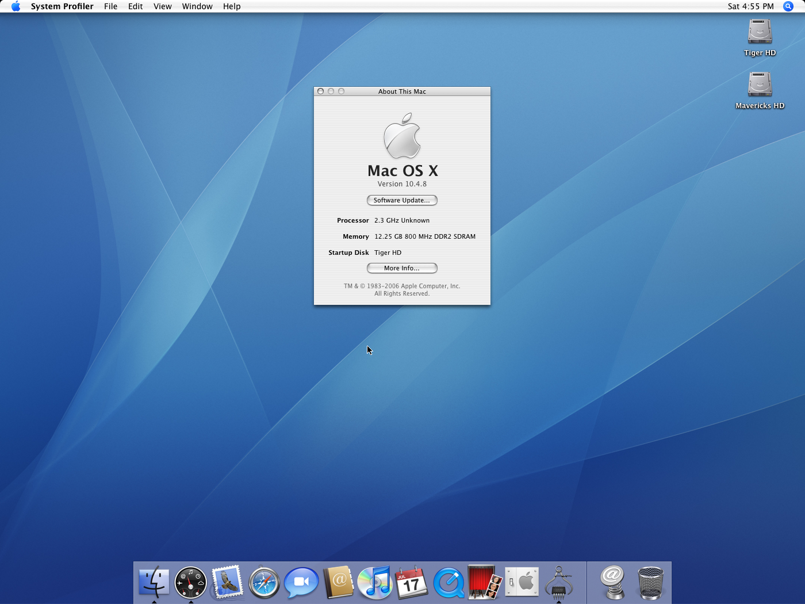

# 为什么 OpenCore 胜过 Clover 和其他引导加载程序

* 支持的版本：0.6.4

这个部分简要地概述了为什么社区正在向 OpenCore 过渡，而且目的是为了消除一些在社区中的错误观念。如果你只是想安装 macOS，可以跳过此页面。

* [为什么 OpenCore 胜过 Clover 和其他引导加载程序](#为什么-opencore-胜过-clover-和其他引导加载程序)
  * OpenCore 的功能
  * 软件支持
  * 内核扩展注入
* [OpenCore 的缺点](#opencore-的缺点)
* [常见的错误观念](#常见的错误观念)
  * 因为 OpenCore 还处在测试阶段，所以它不稳定吗？
  * OpenCore 是否始终注入 SMBIOS 和 ACPI 数据到其他的操作系统内？
  * 使用 OpenCore 需要重新安装操作系统吗？
  * OpenCore 是否只支持限定版本的 macOS？

## OpenCore 的功能

* 更多的操作系统支持！
  * OpenCore 现在直接支持更多版本的 OS X 和 macOS，而且不用经历使用 Clover 和 Chameleon 时需要的痛苦 Hackintosh。
  * 这包括的操作系统里，包含很旧的 10.4 Tiger 而且甚至也包含最新的版本 11 Big Sur！
* 就大体而言，使用 OpenCore 的系统比使用 Clover 的引导速度更快，因为它不执行一些没有必要的修复
* 整体稳定性更好，因为补丁可以更精确：
  * [macOS 10.15.4 更新](https://www.reddit.com/r/hackintosh/comments/fo9bfv/macos_10154_update/)
  * AMD OSX 补丁不需要在每次小型的安全更新之后都进行更新
* 在很多情况下，整体安全性更好：
  * 不需要关闭系统完整性保护（SIP）
  * 内建的文件保险箱 2 支持
  * [保险库](https://dortania.github.io/OpenCore-Post-Install/universal/security.html#Vault)允许为避免不想要的自定义而创建 EFI 快照
  * 真正的安全启动支持
    * 来自 UEFI 的和来自 Apple 的变体都支持
* 启动转换助理和启动设备的选择都被读取启动磁盘设置的 NVRAM 变量支持，就像一台真实的 Mac。
* 通过 `boot.efi` 支持引导热键——在启动时按住 `Option` 或 `ESC` 以选择启动的设备，按住 `Cmd+R` 进入恢复模式或者 `Cmd+Opt+P+R` 以重置 NVRAM。

## 软件支持

有人想从其他引导加载程序转换到 OpenCore 的最大原因实际上是软件支持：

* 内核扩展不再为 Clover 测试：
  * 发现内核扩展的一个 Bug？很多开发者，包括 [Acidanthera](https://github.com/acidanthera) 组织（大部分你最喜欢的内核扩展的制作者）都不会提供支持，除非你使用的是 OpenCore
* 很多固件驱动器都被合并到了 OpenCore 中：
  * [APFS 支持](https://github.com/acidanthera/AppleSupportPkg)
  * [文件保险箱支持](https://github.com/acidanthera/AppleSupportPkg)
  * [固件补丁](https://github.com/acidanthera/AptioFixPkg)
* [AMD OSX 补丁](https://github.com/AMD-OSX/AMD_Vanilla/tree/opencore):
  * 拥有基于 AMD 的硬件？启动 macOS 所需的内核补丁不再支持 Clover——现在只支持 OpenCore。

## 内核扩展注入

为更好地理解 OpenCore 的内核扩展注入系统，我们需要先看一看 Clover 是怎样工作的：

1. 使用补丁将系统完整性保护开放
2. 使用布丁启用 XNU 的僵尸代码以进行内核扩展注入
3. 修复注入内核扩展需要的竞态条件
4. 注入内核扩展
5. 使用补丁还原系统完整性保护

Clover 的方式中需要注意的地方：

* 把 XNU 的僵尸代码看作是从 10.7 版本以来就未使用过的代码，但令人印象深刻的是 Apple 依然没有移除这些代码
  * 操作系统更新经常破坏这个补丁，例如最近的 10.14.4 和 10.15
* 关闭系统完整性保护然后尝试重新打开它，别以为还有什么需要说的
* 几乎被 macOS 11.0 Big Sur 破坏
* 支持早至 10.5 的所有 OS X

现在来看看 OpenCore 的方式：

1. 将现有的预链接的内核和内核扩展准备好注入
2. 在带有新内核扩展的情况下重建 EFI 源内部的缓存
3. 加入新的缓存

OpenCore 的方式中需要注意的地方：

* 与操作系统无关的预链接内核格式自10.6（v2）以来一直保持不变，支持很难被打破。
  * OpenCore 也支持预链接内核（v1，在 10.4 和 10.5 中被发现）、无缓存、Mac OS X Mach 内核扩展内存缓存（Mkext）和内核收集（KernelCollections），意味着它也适当地支持所有英特尔版本的 OS X 或 macOS
* 稳定性更好，因为所涉及的补丁要少得多

# OpenCore 的缺点

The majority of Clover's functionality is actually supported in OpenCore in the form of some quirk, however when transitioning you should pay close attention to OpenCore's missing features as this may or may not affect yourself:

* Does not support booting MBR-based operating systems
  * Work around is to chain-load rEFInd once in OpenCore
* Does not support UEFI-based VBIOS patching
  * This can be done in macOS however
* Does not support automatic DeviceProperty injection for legacy GPUs
  * ie. InjectIntel, InjectNvidia and InjectAti
  * This can be done manually however: [GPU patching](https://dortania.github.io/OpenCore-Post-Install/gpu-patching/)
* Does not support IRQ conflict patching
  * Can be resolved with [SSDTTime](https://github.com/corpnewt/SSDTTime)
* Does not support P and C state generation for older CPUs
* Does not support Target Bridge ACPI patching
* Does not support Hardware UUID Injection
* Does not support auto-detection for many Linux bootloader
  * Can be resolved by adding an entry in `BlessOverride`
* Does not support many of Clover's XCPM patches
  * ie. Ivy Bridge XCPM patches
* Does not support hiding specific drives
* Does not support changing settings within OpenCore's menu
* Does not patch PCIRoot UID value
* Does not support macOS-only ACPI injection and patching

# 常见的错误观念

## OpenCore 还处在测试阶段，所以它不稳定吗

简短回答：不

详细回答：不

OpenCore's version number does not represent the quality of the project. Instead, it's more of a way to see the stepping stones of the project. Acidanthera still has much they'd like to do with the project including overall refinement and more feature support.

For example, OpenCore goes through proper security audits to ensure it complies with UEFI Secure Boot, and is the only Hackintosh bootloader to undergo these rigorous reviews and have such support.

Version 0.6.1 was originally designed to be the official release of OpenCore as it would have proper UEFI/Apple Secure Boot, and would be the 1 year anniversary of OpenCore's release as a public tool. However, due to circumstances around macOS Big Sur and the rewriting of OpenCore's prelinker to support it, it was decided to push off 1.0.0 for another year.

Current road map:

* 2019: Year of Beta
* 2020: Year of Secure Boot
* 2021: Year of Refinement

So please do not see the version number as a hindrance, instead as something to look forward to.

## OpenCore 是否始终注入 SMBIOS 和 ACPI 数据到其他的操作系统内

By default, OpenCore will assume that all OSes should be treated equally in regards to ACPI and SMBIOS information. The reason for this thinking consists of three parts:

* This allows for proper multiboot support, like with [BootCamp](https://dortania.github.io/OpenCore-Post-Install/multiboot/bootcamp.html)
* Avoids poorly made DSDTs and encourages proper ACPI practices
* Avoids edge cases where info is injected several times, commonly seen with Clover
  * i.e. How would you handle SMBIOS and ACPI data injection once you booted boot.efi, but then get kicked out? The changes are already in memory and so trying to undo them can be quite dangerous. This is why Clover's method is frowned upon.

However, there are quirks in OpenCore that allow for SMBIOS injection to be macOS-limited by patching where macOS reads SMBIOS info from. The `CustomSMIOSGuid` quirk with `CustomSMBIOSMode` set to `Custom` can break in the future and so we only recommend this option in the event of certain software breaking in other OSes. For best stability, please disable these quirks.

## 使用 OpenCore 需要重新安装操作系统吗

Not at all in the event you have a "Vanilla" installation – what this refers to is whether the OS has tampered in any way, such as installing 3rd party kexts into the system volume or other unsupported modifications by Apple. When your system has been heavily tampered with, either by you or 3rd party utilities like Hackintool, we recommend a fresh install to avoid any potential issues.

Special note for Clover users: please reset your NVRAM when installing with OpenCore. Many of Clover variables can conflict with OpenCore and macOS.

## OpenCore 是否只支持限定版本的 macOS

As of OpenCore 0.6.2, you can now boot every Intel version of macOS going all the way back to OS X 10.4! Proper support however will depend on your hardware, so please verify yourself: [Hardware Limitations](macos-limits.md)

::: details macOS Install Gallery

Acidanthera has tested many versions, and I myself have run many versions of OS X on my old HP DC 7900 (Core2 Quad Q8300). Here's just a small gallery of what I've tested:

:::

## Does OpenCore support older hardware

As of right now, the majority of Intel hardware is supported so long as the OS itself does! However please refer to the [Hardware Limitations page](macos-limits.md) for more info on what hardware is supported in what versions of OS X/macOS.

Currently, Intel's Yonah and newer series CPUs have been tested properly with OpenCore.

## Does OpenCore support Windows/Linux booting

OpenCore works in the same fashion as any other boot loader, so it respects other OSes the same way. For any OSes where their bootloader has an irregular path or name, you can simply add it to the BlessOverride section.

## Legality of Hackintoshing

Where hackintoshing sits is in a legal grey area, mainly that while this is not illegal we are in fact breaking the EULA. The reason this is not illegal:

* We are downloading macOS from [Apple's servers directly](https://github.com/corpnewt/gibMacOS/blob/master/gibMacOS.command#L84)
* We are doing this as a non-profit origination for teaching and personal use
  * People who plan to use their Hackintosh for work or want to resell them should refer to the [Psystar case](https://en.wikipedia.org/wiki/Psystar_Corporation) and their regional laws

While the EULA states that macOS should only be installed on real Macs([section 2B-i](https://www.apple.com/legal/sla/docs/macOSCatalina.pdf)) or virtual machines running on genuine Macs([section 2B-iii](https://www.apple.com/legal/sla/docs/macOSCatalina.pdf)), there is no enforceable law that outright bans this. However, sites that repackage and modify macOS installers do potentially risk the issue of [DMCA takedowns](https://en.wikipedia.org/wiki/Digital_Millennium_Copyright_Act) and such.

* **Note**: We are not official legal advisors, so please make the proper assessments yourself and discuss with your lawyers if you have any concerns.

## Does macOS support Nvidia GPUs

Due to issues revolving around Nvidia support in newer versions of macOS, many users have somehow come to the conclusion that macOS never supported Nvidia GPUs and don't at this point. However, Apple actually still maintains and supports Macs with Nvidia GPUs in their latest OS, like the 2013 MacBook Pro models with Kepler GPUs.

The main issue has to do with any newer Nvidia GPUs, as Apple stopped shipping machines with them and thus they never had official OS support from Apple. Instead, users had to rely on Nvidia for 3rd party drivers. Due to issues with Apple's newly introduced Secure Boot, they could no longer support the Web Drivers and thus Nvidia couldn't publish them for newer platforms limiting them to mac OS 10.13, High Sierra.

For more info on OS support, see here: [GPU Buyers Guide](https://dortania.github.io/GPU-Buyers-Guide/)
